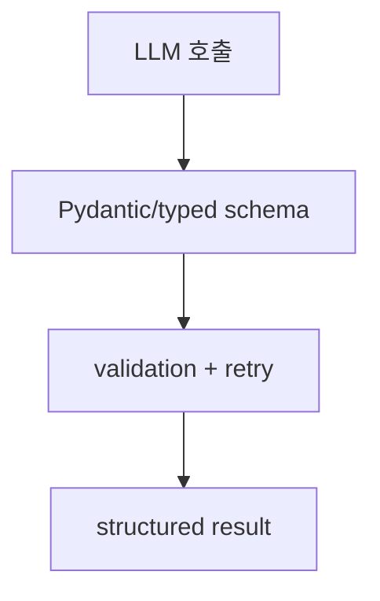

# Instructor Overview

[[instructor|Instructor]] 공식 페이지 요약이다. 다중 언어 [[structured-output|structured output]] 라이브러리로서 Instructor가 제공하는 검증, 재시도, 스키마 중심 개발 경험을 정리한다.

## 구조도

Instructor는 모델 응답을 자유 텍스트로 받는 대신, 스키마·검증·재시도를 기본값으로 두는 얇은 통합층이다.

## 핵심 구조

- 공식 페이지는 Instructor를 다중 언어 structured output 라이브러리로 소개하며, quick start, validation, complex schemas, provider support를 한 번에 보여 준다.
- 핵심은 스키마 기반 결과 추출과 validation/retry 루프를 간단한 API로 감싼다는 점이다.
- 즉 model wrapper라기보다 "출력 품질을 계약화하는 보정층"에 가깝다.

## 왜 중요한가

- Instructor는 lightweight한 방식으로 structured outputs를 강화하고 싶을 때 자주 선택된다.
- Pydantic 모델과 자연스럽게 결합되므로 Python 애플리케이션에서 adoption friction이 낮다.
- 반면 더 큰 runtime abstraction을 원하는 경우에는 [[pydantic-ai|Pydantic AI]]나 [[baml|BAML]]과 다른 선택이 될 수 있다.

## 실무 관점

- 구조화 출력 품질 문제를 빠르게 잡고 싶다면 Instructor는 좋은 첫 도구다.
- 하지만 tool use, long-running workflows, agent orchestration까지 한 번에 해결해 주는 프레임워크는 아니라는 점을 구분해야 한다.
- 즉 출력 검증 레이어로서의 위치를 명확히 이해하고 도입하는 것이 중요하다.

## 도입 판단표

| 판단 축 | 내용 |
|---|---|
| 잘 맞는 상황 | 기존 LLM client에 얇은 structured-output 검증층을 붙이고 싶을 때 |
| 피해야 할 오해 | 계약 파일/agent runtime까지 필요한 상황에서 Instructor만으로 전체 orchestration을 해결하려는 것 |
| 비교/연결 기준 | [[baml|BAML]]과 [[pydantic-ai|Pydantic AI]]와 비교해 runtime layer의 두께를 판단한다. |

## 비교표

| 선택지 | 적합한 상황 | 장점 | 한계 |
| --- | --- | --- | --- |
| Instructor | 빠른 structured output 보강 | 얇고 채택이 쉬움 | orchestration은 별도 |
| BAML | 계약/생성 중심 접근 | 대규모 surface 관리 강함 | DSL 도입 필요 |
| Pydantic AI | agent/runtime까지 함께 볼 때 | 더 넓은 시스템 경계 | 무게가 더 큼 |

## 관련 문서

- [[instructor|Instructor]]
- [[baml|BAML]]
- [[pydantic-ai|Pydantic AI]]
