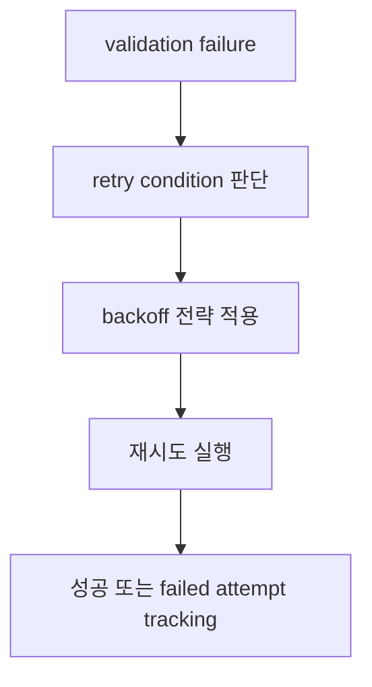

# Instructor Retrying

Instructor의 retrying 문서 요약이다. Tenacity 기반 exponential backoff, error-specific retry, context-based validation retry, failed attempt tracking을 정리한다.

## 구조도

Instructor의 retry는 단순 재호출이 아니라, 어떤 오류를 어떤 조건에서 얼마나 다시 시도할지 정책으로 다뤄진다.

## 핵심 구조

- 문서는 Tenacity 기반 기본 retry, error-specific retries, custom retry conditions, context-based validation with retries, logging/monitoring, failed attempts tracking을 다룬다.
- 즉 retry는 단순 편의 기능이 아니라 validation과 결합된 reliability layer다.
- failed attempts tracking이 포함된 점은 운영 가시성을 중시한다는 뜻이다.

## 왜 중요한가

- structured output 실패를 수동으로 감싸기보다, retry policy를 별도 개념으로 두는 것이 production에 훨씬 유리하다.
- 특히 어떤 오류는 재시도 가치가 있지만 어떤 오류는 즉시 실패해야 한다는 구분이 중요하다.
- Instructor는 이 구분을 lightweight하게 제공하는 방향으로 읽힌다.

## 실무 관점

- retry는 validation과 함께 설계하지 않으면 비용만 늘릴 수 있다.
- logging/monitoring과 failed attempt tracking을 꼭 같이 붙여야 실제 운영에서 조정이 가능하다.
- 이 문서는 [[instructor-validation|Instructor Validation]]과 함께 봐야 의미가 커진다.

## 관련 문서

- [[instructor|Instructor]]
- [[instructor-validation|Instructor Validation]]
- [[instructor-patching|Instructor Patching]]
