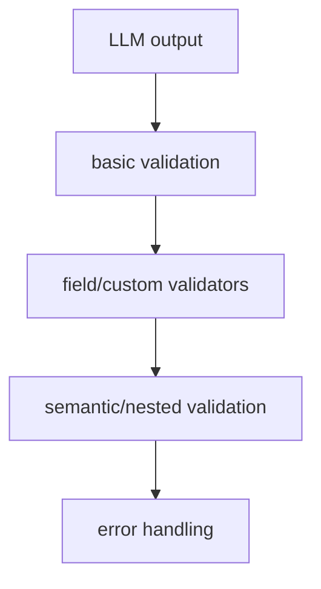

# Instructor Validation

Instructor의 validation 문서 요약이다. field validation, custom validators, semantic validation, nested validation, error handling을 중심으로 정리한다.

## 구조도

Instructor validation은 스키마 일치 여부만 보는 것이 아니라, 의미적 제약과 중첩 구조까지 검증 범위를 넓힌다.

## 핵심 구조

- 문서는 validation flow, basic validation, field/custom validators, pre-validation transformation, semantic/nested validation, error handling을 다룬다.
- 즉 Instructor의 핵심은 “모델이 그럴듯하게 말했다”를 그대로 믿지 않고 검증 흐름을 여러 층으로 두는 데 있다.
- semantic validation이 별도 항목이라는 점은 단순 타입 체크를 넘어선다는 의미다.

## 왜 중요한가

- 구조화 출력의 실제 실패는 JSON 문법보다 의미적 부정확성에서 더 자주 발생한다.
- Instructor가 validation을 중심 기능으로 전면화하는 이유도 여기에 있다.
- 이는 lightweight한 도구라도 운영 품질을 높이는 핵심 지점이 validation임을 보여 준다.

## 실무 관점

- 단순 extraction에서는 field validation만으로 충분할 수 있지만, 실제 제품 데이터는 semantic validation이 필요할 때가 많다.
- 에러 처리 전략까지 같이 설계해야 retry와 연결했을 때 폭주를 막을 수 있다.
- 이 문서는 [[instructor-retrying|Instructor Retrying]]과 짝으로 읽어야 한다.

## 관련 문서

- [[instructor|Instructor]]
- [[instructor-overview|Instructor Overview]]
- [[instructor-retrying|Instructor Retrying]]
