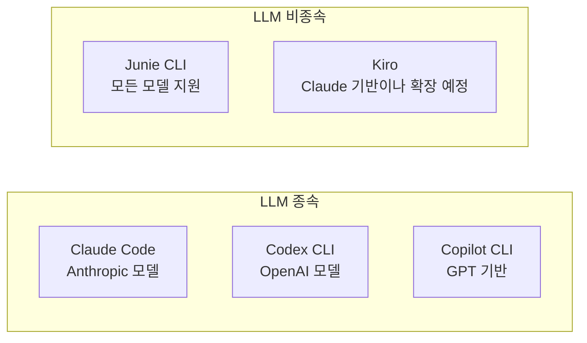

## 개요

Junie CLI는 JetBrains가 개발한 LLM-agnostic 코딩 에이전트다. OpenAI, Anthropic, Google, Grok 등 주요 LLM 프로바이더의 상위 모델을 자유롭게 선택하여 사용할 수 있다. 터미널, JetBrains IDE, CI/CD 파이프라인, GitHub/GitLab에서 실행되며, JetBrains IDE의 코드 인텔리전스(타입 분석, 리팩토링 엔진, 린터 등)를 에이전트가 직접 활용하는 것이 핵심 차별점이다.

2026년 3월 베타로 출시되었으며, 단순한 터미널 AI가 아닌 "깊은 프로젝트 컨텍스트, 구조화된 이해, 워크플로 인식"을 결합한 독립 에이전트를 지향한다. BYOK(Bring Your Own Key) 모델을 채택하여 사용자가 자체 API 키를 제공하면 별도 플랫폼 비용 없이 사용 가능하다. [[coding-agent|코딩 에이전트]] 생태계에서 IDE 인텔리전스를 가장 깊이 활용하는 접근이며, [[how-coding-agents-work|코딩 에이전트 동작 원리]] 중 리팩토링 엔진과 PSI 트리 통합이 핵심 차별점이다.

## 핵심 특징

### LLM-Agnostic 설계

- 특정 LLM에 종속되지 않으며 새로운 모델 출시 시 빠르게 통합
- 사용자가 작업 특성에 따라 최적의 모델을 선택 가능
- Claude, GPT, Gemini 등을 동일한 워크플로에서 전환
- 베타 출시 시 Gemini 3 Flash 1주일 무료 접근 제공

### 코드베이스 인텔리전스

JetBrains IDE가 보유한 수십 년의 코드 분석 기술을 에이전트에 제공:

- **타입 시스템 이해**: 정적 분석 기반의 정확한 코드 수정
- **리팩토링 엔진**: IDE의 시맨틱 인덱스를 활용하여 모든 사용처를 추적하고 스코프와 오버로드를 정확히 처리. 텍스트 기반 검색으로는 오류가 발생하는 리팩토링을 안전하게 수행
- **프로젝트 구조 인식**: 모듈 의존성, 빌드 설정 자동 파악. 커스텀 빌드 명령어, 비표준 테스트 러너, 크로스 컴파일 타겟까지 처리
- **컨텍스트 인식**: 현재 열린 파일, 선택된 코드, 최근 빌드 결과를 인식하여 전체 리포지토리를 스캔하지 않고 효율적으로 작업
- **유의어 인식 검색(synonym-aware search)**: IDE 인덱스를 통해 파일을 한 줄씩 읽지 않고도 프로젝트 구조를 파악

### 실시간 프롬프팅

에이전트 실행 중에도 지시사항을 조정하고 세부사항을 추가할 수 있다. 과정을 재시작하지 않고 결과를 실시간으로 정제한다.

### MCP 통합

인기 MCP 서버를 몇 번의 클릭으로 설치할 수 있으며, 수동 JSON 설정이 필요 없다. 에이전트가 작업 중 MCP 서버가 도움이 될 상황을 자동 감지하고 관련 MCP 옵션을 추천한다.

### 테스트 우선 검증

네이티브 IDE 테스트 러너에 직접 접근하여 테스트 명령어를 추측하지 않고 사전 구성된 테스트 환경을 활용한다. 모노레포처럼 복잡한 설정에서 특히 유용하다. 초기 사용자 평가에 따르면 "Junie가 완료됐다고 하면 코드가 실제로 동작한다"는 피드백이 일반적이다.

### 동작 모드

- **Code 모드**: 자율적 계획 수립 후 코드를 직접 작성/수정/실행
- **Ask 모드**: 대화형으로 질문에 답변하며 가이드 제공

## 기술 상세

### 실행 환경

| 환경 | 지원 방식 |
|------|----------|
| 터미널 | `junie` CLI 명령어 |
| JetBrains IDE | 내장 플러그인 (Beta) |
| CI/CD | 파이프라인 스텝으로 통합 |
| GitHub/GitLab | PR 리뷰, 이슈 처리 |

IDE 연결은 자동 감지되며 JetBrains AI 구독자는 별도 설정 없이 사용 가능하다. [[mcp-architecture|MCP]]를 통한 외부 도구 연결도 수동 JSON 설정 없이 가능하다. Android Studio 지원이 곧 추가될 예정이다.

### 가격 구조

| 플랜 | 가격 | 크레딧 |
|------|------|--------|
| AI Pro | $100/user/year | 10 크레딧/30일 |
| AI Ultimate | $300/user/year | 35 크레딧/30일 |
| AI Enterprise | $720/user/year | SSO 포함 |
| BYOK | 무료 (API 비용만 부담) | - |

### 지원 언어

Java, Kotlin, Python, PHP를 주력으로 지원하며, JetBrains IDE가 지원하는 모든 언어로 확장 가능하다.

### 경쟁 도구 비교

### IDE 인텔리전스 활용 계층

다른 터미널 코딩 에이전트가 LSP(Language Server Protocol)만 사용하는 반면, Junie는 JetBrains의 PSI(Program Structure Interface) 트리, 의도 액션, 인스펙션 엔진까지 에이전트에 노출한다. 이를 통해 단순 코드 생성을 넘어 IDE 수준의 코드 이해와 변환이 가능하다.

### 원클릭 마이그레이션

Claude Code, Codex 등 다른 코딩 에이전트에서 Junie CLI로의 전환을 간소화하는 "원클릭 마이그레이션" 기능을 제공한다. 기존 에이전트의 설정과 워크플로를 분석하여 Junie 환경으로 자동 변환한다.

### 주요 한계

- JetBrains IDE 또는 CLI 환경에서만 동작 (VS Code 미지원)
- 유료 JetBrains IDE 에디션 필요 (IDE 연동 시)
- 복잡한 태스크에서 간헐적으로 인간 개입이 필요
- 다른 에이전트(Claude Code, Codex) 대비 생태계가 아직 초기
- AI 전용 Gemini 모델은 무료 제공 기간 이후 별도 API 키 필요

## 관련 문서

- [[claude-code]] - Anthropic 터미널 코딩 에이전트
- [[codex-cli]] - OpenAI 터미널 코딩 에이전트
- [[copilot-fleet]] - GitHub Copilot 병렬 에이전트
- [[model-context-protocol]] - MCP 통합
