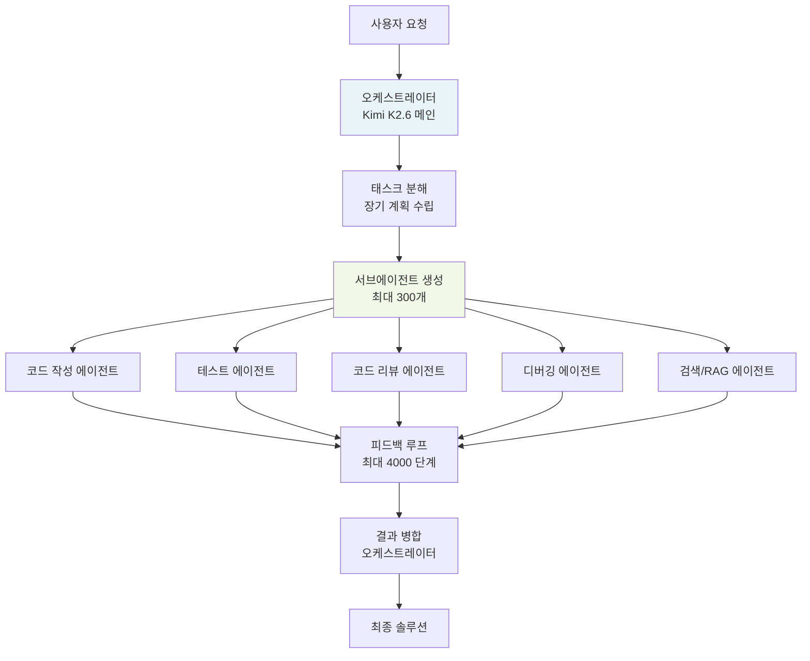
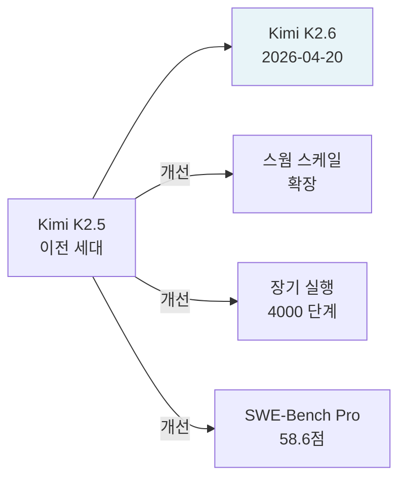

# Kimi K2.6 - 300개 서브에이전트 스웜 기반 장기 자율 코딩 모델

Kimi K2.6은 2026년 4월 20일 중국 Moonshot AI가 공개한 오픈웨이트 LLM이다. 1조(1T) 파라미터 MoE(Mixture of Experts) 아키텍처를 기반으로, 최대 300개 서브에이전트와 4,000 단계의 협업을 지원하는 **에이전트 스웜(agent swarm)** 아키텍처가 핵심 특징이다. SWE-Bench Pro에서 58.6점을 기록해 GPT-5.4(57.7)와 Claude Opus 4.6(53.4)을 상회했다.

## 개요

| 항목 | 내용 |
|------|------|
| 출시일 | 2026년 4월 20일 |
| 개발사 | Moonshot AI (中文: 月之暗面) |
| 아키텍처 | 1T 파라미터 MoE |
| 최대 서브에이전트 | 300개 |
| 최대 협업 단계 | 4,000 steps |
| SWE-Bench Pro | 58.6점 |
| 허깅페이스 | `moonshotai/Kimi-K2.6` |

## 에이전트 스웜 아키텍처

Kimi K2.6의 가장 독창적 특징은 단일 모델이 아니라 **에이전트 스웜(agent swarm)** 으로 작동한다는 점이다. 오케스트레이터 에이전트가 최대 300개의 전문화된 서브에이전트를 동적으로 생성하고 조율한다.



위 다이어그램은 K2.6의 스웜 아키텍처 전체 흐름을 나타낸다. 오케스트레이터가 태스크를 분해하면 역할별 서브에이전트들이 병렬 또는 순차로 실행되고, 피드백 루프를 통해 최대 4,000 단계까지 자율적으로 문제를 해결한다.

## 핵심 특징

### 1. 장기 자율 실행 (Long-Horizon Execution)

일반 LLM 에이전트가 수십 단계에서 한계에 도달하는 것과 달리, K2.6은 4,000 단계의 협업 실행을 지원한다. 이를 통해:
- 대규모 리팩토링 프로젝트 자율 수행
- 멀티-파일 버그 추적 및 수정
- 새로운 기능 설계부터 테스트까지 완전 자동화

이는 [[long-horizon-reasoning]] 능력의 실용적 구현이다.

### 2. 스웜 스케일링

300개 서브에이전트는 단순히 병렬 실행이 아니라 **역할 분담 전문화**를 구현한다. 각 서브에이전트는 코드 작성, 테스트 생성, 리뷰, 검색 등 전문 역할을 수행하며, 오케스트레이터가 전체 진행 상태를 추적하고 조율한다.

이는 [[swarm-openai-handoffs]] 및 [[metagpt-software-agent]] 등 소프트웨어 에이전트 멀티에이전트 접근법의 확장이다.

### 3. SWE-Bench Pro 1위권

SWE-Bench Pro(소프트웨어 엔지니어링 벤치마크)에서 58.6점을 기록해 출시 시점 기준으로:
- GPT-5.4: 57.7점 (상회)
- Claude Opus 4.6: 53.4점 (상회)

이는 실제 깃허브 이슈를 자율로 해결하는 능력을 측정하는 지표다.

## K2.5 → K2.6 진화

[[kimi-k2-5]]에서 K2.6으로의 주요 발전:



K2.6은 K2.5 대비 서브에이전트 스케일링 상한 확장, 장기 실행 안정성 개선, 코딩 특화 벤치마크 성능 향상에 집중했다.

## 1T MoE 기반 모델 구조

K2.6은 1조(1T) 파라미터 [[mixture-of-experts]] 아키텍처를 사용한다. 활성 파라미터 수는 공개되지 않았으나, 동급 MoE 모델들의 관례(전체의 약 3-10%)를 참고하면 30-100B 수준으로 추정된다 [교차검증 필요]. 

MoE 구조는 에이전트 스웜과 시너지를 낸다:
- 대용량 지식 저장으로 다양한 코딩 패턴 내재화
- 추론 시 효율적 파라미터 활성화로 300개 병렬 에이전트 운용 가능

## 실무 활용 시나리오

### 대규모 코드베이스 리팩토링

```python
# Kimi K2.6 에이전트 스웜 활용 (개략적 패턴)
import httpx

client = httpx.Client(base_url="https://api.moonshot.cn/v1")

response = client.post("/chat/completions", json={
    "model": "kimi-k2.6",
    "messages": [
        {
            "role": "user",
            "content": (
                "이 Python 모노레포 전체를 Python 3.12 + async/await 패턴으로 "
                "마이그레이션하고, 테스트 커버리지 80% 이상을 달성해줘. "
                "각 모듈별로 서브에이전트를 배정해서 병렬 처리해줘."
            )
        }
    ],
    "max_tokens": 8192,
})
```

### SWE-Bench 타입 이슈 해결

K2.6의 핵심 용도는 실제 GitHub 이슈를 다음 흐름으로 자율 해결하는 것이다:

1. 이슈 분석 및 재현 코드 작성
2. 원인 추적 (디버깅 에이전트)
3. 수정 코드 작성 (코딩 에이전트)
4. 테스트 추가 (테스트 에이전트)
5. PR 초안 생성

## 경쟁 모델 비교

| 모델 | SWE-Bench Pro | 서브에이전트 | 최대 단계 |
|------|--------------|-------------|----------|
| Kimi K2.6 | 58.6 | 300개 | 4,000 |
| GPT-5.4 | 57.7 | 미공개 | 미공개 |
| Claude Opus 4.6 | 53.4 | 미공개 | 미공개 |
| DeepSeek V4 Pro | 미공개 | - | - |

## 왜 중요한가

K2.6은 "단일 모델 vs 멀티에이전트 시스템" 논쟁에서 **단일 오픈웨이트 모델이 대규모 에이전트 스웜을 내장**할 수 있다는 새 방향을 제시한다.

1. **소프트웨어 엔지니어링 자동화**: SWE-Bench Pro 1위는 실제 개발 업무 자동화 가능성을 시사
2. **스웜 스케일링 법칙**: 300개 에이전트, 4,000 단계라는 수치는 미래 자율 소프트웨어 개발의 기준점이 됨
3. **오픈웨이트 경쟁력**: 독점 모델을 성능으로 추월하는 오픈웨이트 에이전트 모델의 등장

## 관련 문서

- [[kimi-k2-5]] - 전 세대 Kimi K2 모델
- [[swarm-openai-handoffs]] - 에이전트 스웜 핸드오프 개념
- [[metagpt-software-agent]] - 소프트웨어 에이전트 멀티에이전트 패턴
- [[mixture-of-experts]] - MoE 아키텍처 개념
- [[deepseek-v4-pro]] - 동시기 경쟁 오픈웨이트 대형 MoE
- [[long-horizon-reasoning]] - 장기 추론 능력 개념
