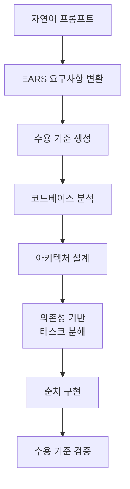

## 개요

Kiro는 Amazon이 지원하는 스펙 드리븐(spec-driven) AI IDE이다. 코드 작성 전에 요구사항, 설계, 태스크 분해 사양서를 자동으로 생성한 뒤 이 스펙을 기반으로 구현을 진행하는 접근 방식을 취한다. 일반적인 코딩 에이전트가 프롬프트에서 곧바로 코드를 생성하는 것과 달리, Kiro는 자연어 프롬프트를 EARS(Easy Approach to Requirements Syntax) 표기법의 명확한 요구사항으로 먼저 변환한다.

이 접근은 바이브 코딩의 "프롬프트 즉시 코드" 방식이 프로덕션 품질 소프트웨어에 부족하다는 인식에서 출발한다. [[spec-driven-development|스펙 드리븐 개발]] 패러다임의 실용적 구현이며, [[coding-agent|코딩 에이전트]] 생태계에서 요구사항 명세를 자동화하는 접근으로 차별화된다.

## 핵심 특징

### 스펙 드리븐 개발 3단계

1. **요구사항 (Requirements)**: 자연어를 EARS 표기법의 구조화된 요구사항과 수용 기준으로 변환
2. **아키텍처 (Design)**: 코드베이스를 분석하여 시스템 설계와 기술 스택을 제시
3. **작업 계획 (Tasks)**: 의존성 기반으로 순서화된 구현 작업 목록 생성

### 에이전트 훅 (Agent Hooks)

파일 저장, 커밋 등 이벤트를 트리거로 자동화 작업을 수행한다. 사전 정의된 프롬프트를 통해 에이전트가 백그라운드에서 자율적으로 실행하며, 주요 활용 사례:

- 파일 저장 시 자동 린팅 및 포매팅
- README/문서 자동 갱신
- 유닛 테스트 자동 생성 및 실행
- 성능 최적화 분석

### 스티어링 파일 (Steering Files)

프로젝트 수준 또는 글로벌 설정으로 코딩 표준, 선호 워크플로우, 도구 설정을 에이전트에 주입한다. 간단한 명령어로 맥락, 코딩 컨벤션, 워크플로우 규칙을 정의할 수 있어 팀 전체의 일관된 개발 스타일을 보장한다.

### MCP 통합

Model Context Protocol을 통해 외부 문서, 데이터베이스, API를 IDE에 연결할 수 있다. 원격 설정도 지원하여 팀 공유 MCP 구성이 가능하다.

### 개발 모드

- **Autopilot**: 대규모 태스크를 단계별 가이드 없이 자율 실행. 스크립트와 명령어에 대한 사용자 제어는 유지
- **Vibe Coding**: 기존 대화형 코딩 방식. 빠른 프로토타이핑에 적합

## 기술 상세

### 동작 흐름

### 주요 사양

| 항목 | 내용 |
|------|------|
| 지원 모델 | Claude Sonnet 4.5, Auto 모드 (프론티어 모델 혼합 + 의도 감지 + 캐싱) |
| 플랫폼 | macOS, Linux, Windows (CLI + SSH 원격 지원) |
| 인증 | AWS Builder ID, IAM Identity Center (AWS 계정 불필요) |
| 라이선스 | 크레딧 기반 과금, 프리 티어 포함 |
| 소스코드 | https://github.com/kirodotdev/Kiro |
| 멀티모달 | 이미지 입력 지원 (채팅) |
| VS Code 호환 | 플러그인/테마/설정 임포트 |

### 지원 언어

Python, Java, JavaScript, TypeScript, C#, Go, Rust, PHP, Ruby, Kotlin, C++, Shell, SQL, Scala, JSON, YAML, HCL

### 추가 기능

- 지능형 에러 진단: 문법/타입/시맨틱 에러를 계층적으로 분석
- Git 커밋 메시지 자동 생성
- 코드 diff 시각화 및 승인 워크플로우
- 실시간 크레딧 사용량 추적

### 바이브 코딩과의 차별점

Kiro는 스스로를 [[vibe-coding]] 방식의 대안으로 포지셔닝한다. 바이브 코딩이 빠른 프로토타이핑에 적합하다면, Kiro는 프로덕션 소프트웨어에 필요한 명시적 요구사항, 설계 문서, 테스트 가능한 수용 기준을 자동 생성함으로써 체계적 개발을 지향한다.

| 비교 항목 | Vibe Coding | Kiro Spec-Driven |
|-----------|-------------|------------------|
| 진입점 | 프롬프트 -> 즉시 코드 | 프롬프트 -> 요구사항 -> 설계 -> 구현 |
| 산출물 | 코드만 | 스펙 문서 + 수용 기준 + 코드 |
| 적합 단계 | 프로토타이핑 | 프로덕션 개발 |
| 테스트 | 수동/선택적 | 수용 기준 기반 자동 검증 |
| 문서 | 별도 작성 | 스펙에서 자동 생성 |

## EARS 표기법 상세

EARS(Easy Approach to Requirements Syntax)는 자연어 요구사항의 모호성을 줄이기 위한 구조화된 표기법이다. Kiro는 사용자의 자연어 프롬프트를 다음과 같은 EARS 패턴으로 자동 변환한다:

| EARS 패턴 | 구조 | 예시 |
|-----------|------|------|
| Ubiquitous | "The [system] shall [action]" | "시스템은 모든 입력을 로깅해야 한다" |
| Event-Driven | "When [trigger], the [system] shall [action]" | "파일 저장 시 자동 포매팅을 실행한다" |
| State-Driven | "While [condition], the [system] shall [action]" | "오프라인 상태에서 로컬 캐시를 사용한다" |
| Unwanted Behavior | "If [condition], then the [system] shall [action]" | "인증 실패 시 재시도를 3회로 제한한다" |
| Optional Feature | "Where [feature], the [system] shall [action]" | "다크 모드 지원 시 색상 토큰을 전환한다" |

각 요구사항에는 테스트 가능한 수용 기준(acceptance criteria)이 자동으로 생성되어 구현 완료 여부를 객관적으로 검증할 수 있다. 이 방식은 특히 팀 규모가 커질수록 요구사항 해석의 일관성을 유지하는 데 효과적이다.

## 관련 문서

- [[claude-code]] - 터미널 기반 코딩 에이전트
- [[codex-cli]] - OpenAI 터미널 코딩 에이전트
- [[augment-intent]] - 에이전트 오케스트레이션 워크스페이스
- [[vibe-coding-platforms]] - 바이브 코딩 플랫폼 비교
