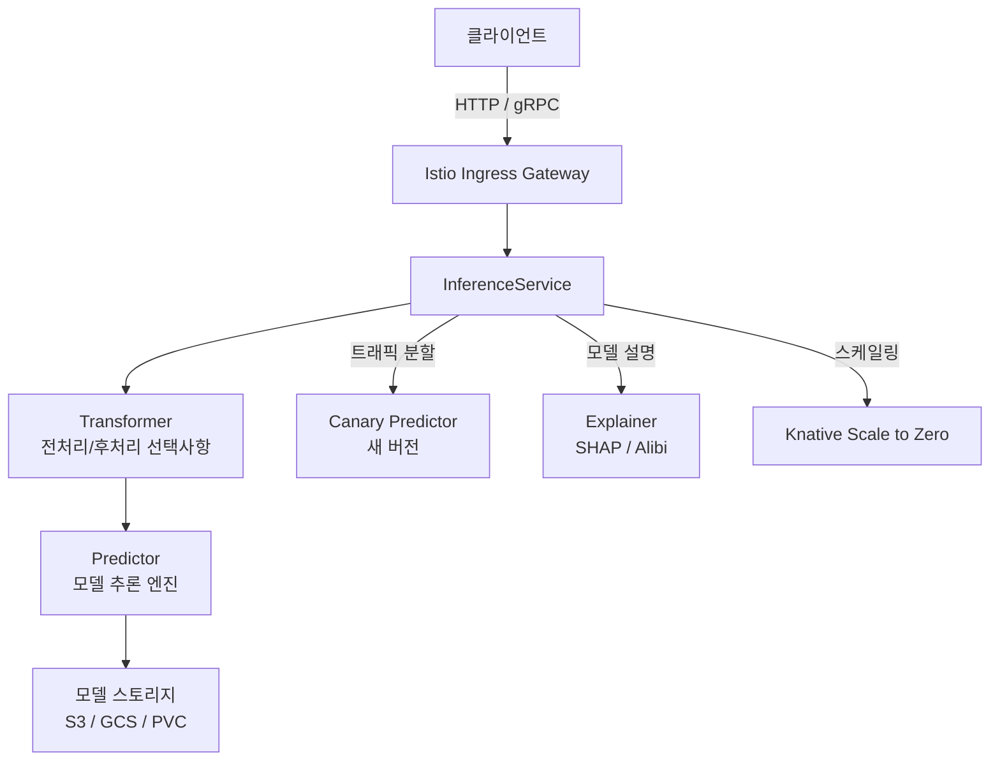

# KServe

KServe(구 KFServing)는 Kubernetes 위에서 ML 모델을 서빙하기 위한 오픈소스 플랫폼이다. Knative와 Istio를 기반으로 서버리스 추론, 트래픽 분할(A/B 테스트, 카나리 배포), 자동 스케일링, 멀티 프레임워크 지원을 제공한다. CNCF(Cloud Native Computing Foundation) 인큐베이팅 프로젝트다.

## 핵심 기능

- **멀티 프레임워크 지원**: TensorFlow, PyTorch, XGBoost, scikit-learn, ONNX, Hugging Face 트랜스포머 등
- **서버리스 추론**: Knative 기반으로 요청이 없을 때 파드를 0으로 스케일 다운
- **트래픽 분할**: Istio 기반으로 여러 모델 버전 간 트래픽 비율 제어 (A/B 테스트, 카나리 배포)
- **파이프라인**: 전처리(transformer) - 추론 - 후처리를 단일 InferenceService로 구성
- **모델 설명 가능성**: SHAP, Alibi 기반 설명 서버 내장

## 아키텍처



InferenceService가 KServe의 핵심 CRD(Custom Resource Definition)이며, Predictor, Transformer, Explainer 세 컴포넌트를 조합한다.

## InferenceService 배포 예시

```yaml
apiVersion: serving.kserve.io/v1beta1
kind: InferenceService
metadata:
  name: sklearn-iris
spec:
  predictor:
    sklearn:
      storageUri: s3://my-models/sklearn/iris
      resources:
        limits:
          cpu: "1"
          memory: 2Gi
```

```bash
kubectl apply -f sklearn-iris.yaml
kubectl get inferenceservice sklearn-iris
# NAME          URL                                     READY
# sklearn-iris  http://sklearn-iris.default.example.com  True
```

## 카나리 배포 (트래픽 분할)

```yaml
apiVersion: serving.kserve.io/v1beta1
kind: InferenceService
metadata:
  name: recommendation-model
spec:
  predictor:
    canaryTrafficPercent: 20        # 새 버전에 20% 트래픽
    model:
      modelFormat:
        name: pytorch
      storageUri: s3://models/rec-v2
  predictor:   # 기본(stable) 버전
    model:
      modelFormat:
        name: pytorch
      storageUri: s3://models/rec-v1
```

트래픽 비율을 점진적으로 높여가며 새 모델의 안정성을 검증한 뒤 완전 전환한다.

## ModelMesh 모드

다수의 소형 모델을 효율적으로 서빙하기 위한 멀티 모델 서빙 모드다. 단일 파드에 여러 모델을 동적으로 로드/언로드하며, 모델 수가 수백~수천 개일 때 파드 오버헤드를 줄인다.

```yaml
apiVersion: serving.kserve.io/v1alpha1
kind: ServingRuntime
metadata:
  name: mlserver-sklearn
spec:
  supportedModelFormats:
    - name: sklearn
      version: "1"
  containers:
    - name: mlserver
      image: docker.io/seldonio/mlserver:1.3.5
```

## 추론 프로토콜

KServe는 Open Inference Protocol(V2 Inference Protocol)을 표준 인터페이스로 지원한다. Triton Inference Server와 동일한 프로토콜이어서 클라이언트 코드 변경 없이 백엔드를 전환할 수 있다.

```python
import requests

payload = {
    "inputs": [{
        "name": "input-0",
        "shape": [1, 4],
        "datatype": "FP32",
        "data": [[5.1, 3.5, 1.4, 0.2]]
    }]
}

response = requests.post(
    "http://sklearn-iris.default.example.com/v2/models/sklearn-iris/infer",
    json=payload
)
```

## KServe vs Seldon Core 비교

| 기준 | KServe | [[seldon-core]] |
|------|--------|----------|
| 기반 | Knative + Istio | Istio (Knative 선택) |
| Scale to Zero | 기본 지원 | 추가 설정 필요 |
| 멀티 모델 서빙 | ModelMesh | MLServer 기반 |
| 설명 가능성 | Alibi 내장 | Alibi 내장 |
| 엔터프라이즈 지원 | 없음 | Seldon Enterprise (유료) |
| 커뮤니티 | CNCF 인큐베이팅 | 독립 |

## 관련 문서

- [[model-serving]] - KServe가 구현하는 모델 서빙 개념과 패턴
- [[kubernetes-for-ml]] - KServe가 의존하는 Kubernetes ML 인프라
- [[seldon-core]] - Kubernetes 기반 유사 모델 서빙 플랫폼
