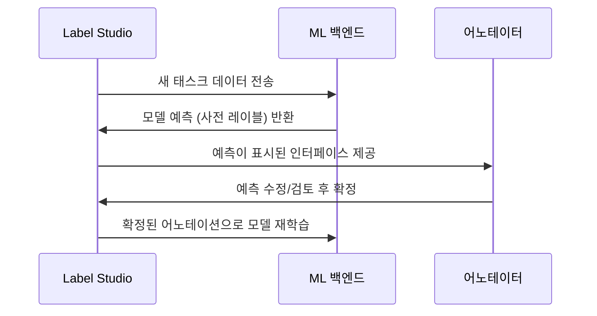

# Label Studio

HumanSignal이 개발하고 오픈소스로 공개한 다중 모달 데이터 어노테이션 플랫폼. 텍스트, 이미지, 오디오, 비디오, 시계열 등 다양한 데이터 유형에 대한 레이블링 작업을 하나의 인터페이스에서 처리한다. ML 학습 데이터 준비부터 RLHF(인간 피드백 강화학습) 데이터 수집까지 폭넓게 활용된다.

## 개요

| 항목 | 내용 |
|---|---|
| 이름 | Label Studio |
| 개발사 | HumanSignal |
| 라이선스 | Apache 2.0 (Community) |
| 저장소 | github.com/HumanSignal/label-studio |
| 설치 방식 | pip, Docker, Kubernetes |
| 관리형 서비스 | Label Studio Enterprise (유료) |
| 지원 데이터 | 텍스트, 이미지, 오디오, 비디오, HTML, 시계열, 다중 모달 |

## 지원 어노테이션 유형

```mermaid
flowchart TD
    LS[Label Studio] --> Text[텍스트]
    LS --> Image[이미지]
    LS --> Audio[오디오/비디오]
    LS --> Other[기타]

    Text --> NER[개체명 인식\nNamed Entity]
    Text --> Class[텍스트 분류]
    Text --> RLHF[LLM 응답 비교\n랭킹/선호도]
    Text --> QA[질의응답\n스팬 추출]

    Image --> BBox[바운딩 박스]
    Image --> Seg[픽셀 세그멘테이션]
    Image --> KeyPt[키포인트]
    Image --> Poly[폴리곤]

    Audio --> Trans[전사 (Transcription)]
    Audio --> Diar[화자 분리]

    Other --> TS[시계열 레이블링]
    Other --> HTML[HTML/Rich Text]
```

## 핵심 기능

### 레이블링 설정 (Labeling Config)

Label Studio는 XML 기반의 레이블링 설정으로 커스텀 인터페이스를 정의한다.

```xml
<!-- LLM 응답 비교 (RLHF 선호도 데이터 수집) -->
<View>
  <Text name="prompt" value="$prompt"/>
  <Header value="어떤 응답이 더 낫습니까?"/>
  <PairwiseComparison name="comparison"
    toName="response_a,response_b"
    selectionStyle="checkbox"/>
  <Text name="response_a" value="$response_a"/>
  <Text name="response_b" value="$response_b"/>
</View>
```

```xml
<!-- 이미지 객체 탐지 -->
<View>
  <Image name="image" value="$url"/>
  <RectangleLabels name="label" toName="image">
    <Label value="고양이" background="#FF0000"/>
    <Label value="강아지" background="#0000FF"/>
  </RectangleLabels>
</View>
```

### Python SDK 연동

```python
from label_studio_sdk import Client

ls = Client(url="http://localhost:8080", api_key="your-api-key")

# 프로젝트 생성
project = ls.start_project(
    title="LLM 응답 품질 평가",
    label_config="""
    <View>
      <Text name="response" value="$response"/>
      <Rating name="quality" toName="response" maxRating="5" icon="star"/>
    </View>
    """,
)

# 태스크(레이블링 아이템) 임포트
project.import_tasks([
    {"data": {"response": "AI가 생성한 응답 텍스트 1"}},
    {"data": {"response": "AI가 생성한 응답 텍스트 2"}},
])

# 어노테이션 내보내기
annotations = project.export_tasks(export_type="JSON_MIN")
```

## ML 백엔드 통합

Label Studio는 ML 백엔드(ML Backend)를 연결하여 사전 레이블링(pre-labeling)과 능동 학습(active learning)을 지원한다. 모델 예측을 어노테이터에게 제안으로 표시해 생산성을 높인다.



## LLM 파인튜닝 데이터 수집 워크플로우

Label Studio는 [[data-annotation|데이터 어노테이션]] 분야에서 LLM 파인튜닝 데이터를 수집하는 핵심 도구다.

| 단계 | 작업 | Label Studio 역할 |
|---|---|---|
| 1. 데이터 수집 | 프롬프트-응답 쌍 생성 | 레이블링 작업 생성 |
| 2. 품질 평가 | 응답 품질 점수화 | 평가 인터페이스 제공 |
| 3. 선호도 수집 | RLHF 비교 데이터 | PairwiseComparison 컴포넌트 |
| 4. 오류 수정 | 잘못된 응답 교정 | 텍스트 편집 인터페이스 |
| 5. 내보내기 | JSONL, CSV 등 형태로 추출 | 다양한 포맷 내보내기 |

## Label Studio vs Argilla

| 항목 | Label Studio | [[argilla|Argilla]] |
|---|---|---|
| 주요 용도 | 범용 다중 모달 어노테이션 | LLM 데이터 큐레이션 특화 |
| 데이터 유형 | 텍스트, 이미지, 오디오, 비디오 | 주로 텍스트/LLM 출력 |
| UI 복잡도 | 높음 (XML 설정 필요) | 낮음 (LLM 친화적 UI) |
| 통합 | 범용 ML 파이프라인 | HuggingFace 생태계 강점 |
| 라이선스 | Apache 2.0 | Apache 2.0 |
| 강점 | 다양한 태스크 지원 | LLM 피드백 루프 특화 |

## 실무 관점

Label Studio는 **이미지, 오디오, 비디오 등 다중 모달 데이터를 함께 다루는 ML 팀**에 강점을 갖는다. XML 기반 레이블링 설정 때문에 초기 진입 장벽이 있지만, 한 번 습득하면 매우 유연한 커스텀 인터페이스를 만들 수 있다. LLM 파인튜닝 데이터에만 집중한다면 [[argilla|Argilla]]가 더 직관적인 선택이다. 대규모 팀이라면 Enterprise 플랜의 어노테이터 관리, 품질 보증(QA) 워크플로우, 싱글사인온(SSO) 기능을 고려해야 한다.

## 관련 문서

- [[data-annotation|데이터 어노테이션]] - 어노테이션 전략, 품질 관리, 도구 비교
- [[argilla|Argilla]] - LLM 데이터 큐레이션에 특화된 피드백 도구
- [[rag-pipeline|RAG 파이프라인]] - 어노테이션된 데이터를 활용하는 다운스트림 파이프라인
