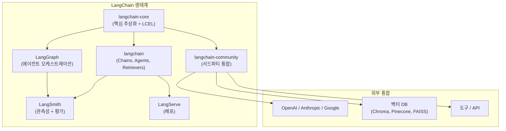
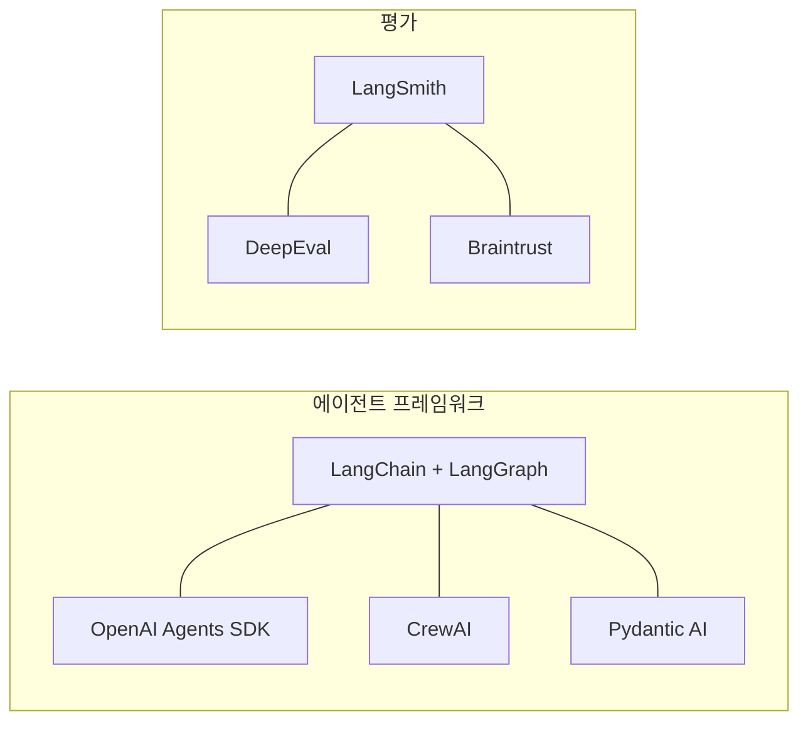

# LangChain

Harrison Chase가 2022년 10월에 시작한 LLM 애플리케이션 빌딩 프레임워크. 초기 버전을 9일 만에 작성했으며, 3년 만에 GitHub 99K+ stars, 1억 3천만+ 다운로드, 12.5억 달러 기업 가치를 달성했다. Python과 JavaScript/TypeScript 모두 지원하며, Fortune 500의 1/3이 LangChain 제품을 사용한다(2025년 말 기준).

## 프로젝트 개요

| 항목 | 내용 |
|---|---|
| 이름 | LangChain |
| 창시자 | Harrison Chase |
| 시작 | 2022년 10월 |
| 언어 | Python, JavaScript/TypeScript |
| 라이선스 | MIT |
| 저장소 | github.com/langchain-ai/langchain |
| GitHub Stars | 99K+ (2026년 4월) |
| 회사 | LangChain, Inc. (기업 가치 12.5억 달러) |
| 슬로건 | "Build context-aware reasoning applications" |

## 생태계 구조

LangChain은 단일 라이브러리가 아니라 상호 연결된 제품군이다.



### 패키지 아키텍처 (v0.3)

LangChain v0.3부터 패키지가 명확히 분리되었다.

- **langchain-core**: 핵심 추상화(ChatModel, Retriever, VectorStore 등)와 LCEL. 다른 모든 패키지의 기반
- **langchain**: Chains, Agents, Memory 등 고수준 구성 요소
- **langchain-community**: 서드파티 통합 (OpenAI, Anthropic, Chroma 등). 개별 통합 패키지(`langchain-openai`, `langchain-anthropic` 등)로 분리 추세
- **[[langgraph|LangGraph]]**: 상태 기반 에이전트 그래프 오케스트레이션. LangChain 생태계의 에이전트 런타임

## 핵심 모듈

### Models (모델)

LLM과 Chat Model을 통합 인터페이스로 감싼다. `invoke()`, `stream()`, `batch()` 등 표준 메서드를 통해 OpenAI, Anthropic, Google, 로컬 모델 등 다양한 프로바이더를 동일한 방식으로 호출한다.

### Prompts (프롬프트)

`ChatPromptTemplate`, `FewShotPromptTemplate` 등으로 프롬프트를 구조화한다. 변수 삽입, 예시 선택, 출력 파서 연결 등을 선언적으로 정의한다.

### Chains (체인)

여러 단계를 순차적으로 연결하는 파이프라인. 프롬프트 -> 모델 -> 출력 파서를 하나의 실행 단위로 묶는다. LCEL 도입 이후 `|` 연산자로 체인을 직관적으로 표현한다.

### Agents (에이전트)

LLM이 도구(Tool)를 선택하고 실행하는 자율적 의사 결정 루프. ReAct 패턴을 기본으로 하며, 도구 호출 결과를 관찰하고 다음 행동을 결정한다. 복잡한 에이전트 워크플로우는 [[langgraph|LangGraph]]로 이관하는 것이 권장 패턴이다.

### Memory (메모리)

대화 히스토리를 관리하는 모듈. `ConversationBufferMemory`, `ConversationSummaryMemory` 등으로 컨텍스트 윈도우 관리 전략을 선택한다.

### Retrievers (검색기)

RAG(Retrieval-Augmented Generation) 파이프라인의 검색 계층. 벡터 스토어, BM25, 앙상블 검색기 등을 통합 인터페이스로 제공한다.

## LCEL (LangChain Expression Language)

LCEL은 LangChain 컴포넌트를 조합하는 선언적 구문이다. `|` (파이프) 연산자로 Runnable 객체를 체이닝하며, 동기/비동기/스트리밍을 단일 정의에서 모두 지원한다.

```python
from langchain_core.prompts import ChatPromptTemplate
from langchain_openai import ChatOpenAI
from langchain_core.output_parsers import StrOutputParser

# LCEL 체인 정의
chain = (
    ChatPromptTemplate.from_template("Explain {topic} simply.")
    | ChatOpenAI(model="gpt-4o")
    | StrOutputParser()
)

# 동기 호출
result = chain.invoke({"topic": "quantum computing"})

# 스트리밍
for chunk in chain.stream({"topic": "quantum computing"}):
    print(chunk, end="")
```

LCEL 체인은 LangSmith에 자동으로 트레이스가 기록되어 관측성을 확보할 수 있다.

## LangGraph: 에이전트 오케스트레이션

[[langgraph|LangGraph]]는 LangChain 생태계에서 에이전트 오케스트레이션을 담당하는 별도 프레임워크다. 노드(Node)와 엣지(Edge)로 구성된 상태 그래프(StateGraph)에서 에이전트 워크플로우를 정의하며, 체크포인트 기반 지속 실행(Durable Execution), Human-in-the-Loop, 분기/병합 등을 지원한다. 2025년 10월 1.0 GA, 2026년 2월 2.0 릴리스를 거치며 프로덕션 에이전트의 de-facto 런타임으로 자리잡았다.

## LangSmith: 관측성과 평가

LangSmith는 LangChain의 상용 관측성 플랫폼이다. LLM 호출 트레이스, 토큰 사용량, 지연시간(P50/P99), 에러율, 비용, 피드백 점수를 커스텀 대시보드로 추적한다. 평가(Evaluation) 기능으로 데이터셋 기반 자동 테스트와 [[llm-as-judge-calibration|LLM-as-Judge]] 평가를 실행하고, 웹훅이나 PagerDuty 연동 알림을 설정할 수 있다.

## 경쟁 구도와 포지셔닝

LangChain은 범용 LLM 프레임워크로 가장 넓은 생태계를 보유하지만, 특정 영역에서 전문 프레임워크와 경쟁한다.



- [[openai-agents-sdk|OpenAI Agents SDK]]: OpenAI 모델에 최적화된 경량 에이전트 SDK. Handoff 패턴 특화
- [[crewai|CrewAI]]: 멀티 에이전트 협업 프레임워크. 역할 기반 에이전트 팀 구성
- [[pydantic-ai|Pydantic AI]]: 타입 안전성 중심의 에이전트 프레임워크. Pydantic 모델로 입출력 검증

LangChain의 차별점은 "풀스택" 접근이다. 모델 추상화부터 RAG, 에이전트, 관측성, 배포까지 한 생태계 안에서 해결할 수 있다. 반면 이 포괄성이 학습 곡선과 복잡도를 높인다는 비판도 있다.

## 관련 문서
- [[langsmith]] -- LangSmith - LLM 애플리케이션 관측 플랫폼

- [[langgraph|LangGraph]] -- 에이전트 오케스트레이션 프레임워크
- [[pydantic-ai|Pydantic AI]] -- 타입 안전 에이전트 프레임워크
- [[openai-agents-sdk|OpenAI Agents SDK]] -- OpenAI의 에이전트 SDK
- [[crewai|CrewAI]] -- 멀티 에이전트 협업 프레임워크
- [[deepeval|DeepEval]] -- LLM 평가 프레임워크
