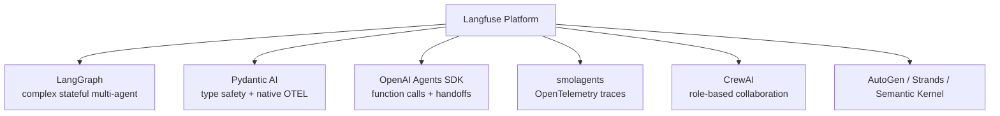
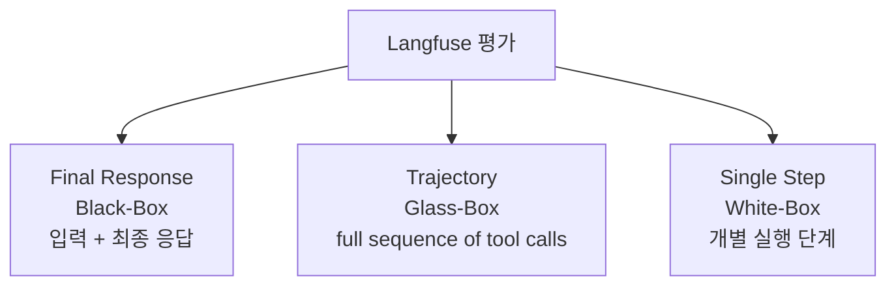

# AI Agent Observability, Tracing & Evaluation with Langfuse

Langfuse 블로그 글의 압축 요약. AI Agent Observability를 정의하고 다양한 프레임워크 통합 + 3가지 평가 전략을 설명.

## 핵심 개념

**AI Agent Observability** = 에이전트의 성능, 행동, 인터랙션을 tracking·analyzing.

- 실시간 LLM 호출 모니터링
- Control flow 추적
- 의사결정 추적
- Output 추적

## 주요 프레임워크 통합

| 프레임워크 | 특징 |
|---|---|
| **LangGraph** | "complex, stateful, multi-agent applications" — 내장 persistence |
| **Pydantic AI** | "type safety and ergonomic developer experience" + native OpenTelemetry instrumentation |
| **OpenAI Agents SDK** | "detailed traces of agent execution, including planning, function calls, and multi-agent handoffs" |
| **smolagents** | "agent interactions are traced using OpenTelemetry" |
| **CrewAI** | "role-based collaboration among multiple agents" |
| 추가 | AutoGen, Strands Agents, Semantic Kernel |

## OpenTelemetry 채택

> "OpenTelemetry as a standard for collecting agent telemetry data, **preventing vendor lock-in**"

업계가 OTEL 표준에 수렴 중. Pydantic AI, smolagents 등이 native 지원.

## 평가 접근법 (3가지 보완 전략)

| 전략 | 시점 | 데이터 |
|---|---|---|
| **Final Response** (Black-Box) | 종료 후 | 사용자 입력 + 최종 응답만 |
| **Trajectory** (Glass-Box) | 종료 후 | "full sequence of tool calls, reasoning steps, and decisions" |
| **Single Step** (White-Box) | 단계별 | 개별 실행 단계 |

3단계 평가 phase: 수동 추적 → 온라인 평가 → 대규모 오프라인 평가.

## 핵심 기능

- 실시간 비용 추적 + 토큰 모니터링
- 사용자 피드백 메커니즘
- LLM-as-a-Judge evaluators
- Benchmark 데이터셋 생성
- 자동화 실험
- 엣지 케이스 식별

## 메모

- 게시일: 2025-03-16 (지속 업데이트)
- Langfuse는 open-source LLM 엔지니어링 플랫폼 (YC W23)
- Self-hostable, ClickHouse 기반 high-volume storage
- 최근 강화: OpenTelemetry-native SDK, full execution tracing 기반 LLM-as-Judge
- vLLM/SGLang multi-tenant 환경에서 강한 선택지로 평가됨

## 관련 문서

- [[langfuse]] — Langfuse entity 페이지
- [[agent-observability]] — Agent Observability 일반
- [[ai-observability-patterns]] — 옵저버빌리티 패턴
- [[opentelemetry-genai-semconv]] — OpenTelemetry GenAI 시맨틱 컨벤션
- [[langchain-agent-frameworks-evolution]] — LangChain 프레임워크 진화 (LangSmith 비교)
- [[pydantic-ai-overview-summary]] — Pydantic AI (네이티브 OTEL 지원)
- [[llm-as-judge]] — LLM-as-Judge 평가
