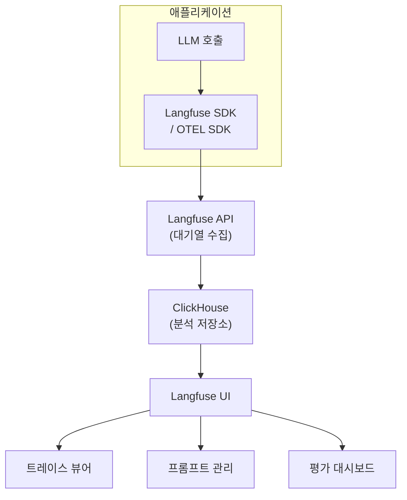

## 개요

Langfuse는 MIT 라이선스의 오픈소스 LLM 옵저버빌리티 플랫폼이다. 트레이싱, 프롬프트 버저닝, 평가, [[opentelemetry-genai-semconv|OpenTelemetry GenAI 시맨틱 컨벤션]] 통합을 핵심 기능으로 제공하며, 셀프호스팅을 일급 시민(First-Class Citizen)으로 지원하여 벤더 락인 없이 운영할 수 있다. 에어갭 환경과 오프라인 배포도 가능하여, 데이터 주권이 중요한 엔터프라이즈에서 선호된다. [[llm-observability-platforms|LLM 옵저버빌리티 플랫폼]] 전체 시장에서 오픈소스 진영의 대표 도구로 평가된다.

## 핵심 특징

### 딥 트레이싱

멀티스텝 에이전트 워크플로우를 위한 3계층 데이터 구조를 제공한다:

- **Trace**: 요청 전체를 기록하는 최상위 단위. 정확한 프롬프트, 모델 응답, 토큰 사용량, 레이턴시, 도구/검색 단계를 캡처
- **Session**: 멀티턴 애플리케이션의 대화 그룹핑
- **Observation**: 트레이스 내 개별 연산 (LLM 호출, 도구 실행 등)

대기열 기반 트레이스 수집(Queued Trace Ingestion)으로 애플리케이션 레이턴시에 영향을 주지 않고 비동기 배치 처리한다. v3부터 ClickHouse 분석 데이터베이스를 도입하여 **수십억 이벤트에서도 서브초(sub-second) 쿼리 성능**을 달성한다.

부가 기능으로 환경 분리(dev/staging/prod), 커스텀 트레이스 ID를 통한 분산 트레이싱, 메타데이터 기반 필터링을 지원한다.

### 프롬프트 관리

프레임워크에 독립적인 프롬프트 버전 관리 시스템을 제공한다. 프롬프트 변경 이력 추적, 버전 간 성능 비교, A/B 테스트가 가능하다. MCP 서버 통합으로 AI 에이전트가 직접 프롬프트 저장소에 접근할 수도 있다.

### 비용 및 토큰 추적

모든 LLM 호출의 토큰 사용량과 비용을 자동으로 추적한다. 모델별, 기간별, 사용자별 비용 분석이 가능하여 FinOps 워크플로우와 직접 연결된다.

### 평가

- **LLM-as-a-Judge**: 커스텀 평가기를 통한 자동 품질 측정
- **원격 평가**: API를 통한 외부 평가 워크플로우 연동
- **인간 평가**: 수동 레이블링과 자동 평가 결합
- **데이터셋 관리**: 평가용 골든 데이터셋 구축 및 실험(experiment) 실행

### OpenTelemetry 네이티브

Java, Go, Rust 등 다양한 언어의 OpenTelemetry SDK와 네이티브 통합되어, 기존 모니터링 인프라에 자연스럽게 편입된다. OTLP 엔드포인트를 직접 지원하여 별도 어댑터 없이 연결 가능하다.

## 기술 상세

### 아키텍처

### 프레임워크 통합

100개 이상의 프레임워크와 통합을 지원한다:

| 프레임워크 | 통합 방식 |
|-----------|----------|
| LangChain / LangGraph | 콜백 핸들러 |
| LlamaIndex | 콜백 핸들러 |
| CrewAI | 네이티브 통합 |
| OpenAI SDK | 래퍼 함수 |
| Vercel AI SDK | 미들웨어 |
| 기타 | OpenTelemetry 스팬 |

### 셀프호스팅

셀프호스팅이 클라우드 버전과 동일한 기능을 제공하는 것이 Langfuse의 핵심 차별점이다:
- Docker Compose 또는 Kubernetes로 배포
- 에어갭/오프라인 환경 지원
- 클라우드 대비 기능 제한 없음

### 과금 구조

- **오픈소스**: 무료 셀프호스팅
- **클라우드**: $29/월 시작, 단위 기반 예측 가능한 과금
- 다차원 과금(요청 수 + 트레이스 수 + 사용자 수)을 사용하는 경쟁사 대비 단순한 구조

### Braintrust와의 비교

| 항목 | Langfuse | [[braintrust]] |
|------|----------|----------------|
| 라이선스 | MIT 오픈소스 | 프로프라이어터리 |
| 셀프호스팅 | 완전 기능 동등 (에어갭 지원) | 엔터프라이즈만 (하이브리드: 데이터 플레인 VPC, 컨트롤 플레인 관리형) |
| 분석 엔진 | ClickHouse (v3, 서브초 쿼리) | Brainstore (스트리밍 Rust + 오브젝트 스토리지) |
| 통합 철학 | OpenTelemetry 네이티브 SDK | `wrapOpenAI` SDK + AI 프록시 게이트웨이 |
| 핵심 강점 | 유연성, 벤더 독립, 100+ 통합 | 평가 중심 철학, 사이드바이사이드 프롬프트 비교 |
| 과금 시작 | $29/월 (50k 무료 유닛), 오버리지 $8/100k 유닛 | $249/월 (데이터량+스코어+보존 별도 과금) |
| API 접근 | Full CRUD API-first, CSV/JSON/S3 내보내기 | BTQL/SQL 독자 쿼리 언어 |
| 프롬프트 관리 | 프레임워크 독립 + MCP 서버 | 평가 중심 플레이그라운드 통합 |
| 보안 인증 | SOC 2 Type II, ISO 27001, HIPAA | SOC 2 Type II, HIPAA |
| OTEL 지원 | 네이티브 | 스팬 변환 |

## 관련 문서
- [[helicone]] -- Helicone (LLM API 프록시 & 비용 추적)

- [[braintrust]] - AI 옵저버빌리티 (경쟁 도구)
- [[portkey]] - AI 게이트웨이 (옵저버빌리티 기능 포함)
- [[ai-agent-guardrails]] - 에이전트 가드레일 (모니터링 연계)
- [[litellm]] - LLM 프록시 (Langfuse 연동 지원)
