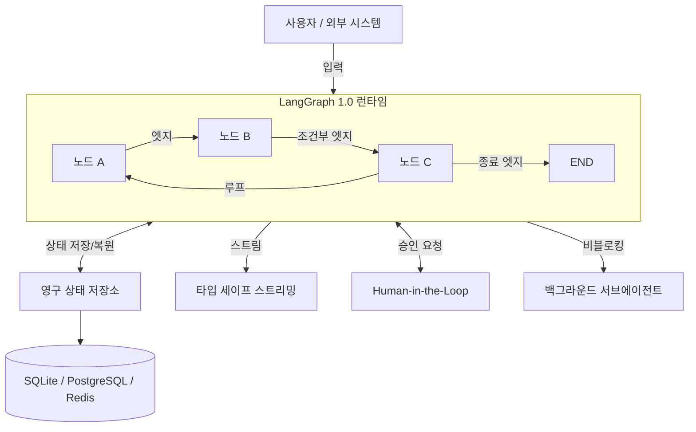

# LangGraph 1.0 GA - 영구 상태 저장 및 Human-in-the-Loop API 공식화

LangGraph 1.0과 LangChain 1.0이 동시에 첫 메이저 버전으로 GA(General Availability) 됐다. LangGraph는 상태 그래프(state graph) 기반 에이전트 오케스트레이션 프레임워크로, 1.0 버전에서는 영구 상태(persistence), human-in-the-loop, 타입 세이프 스트리밍이 일급(first-class) API로 승격됐다.

## 아키텍처 개요



LangGraph 1.0의 핵심 런타임은 상태 그래프 실행, 영구 저장, 사람 개입, 스트리밍 네 가지 관심사를 명확히 분리한다.

## 핵심 변경사항

### 1. 영구 상태 자동 저장 (Built-in Persistence)

기존에는 체크포인터(checkpointer)를 수동으로 설정해야 했다. 1.0부터는 체크포인트가 기본 내장된다.

```python
from langgraph.graph import StateGraph, END
from langgraph.checkpoint.sqlite import SqliteSaver
from typing import TypedDict

class AgentState(TypedDict):
    messages: list
    step_count: int

# 1.0 방식 - SQLite 기반 자동 체크포인트
memory = SqliteSaver.from_conn_string(":memory:")

builder = StateGraph(AgentState)
builder.add_node("agent", call_model)
builder.add_node("tools", call_tools)
builder.set_entry_point("agent")

graph = builder.compile(checkpointer=memory)

# thread_id로 대화 세션을 영속화
config = {"configurable": {"thread_id": "session-001"}}
result = graph.invoke({"messages": [HumanMessage("안녕")]}, config=config)

# 동일 thread_id로 재시작하면 이전 상태에서 이어서 실행
result2 = graph.invoke({"messages": [HumanMessage("계속해줘")]}, config=config)
```

체크포인트 백엔드:
- `SqliteSaver` — 로컬 개발, 단일 프로세스 서버
- `PostgresSaver` — 프로덕션 다중 인스턴스 환경
- `RedisSaver` — 고처리량 캐시 기반 환경

### 2. Human-in-the-Loop (HITL) 일급 지원

에이전트 실행 중간에 사람의 승인이나 입력이 필요한 패턴을 `interrupt_before`, `interrupt_after`로 선언적으로 제어한다.

```python
# 특정 노드 실행 전 사람 승인 대기
graph = builder.compile(
    checkpointer=memory,
    interrupt_before=["tool_call_node"],  # 도구 호출 전 인터럽트
)

# 첫 실행 — tool_call_node 직전에서 일시 중단
result = graph.invoke(input, config)
# result["__interrupt__"] 에 현재 상태 포함

# 사람이 검토 후 재개
human_approval = "승인"
graph.update_state(config, {"approval": human_approval})
final = graph.invoke(None, config)  # None 입력으로 재개
```

이 패턴은 [[agent-state-machine]] 개념과 직결된다 — 그래프가 "승인 대기" 상태(state)로 전환되고, 사람의 입력이 이벤트(event)가 되어 다음 상태로 전이된다.

### 3. 타입 세이프 스트리밍 (v2 옵션)

스트리밍 이벤트 포맷이 명확히 구조화됐다.

```python
# v2 스트리밍 모드
for event in graph.stream(input, config, stream_mode="values"):
    # 각 이벤트는 TypedDict 기반 구조
    print(event)  # {"messages": [...], "step_count": 3}

# 이벤트 타입별 필터링
for event in graph.stream(input, config, stream_mode="updates"):
    for node_name, node_output in event.items():
        print(f"[{node_name}]: {node_output}")
```

v1의 스트리밍은 딕셔너리 키가 문서화되지 않아 파싱이 불안정했다. v2 모드에서는 `values`, `updates`, `debug` 세 가지 모드가 명확히 정의됐다.

### 4. 비블로킹 백그라운드 서브에이전트 태스크

서브에이전트를 백그라운드 태스크로 실행하고, 부모 그래프가 그 결과를 나중에 수집하는 패턴이 공식 API로 지원된다.

```python
from langgraph.prebuilt import create_react_agent
from langgraph.types import Background

# 백그라운드로 서브에이전트 실행
async def orchestrator_node(state, config):
    task = await Background.spawn(
        agent_graph.ainvoke,
        {"task": state["subtask"]},
        config=config
    )
    return {"background_task_id": task.task_id}

# 나중에 결과 수집
async def collector_node(state, config):
    result = await Background.await_task(state["background_task_id"])
    return {"result": result}
```

## LangChain 1.0과의 관계

LangGraph 1.0과 동시에 LangChain 1.0도 GA됐다. 패키지 구조가 재정비됐다:

| 기존 위치 | 1.0 위치 |
|-----------|----------|
| `langgraph.prebuilt.create_react_agent` | `langchain.agents.create_react_agent` |
| `langgraph.prebuilt.ToolNode` | `langchain.agents.ToolNode` |
| `langchain.agents.AgentExecutor` | **deprecated** — LangGraph 그래프로 대체 |

LangChain 1.0은 핵심 에이전트 루프 추상화에 집중하고, 복잡한 상태 관리는 LangGraph로 위임하는 역할 분리가 명확해졌다.

## 마이그레이션 가이드 요약

```bash
# 패키지 업그레이드
pip install --upgrade langchain==1.0.0 langgraph==1.0.0

# breaking change 체크
python -m langchain.cli migrate --check .
```

주요 breaking change:
- `AgentExecutor` 사용 코드는 LangGraph `StateGraph` 기반으로 마이그레이션 권장
- `langgraph.prebuilt` 내 일부 심볼이 `langchain.agents`로 이동
- 체크포인트 스키마가 변경됐으므로 기존 저장된 상태와 비호환

## 왜 중요한가

LangGraph 1.0 GA는 에이전트 프레임워크의 "프로덕션 준비" 시대를 선언한다. 이전까지 에이전트 오케스트레이션 도구들은 영속성과 HITL을 플러그인처럼 붙이는 형태였지만, LangGraph 1.0은 이를 설계 중심에 놓는다.

- **장기 실행 에이전트(long-running agent)**: 상태 영속화로 다일간 실행되는 에이전트 가능
- **엔터프라이즈 워크플로우**: HITL로 인간 감독이 필요한 고위험 작업 지원
- **디버깅 가능성**: 체크포인트로 임의 시점 상태 복원/재실행 가능

관련 개념인 [[agent-state-machine]]이나 [[langgraph-durable-execution]] 문서와 교차해서 읽으면 내부 동작 원리를 더 깊이 이해할 수 있다.

## 관련 문서

- [[langgraph]] — LangGraph 전반 개요
- [[agent-state-machine]] — 상태 머신 기반 에이전트 패턴
- [[langgraph-durable-execution]] — LangGraph 영구 실행 내부 구현
- [[langgraph-persistence]] — 체크포인터 백엔드 상세
- [[langchain]] — LangChain 1.0 개요
- [[human-in-the-loop]] — HITL 에이전트 패턴
