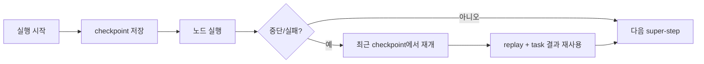

# LangGraph Durable Execution

[[langgraph|LangGraph]]의 durable execution 가이드 요약이다. checkpointer, thread_id, deterministic replay, task wrapping, durability mode를 통해 장기 실행 그래프를 재개 가능한 워크플로우로 만드는 법을 설명한다.

## 구조도

Durable execution의 핵심은 “중단된 줄 번호에서 이어서 실행”이 아니라, checkpoint 기준으로 replay 가능한 workflow를 설계하는 데 있다.

## 핵심 구조

- LangGraph는 checkpointer를 붙인 그래프에서 durable execution을 기본 지원한다. 중단 후에도 최근 checkpoint를 기준으로 재개할 수 있다.
- 문서가 특히 강조하는 점은 **deterministic and idempotent** 설계다. 재개 시 코드가 같은 줄에서 이어지는 것이 아니라 적절한 시작점부터 replay되기 때문이다.
- 그래서 랜덤성, 파일 쓰기, 외부 API 호출 같은 비결정적·부작용 작업은 task로 감싸고 재시도 안전성을 확보해야 한다.

## durability mode 비교

| 모드 | 의미 | 장점 | trade-off |
| --- | --- | --- | --- |
| exit | 실행 종료 시점에만 저장 | 가장 빠름 | 중간 crash 복구가 약함 |
| async | 다음 step과 병렬로 비동기 저장 | 성능/내구성 균형 | 저장 직전 crash 손실 가능 |
| sync | 다음 step 전에 동기 저장 | 가장 안전함 | 지연 증가 |

## 실무 설계 포인트

- human-in-the-loop, long-running task, flaky external API처럼 “언젠가 끊길 수밖에 없는” 흐름에는 durable execution이 사실상 필수다.
- 하지만 기능을 켜는 것만으로 충분하지 않다. 어떤 작업을 task 단위로 분리할지, 어떤 side effect를 idempotent하게 만들지까지 함께 설계해야 한다. [[long-running-agent-harnesses|Long-running agent harness]] 관점에서 보면 세션 재개 artifact 설계와 연결된다.
- 따라서 이 문서는 [[langgraph-persistence|LangGraph Persistence]]와 짝으로 읽어야 한다. persistence는 저장 구조를, durable execution은 재개 규율을 설명한다.

## 도입 체크리스트

- checkpointer를 실제 durable store와 연결했는가?
- 각 실행에 고유한 `thread_id`를 부여하는가?
- 비결정적 작업과 side effect를 task로 감쌌는가?
- sync/async/exit 중 어떤 durability mode가 제품 요구에 맞는지 정했는가?

## 관련 문서

- [[langgraph|LangGraph 1.0 / 2.0 (Agent Orchestration Framework)]]
- [[langgraph-quickstart|LangGraph Quickstart]]
- [[langgraph-persistence|LangGraph Persistence]]
- [[long-running-agent-harnesses|Agent Harnesses for Long-Running Coding Sessions]]
