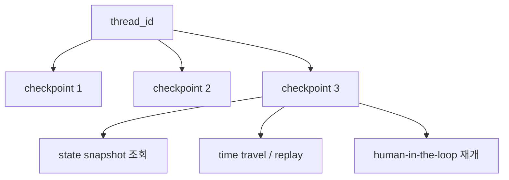

# LangGraph Persistence

[[langgraph|LangGraph]]의 persistence 가이드 요약이다. thread, checkpoint, super-step, memory store를 통해 그래프 상태를 저장·조회·재생하는 구조를 설명한다.

## 구조도

Persistence는 LangGraph의 부가 기능이 아니라, thread 단위로 checkpoint를 누적해 장기 실행·메모리·디버깅을 가능하게 만드는 기반 계층이다.

## 핵심 개념

- thread는 하나의 실행 계열을 추적하는 식별자이고, checkpoint는 특정 시점의 상태 스냅샷이다.
- super-step은 그 시점에 스케줄된 노드들이 한 번 실행되는 graph tick이며, checkpoint는 이 경계마다 저장된다.
- 이 구조 덕분에 human-in-the-loop, conversational memory, time travel, fault tolerance가 모두 같은 persistence 계층 위에서 구현된다.

## 왜 중요한가

- LangGraph 문서는 persistence를 단순 캐시가 아니라 실행 기록 시스템으로 다룬다. 즉 메모리, 디버깅, 복구가 같은 저장 구조를 공유한다.
- 특히 pending writes 개념은 [[langgraph-durable-execution|durable execution]]과 밀접하며, 일부 노드만 성공한 super-step을 다시 시작할 때 중복 실행을 줄이는 데 중요하다.
- LangGraph Agent Server가 checkpointing을 자동 처리한다는 설명도 실무적으로 중요하다. 직접 인프라를 짜는 경우와 관리형 서버를 쓸 경우 책임 범위가 달라진다.

## 읽는 방법

| 개념 | 질문 | 실무 해석 |
| --- | --- | --- |
| thread | 이 실행 계열을 어떻게 식별할까? | 사용자/작업/세션 ID 전략과 연결 |
| checkpoint | 어디까지 저장할까? | 재개 granularity와 비용의 균형 |
| memory store | 무엇을 오래 남길까? | 대화 메모리와 운영 로그 구분 |
| replay | 어디서부터 다시 볼까? | 디버깅·감사·대체 분기 실험 |

## 실무 관점

- 장기 에이전트에서 persistence는 기능이 아니라 운영 장치다. 없으면 재개, 감사, 비교 실험, 사용자 승인 흐름이 모두 취약해진다.
- 반대로 persistence를 넣으면 thread 설계, serializer, encryption, checkpoint 보존 정책 같은 저장소 문제를 정면으로 다뤄야 한다.
- 그래서 [[langgraph-durable-execution|LangGraph Durable Execution]]은 persistence의 소비자이고, persistence 문서는 그 기반 인프라 설명서로 읽는 편이 좋다.

## 관련 문서

- [[langgraph|LangGraph 1.0 / 2.0 (Agent Orchestration Framework)]]
- [[langgraph-quickstart|LangGraph Quickstart]]
- [[langgraph-durable-execution|LangGraph Durable Execution]]
- [[agent-memory-systems|Agent Memory Systems]]
