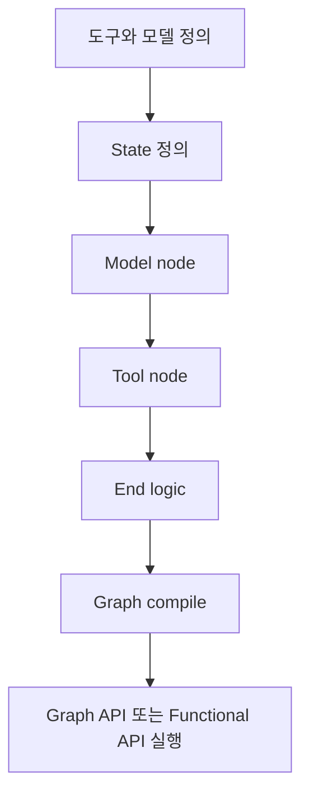

# LangGraph Quickstart

LangGraph의 공식 quickstart 요약이다. 계산기 agent 예제를 통해 도구, 상태, model node, tool node, 종료 조건, graph compile 순서를 한 번에 보여 준다.

## 구조도

LangGraph quickstart는 “agent를 프롬프트 하나로 만드는 법”이 아니라, 상태와 노드를 명시해 실행 그래프를 조립하는 법을 소개한다.

## 핵심 구조

- 공식 예제는 계산기 agent를 만들면서 도구 정의, 상태 정의, model node, tool node, 종료 논리를 단계적으로 분리한다.
- 그래프 상태는 메시지와 LLM 호출 횟수처럼 실행 전반에 살아남아야 하는 값을 담는다.
- 같은 문제를 Graph API와 Functional API 두 방식으로 풀 수 있게 보여 주는데, 이는 LangGraph의 핵심 설계가 “상태 기반 실행”임을 드러낸다.

## 왜 중요한가

- quickstart만 읽어도 LangGraph가 일반 agent 프레임워크와 달리 상태와 제어 흐름을 먼저 모델링한다는 점이 보인다.
- node와 edge를 명시하므로, 후속 단계에서 persistence, durable execution, interrupts 같은 고급 기능을 붙이기 쉽다.
- 즉 이 문서는 LangGraph를 단순 래퍼가 아니라 실행 runtime으로 이해하게 만드는 입문 문서다.

## Graph API vs Functional API

| API | 적합한 상황 | 장점 |
| --- | --- | --- |
| Graph API | 노드/엣지를 눈에 보이게 설계하고 싶을 때 | 구조가 명확하고 시각화/디버깅이 쉬움 |
| Functional API | 함수 단위로 빠르게 조립하고 싶을 때 | Python 코드 흐름과 가깝고 간결함 |

## 실무 관점

- LangGraph를 도입하는 팀은 quickstart 단계에서부터 state schema를 어떻게 설계할지 고민해야 한다. 나중에 persistence와 time travel 품질이 여기서 갈린다.
- 또한 quickstart 예제는 도구 호출과 종료 조건을 명시적으로 나누므로, 장기 에이전트에서 “계속 생각만 하는 루프”를 줄이는 설계 힌트를 준다.
- 문서가 LangChain Docs MCP server와 LangChain Skills 설치를 추천하는 점도 흥미롭다. LangGraph 자체가 agent-friendly documentation surface를 중시한다는 신호다.

## 관련 문서

- [[langgraph|LangGraph 1.0 / 2.0 (Agent Orchestration Framework)]]
- [[langgraph-durable-execution|LangGraph Durable Execution]]
- [[langgraph-persistence|LangGraph Persistence]]
- [[deep-agents|Deep Agents (LangChain Harness for Long-Running Tasks)]]
