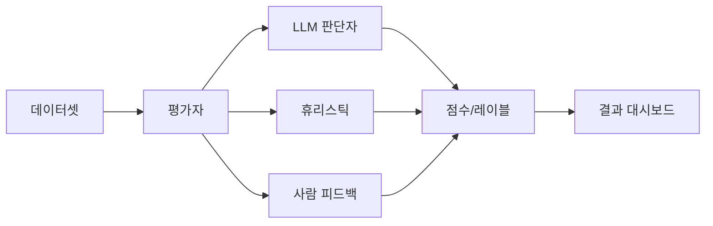
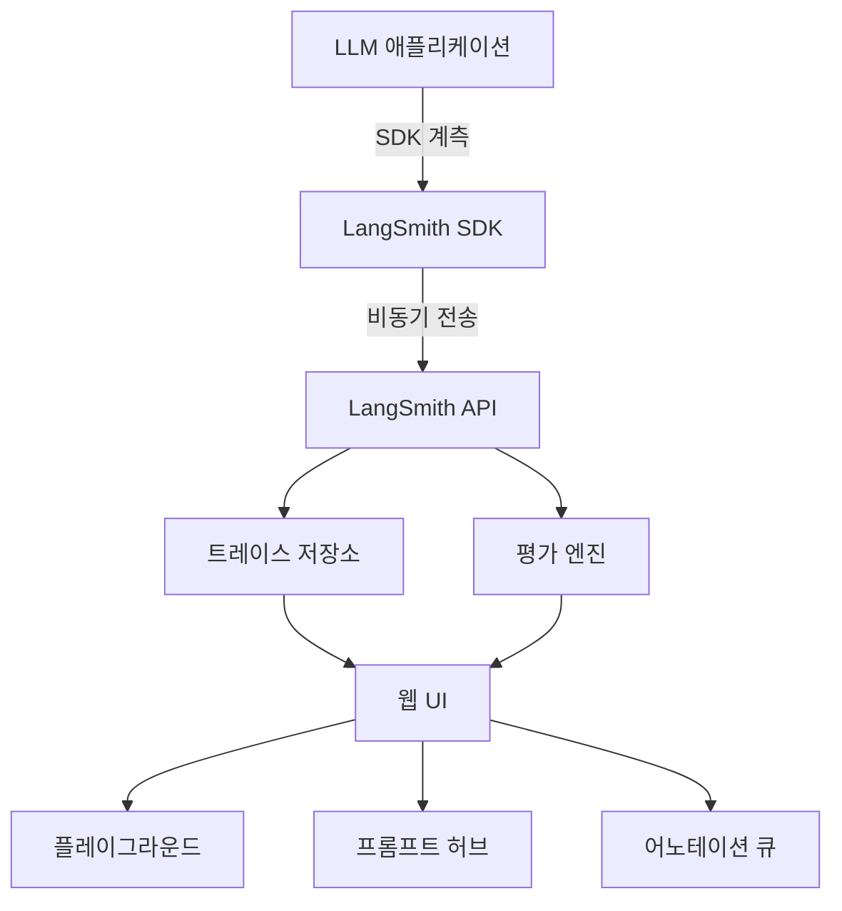

# LangSmith - LLM 애플리케이션 관측 플랫폼

## 개요

LangSmith는 LangChain이 개발한 LLM 애플리케이션 전용 관측 가능성(observability) 플랫폼이다. LLM 호출, 에이전트 실행, 체인 흐름을 추적·시각화하고, 데이터셋 기반 평가와 프롬프트 관리 기능을 한 곳에서 제공한다. LangChain과 독립적으로 사용할 수 있으며, 어떤 LLM 프레임워크와도 통합 가능하다.

## 핵심 기능

### 1. 트레이싱 (Tracing)

LLM 애플리케이션의 모든 실행 경로를 트리 구조로 시각화한다.

- **런(Run) 기록**: 입력/출력, 소요 시간, 토큰 수, 비용 자동 기록
- **중첩 실행 추적**: LLM 호출 → 도구 호출 → 서브 에이전트 등 계층적 실행 구조를 그대로 포착
- **메타데이터 태깅**: 사용자 ID, 세션 ID, 환경(dev/prod) 등 커스텀 메타데이터 부착
- **에러 추적**: 예외 발생 위치, 스택 트레이스, 재현에 필요한 입력 보존

```python
from langsmith import traceable

@traceable(name="my-chain")
def run_chain(user_input: str) -> str:
    # LLM 호출 로직
    return response
```

### 2. 평가 (Evaluation)



- **데이터셋**: 입력-출력 쌍을 관리하는 평가용 기준 셋. 프로덕션 트레이스에서 직접 추출 가능
- **자동 평가자**: LLM을 판단자로 사용하는 평가(correctness, helpfulness, toxicity 등)
- **코드 평가자**: 정규표현식, 파이썬 함수 등 결정론적 평가 로직
- **사람 피드백**: 어노테이터가 직접 레이블링하는 UI 제공
- **실험 비교**: 프롬프트 변경·모델 교체 전후를 같은 데이터셋으로 비교

### 3. 프롬프트 허브 (Prompt Hub)

- 프롬프트 버전 관리와 협업을 위한 중앙 저장소
- 태그와 커밋 메시지로 변경 이력 추적
- 코드에서 `hub.pull("my-prompt:latest")`로 동적 로드

### 4. 프롬프트 플레이그라운드 (Prompt Playground)

- 저장된 트레이스를 선택해 프롬프트 수정 후 재실행
- 여러 모델 간 출력 품질 비교
- 배치 실행으로 데이터셋 전체에 대한 신속한 회귀 테스트

## 아키텍처



SDK는 백그라운드 스레드로 비동기 전송하므로 애플리케이션 레이턴시에 영향을 주지 않는다.

## 유사 도구 비교

| 기능 | LangSmith | Braintrust | W&B Weave | Arize Phoenix |
|------|-----------|-----------|-----------|---------------|
| LLM 추적 | 완성도 높음 | 완성도 높음 | 완성도 높음 | 완성도 높음 |
| 평가 워크플로우 | 강력 (Hub 통합) | 강력 | 중간 | 중간 |
| 프롬프트 관리 | Hub로 통합 | 별도 | 미흡 | 미흡 |
| ML 실험 추적 | 미지원 | 미지원 | W&B 연동 | 미지원 |
| 오픈소스 | 일부 (LangFuse 대안) | 아니오 | 아니오 | 오픈소스 |
| 가격 | 무료 플랜 + 유료 | 무료 플랜 + 유료 | W&B 플랜 포함 | 오픈소스/클라우드 |

**Braintrust**: 평가 중심 설계, CI/CD 파이프라인 통합 강점
**W&B Weave**: 기존 W&B 사용자에게 자연스러운 확장, ML 실험과 LLM 추적 통합
**Arize Phoenix**: 오픈소스, OpenInference 표준, 드리프트 감지에 강점

## 통합

LangSmith는 SDK를 통해 다양한 프레임워크와 통합된다:

- **LangChain/LangGraph**: 자동 계측 (환경 변수 설정만으로 활성화)
- **OpenAI SDK**: `wrap_openai()` 래퍼로 감싸기
- **Anthropic SDK**: `wrap_anthropic()`
- **직접 호출**: `@traceable` 데코레이터 또는 `RunTree` API

```python
import os
os.environ["LANGCHAIN_TRACING_V2"] = "true"
os.environ["LANGCHAIN_API_KEY"] = "..."
# 이후 모든 LangChain 실행이 자동으로 추적됨
```

## 프로덕션 패턴

- **온라인 평가**: 프로덕션 트레이스에 실시간 자동 평가자 연결
- **데이터 플라이휠**: 프로덕션 실패 케이스를 데이터셋에 추가 → 평가 루프 개선
- **A/B 테스트**: 메타데이터 태그로 실험 그룹 구분 후 비교 분석
- **어노테이션 큐**: 불확실한 응답을 사람 검토 큐로 라우팅

## 실무 관점

LangSmith의 가장 큰 가치는 LLM 애플리케이션의 "블랙박스 문제"를 해결하는 데 있다. 전통적인 소프트웨어 로깅으로는 포착하기 어려운 중첩된 LLM 호출 구조와 비결정적 출력을 체계적으로 기록·분석할 수 있다. 특히 평가 데이터셋과 트레이스 저장소가 연결된 구조 덕분에 "프로덕션에서 실패한 케이스 → 데이터셋 추가 → 회귀 방지" 사이클을 구축하기 쉽다.

## 관련 문서

- [[LangChain]]
- [[llm-observability-platforms|LLM 관측 플랫폼]]
- [[Weights & Biases - ML 실험 관리]]
- [[에이전트 평가 지표와 벤치마크]]
- [[prompt-engineering|프롬프트 엔지니어링]]
