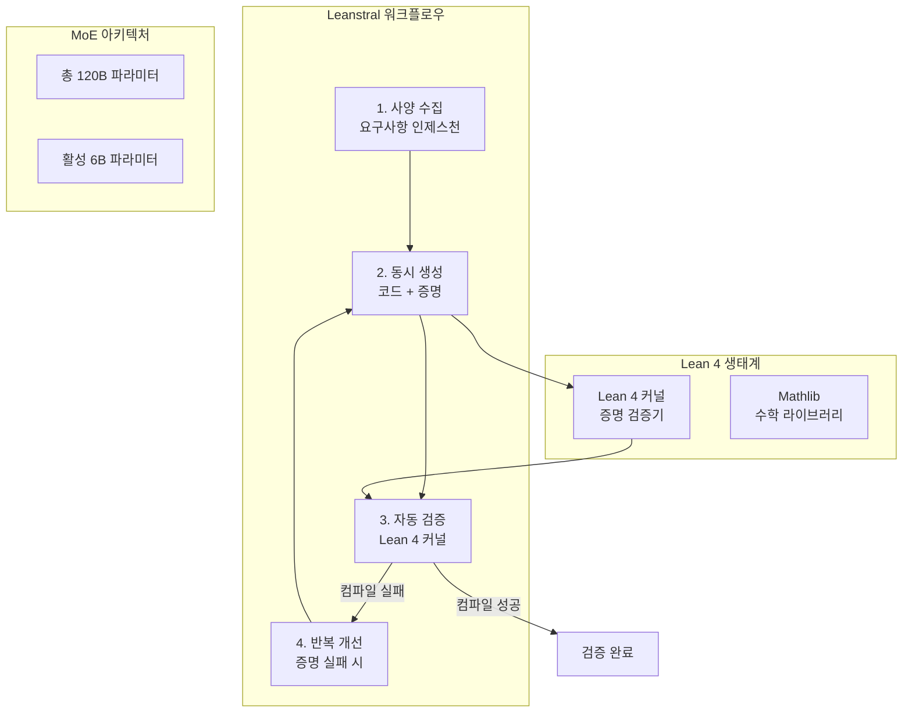

## 개요

Leanstral은 [[mistral-small-4|Mistral AI]]가 2026년 3월 16일 출시한 Lean 4 전용 오픈소스 AI 에이전트이다. 소프트웨어 코드와 기계 검증 가능한 수학적 증명을 동시에 생성하는 최초의 AI 도구로, "증명이 Lean 4에서 컴파일되면 논리가 검증된 것 -- 테스트만 된 것이 아니다"라는 원칙에 기반한다. MoE 아키텍처(총 120B, 활성 6B)를 사용하며, [[claude-sonnet-4-5|Claude Sonnet]] 대비 93%의 비용 절감을 달성했다. Apache 2.0 라이선스로 공개되었다.

## 핵심 특징

- **Lean 4 전용 AI**: 형식적 증명 보조기(formal proof assistant)인 Lean 4에 특화
- **코드 + 증명 동시 생성**: 소프트웨어 코드와 그 논리적 정확성을 입증하는 증명을 함께 생성
- **기계 검증**: Lean 4 커널을 통한 증명 검증 -- 테스트 케이스 샘플링이 아닌 모든 가능한 입력에 대한 검증
- **MoE 아키텍처**: 120B 총 파라미터 중 6B만 활성화하여 추론 효율 최적화
- **93% 비용 절감**: Claude Sonnet($549/태스크) 대비 $36/태스크

## 아키텍처

## 기술 상세

### 4단계 워크플로우

1. **사양 수집(Specification Ingestion)**: 요구사항을 형식적 사양으로 변환
2. **동시 생성(Simultaneous Generation)**: 코드와 증명을 병렬로 생성
3. **자동 검증(Automated Proof Validation)**: Lean 4 커널을 통한 컴파일 검증
4. **반복 개선(Iterative Refinement)**: 증명 컴파일 실패 시 자동 수정 반복

### 형식 검증 vs 기존 테스트

| 방식 | 커버리지 | 보장 수준 |
|---|---|---|
| 단위 테스트 | 샘플링된 입력만 검증 | 테스트된 케이스에 한정 |
| 속성 기반 테스트 | 무작위 입력 생성 | 통계적 신뢰도 |
| **형식 검증 (Leanstral)** | **모든 가능한 입력** | **수학적 증명** |

### FLTEval 벤치마크

FLTEval(Formal Lean Theorem Evaluation)은 Lean 4 증명 생성 능력을 평가하는 벤치마크로, pass@k 지표는 k번의 시도 내에 올바른 증명을 생성할 확률을 나타낸다.

| 지표 | Leanstral | Claude Sonnet 4.6 | Claude Opus 4.6 |
|---|---|---|---|
| pass@2 | 26.3 | 23.7 | 39.6 |
| pass@16 | 31.9 | ~23.9 | - |
| 태스크당 비용 | $36 | $549 | $1,650 |
| **비용 절감율** | **93% (vs Sonnet)** | 기준 | 기준 |

Opus 4.6이 pass@2에서 39.6으로 최고 정확도를 보이지만, 태스크당 비용이 $1,650으로 Leanstral의 46배에 달한다. Leanstral은 MoE 아키텍처의 선택적 활성화 덕분에 추론 시 6B 파라미터만 사용하여, 동등 수준의 증명 능력을 극적으로 낮은 비용에 제공한다.

### 왜 Lean 4인가

Lean 4는 기존 정리 증명기(Coq, Isabelle 등)와 달리 범용 프로그래밍 언어와 형식 검증 시스템을 통합한다. 코드 자체가 증명이 될 수 있는 의존 타입(dependent type) 시스템을 갖추고 있어, Leanstral이 코드와 증명을 동시에 생성하기에 적합한 대상이다. Lean 4의 수학 라이브러리인 Mathlib는 10만 개 이상의 정리와 정의를 포함하며, Leanstral은 이 라이브러리를 참조하여 기존 수학적 결과 위에 새로운 증명을 구축한다.

### 반복 개선(Iterative Repair) 메커니즘

4단계 워크플로우의 핵심은 반복 개선 단계다. Lean 4 커널이 증명 컴파일에 실패하면, 실패 지점의 진단 정보(diagnostic feedback)가 모델에 피드백된다. 모델은 이 진단 정보를 기반으로 증명 전략을 수정하고 재시도한다. 이 과정은 증명이 컴파일되거나 최대 반복 횟수에 도달할 때까지 반복된다. 실패를 보고할 때는 구체적인 실패 이유와 시도된 접근법을 함께 제공한다.

### MCP 지원

Leanstral은 Model Context Protocol(MCP) 통합을 지원하여, 외부 도구 및 코딩 에이전트와 연결할 수 있다. 이를 통해 소프트웨어 개발 파이프라인에 형식 검증을 자동으로 통합하는 워크플로우 구성이 가능하다.

## 접근 방법

- **Mistral Vibe IDE**: `/leanstral` 명령어로 제로 셋업 사용
- **Labs API**: 무료 엔드포인트 (labs-lsp-2603), 프로그래매틱 통합
- **오픈소스 가중치**: 로컬 배포용 다운로드, 완전한 데이터 주권 보장
- **MCP**: 외부 도구 연결을 위한 Model Context Protocol 지원

## 적용 시나리오

### 안전 필수 소프트웨어(Safety-Critical Software)

항공, 의료기기, 자율주행 등 단위 테스트 커버리지가 불충분한 영역에서 형식 검증의 가치가 극대화된다. [[mistral-small-4|Mistral AI]]의 모델 라인업 중 형식 검증에 특화된 유일한 오픈소스 도구다. 기존 테스트는 샘플링된 입력만 검증하지만, Leanstral의 형식 검증은 정의된 도메인 내 모든 가능한 입력에 대해 수학적 보장을 제공한다.

### 암호학 프로토콜 검증

암호학 프로토콜의 정확성은 단위 테스트만으로 검증하기 어렵다. Leanstral을 활용하면 프로토콜의 수학적 속성(기밀성, 무결성, 인증)을 형식적으로 증명할 수 있다.

### 스마트 컨트랙트 검증

블록체인 스마트 컨트랙트는 배포 후 수정이 불가능하므로, 배포 전 형식 검증의 필요성이 특히 높다. Leanstral은 컨트랙트 로직의 정확성을 수학적으로 증명하여 취약점 배포를 사전에 방지할 수 있다.

## 관련 문서

- [[mistral-small-4]] - Mistral의 최신 MoE 언어 모델
- [[voxtral-tts]] - Mistral의 음성합성 모델
- [[deepseek-v3-2]] - DeepSeek의 오픈소스 프론티어 모델
- [[gemma-4]] - Google의 오픈소스 모델 패밀리
