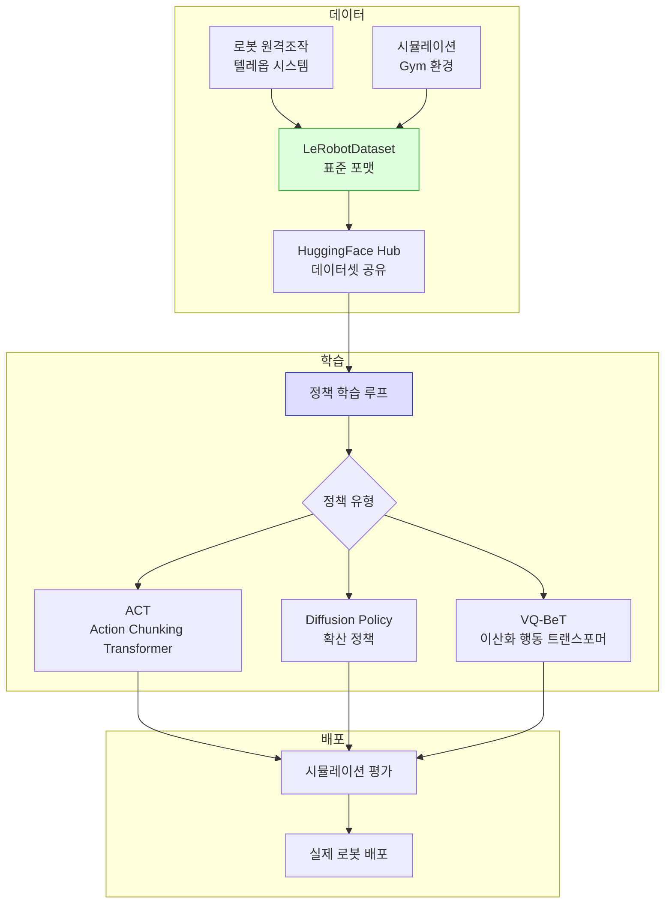

# LeRobot 프레임워크

## 개요

LeRobot은 HuggingFace가 개발하는 **오픈소스 로봇 학습 프레임워크**다. 로봇 조작 연구의 접근성을 높이는 것이 목표로, 데이터 수집부터 정책 학습, 실제 로봇 배포까지 전체 워크플로우를 단일 라이브러리로 제공한다.

HuggingFace Hub 생태계와 긴밀하게 통합되어, 사전학습 체크포인트, 데이터셋, 시뮬레이션 환경을 Hub에서 직접 불러오는 방식으로 커뮤니티 공유를 촉진한다.

## 프레임워크 구조

## 지원 정책 알고리즘

| 알고리즘 | 유형 | 특징 |
|----------|------|------|
| ACT ([[action-chunking-transformer]]) | 트랜스포머 | 행동 청킹, 시간적 앙상블 |
| Diffusion Policy ([[diffusion-policy]]) | 확산 모델 | 다중 모드 행동 분포 |
| VQ-BeT | 이산 트랜스포머 | 행동 이산화 + 트랜스포머 |
| TD-MPC2 | 모델 기반 RL | 잠재 공간 예측 제어 |

## LeRobotDataset 포맷

LeRobot은 로봇 조작 데이터를 위한 표준화 포맷을 정의한다. 주요 구성은 다음과 같다.

- **비디오 스트림**: 다중 카메라 뷰 (mp4 압축)
- **상태/행동 시계열**: parquet 형식의 관절값, 엔드이펙터 포즈
- **메타데이터**: 태스크 설명, 에피소드 정보, 로봇 사양
- **태스크 언어 레이블**: 각 에피소드에 대한 자연어 설명

이 포맷은 HuggingFace Hub 데이터셋으로 직접 업로드/다운로드할 수 있어 데이터 공유가 용이하다.

## 하드웨어 지원

LeRobot은 특정 로봇 하드웨어에 종속되지 않지만, 초저비용 로봇인 **SO-100** 및 **SO-101**을 공식 튜토리얼 하드웨어로 채택했다. 이 로봇들은 서보 모터 기반의 5-6 DoF 로봇 팔로, 약 100-300달러 수준의 비용으로 조립할 수 있다.

HuggingFace는 이 저비용 하드웨어 + LeRobot 조합으로 "100달러 로봇 학습" 환경을 만드는 것을 목표로 삼고 있다.

## 시뮬레이션 환경

LeRobot은 여러 시뮬레이션 환경과 통합된다.

- **Gym-PushT**: 2D 블록 밀기 (간단한 벤치마크)
- **Gym-Lerobot**: 로봇 팔 조작 태스크 모음
- **MuJoCo 기반 환경**: 고도 물리 시뮬레이션 태스크
- **Isaac Lab**: NVIDIA 기반 대규모 병렬 시뮬레이션 (통합 진행 중)

[[sim2real-transfer]] 관점에서, 시뮬레이션에서 학습한 정책을 실제 하드웨어에 배포하는 워크플로우를 표준화하는 것이 LeRobot의 주요 목표 중 하나다.

## 생태계 포지션

LeRobot은 [[octo-robot-policy]]와 같은 사전학습 파운데이션 모델의 파인튜닝 플랫폼으로도 활용될 수 있다. HuggingFace Hub에 업로드된 로봇 파운데이션 모델 체크포인트를 LeRobot 데이터로 파인튜닝하는 워크플로우가 문서화되어 있다.

[[robot-teleoperation-data]] 수집에도 LeRobot의 텔레옵 도구를 활용하며, ALOHA 스타일의 양팔 텔레옵부터 스페이스마우스 조작까지 다양한 수집 방식을 지원한다.

## 관련 문서

- [[vla-models]] - VLA 모델과의 연계
- [[diffusion-policy]] - LeRobot 핵심 알고리즘 중 하나
- [[action-chunking-transformer]] - LeRobot의 ACT 구현
- [[octo-robot-policy]] - HuggingFace Hub 기반 파운데이션 모델
- [[sim2real-transfer]] - 시뮬레이션-실제 전이 개념
- [[robot-teleoperation-data]] - 데이터 수집 방법론
