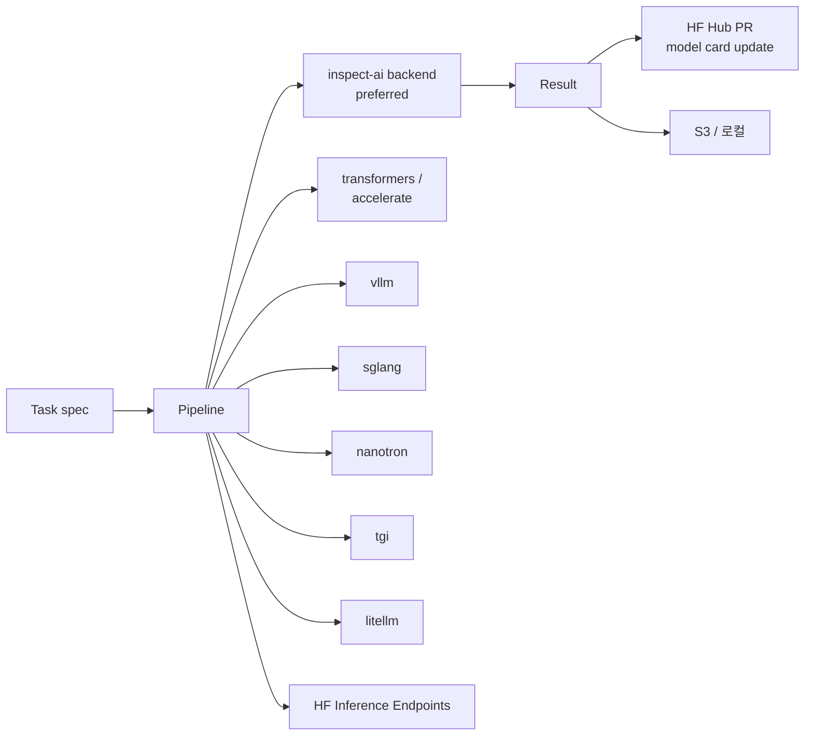

# lighteval (HuggingFace)

> "Lighteval is your all-in-one toolkit for evaluating LLMs across multiple backends—whether it's transformers, tgi, vllm, or nanotron—with ease."

HF Leaderboard & Evals 팀이 만든 평가 프레임워크. **[[inspect-ai]] 를 1차 평가 backend 로 채택** 하여 "preferred way" 로 명시 -- UK AISI Inspect AI 의 솔버/스코러/툴/샌드박스 모델 위에 HF 의 다양한 모델 backend 를 얹는 구조.

## 한 줄 정체성

HF 의 다중 backend 통합. **inspect-ai 를 1차 backend 로** 채택해 agent eval 까지 포섭, HF Hub 에 결과 자동 push (PR 형태).

## 목적과 위치

기존 [[lm-evaluation-harness]] 와 [[openai-evals]] 의 중간을 지향. HF 입장:
- accelerate / transformers 와의 깊은 통합
- vLLM / TGI / nanotron / SGLang 등 HF 생태계 launcher 통합
- HF Hub 에 결과 자동 push (PR 형태로 모델 카드 업데이트)



## Backend 지원

> "Evaluate models on CPU or one or more GPUs using 🤗 Accelerate; nanotron: Evaluate models in distributed settings using ⚡️ Nanotron; vllm: Evaluate models on one or more GPUs using 🚀 VLLM"

| Backend | 설명 |
|---|---|
| **inspect-ai** | preferred (1차 권장) |
| transformers | accelerate 기반 CPU/GPU |
| accelerate | multi-GPU |
| vllm | TP/DP/PP |
| sglang | 빠른 batch |
| nanotron | 분산 학습 환경 |
| tgi | Text Generation Inference |
| litellm | 다중 provider API |
| HF Inference Endpoints | managed |

## CLI 예

```bash
# HF inference provider 사용
lighteval eval "hf-inference-providers/openai/gpt-oss-20b" gpqa:diamond

# custom 모델 (직접 구현한 API)
lighteval custom <args>
```

## Python API quick start

```python
from transformers import AutoModelForCausalLM
from lighteval.models.transformers.transformers_model import TransformersModel
from lighteval.pipeline import Pipeline

model = AutoModelForCausalLM.from_pretrained(MODEL_NAME, device_map="auto")
config = TransformersModelConfig(model_name=MODEL_NAME, batch_size=1)
model = TransformersModel.from_model(model, config)
pipeline = Pipeline(model=model, tasks=BENCHMARKS)
results = pipeline.evaluate()
```

## Task 커버리지

> "Lighteval supports 1000+ evaluation tasks across multiple domains and languages."

도메인:
- **Knowledge**: MMLU, MMLU-Pro, MMMU, BIG-Bench, TriviaQA
- **Math/Code**: GSM8K, MATH, AIME24, AIME25, LiveCodeBench
- **Chat eval**: IFEval, MUSR, DROP, MT-Bench
- **Multilingual**: XTREME, Flores200 (200 언어), CMMLU, RUMMLU

## VLLM backend

`src/lighteval/models/vllm/vllm_model.py` 참조. 데이터/파이프라인/텐서 병렬 모두 지원.

## Hub 통합

- 결과를 HF Hub 에 PR 로 push (모델 카드 자동 업데이트)
- S3 / 로컬 옵션 모두

```bash
pip install lighteval
hf auth login
```

## 다른 harness 와의 포지셔닝

| 측면 | lighteval | [[lm-evaluation-harness]] | [[inspect-ai]] |
|---|---|---|---|
| 1차 backend | **inspect-ai (래핑)** | 자체 추상화 | 자체 추상화 |
| HF 생태계 | 1급 (HF 팀이 직접) | 2급 | 3급 |
| Hub push 결과 | yes (PR) | no | no |
| Task 수 | 1000+ | 60+ (수백 subtask) | 사용자 정의 위주 |
| 멀티링궐 깊이 | 가장 강함 | 중간 | 중간 |

채택 패턴: HF 팀이 자체 leaderboard 운영을 lm-evaluation-harness 에서 lighteval 로 옮기는 흐름. Inspect AI 를 backend 로 두므로 agent / tool eval 까지 포섭 가능.

**lighteval 의 inspect-ai 채택 의미**: HF 가 평가 backend 로 자체 코드를 새로 짜지 않고 UK AISI 의 Inspect 를 위에 얹기로 한 것은 **inspect-ai 가 차세대 표준**임을 시사. static eval 세대 (lm-eval) 를 대체하면서도 agent eval 까지 한 번에 포섭하려는 디자인 결정. 자세한 비교는 [[evaluation-harness-comparison]] 참조.

### 알려진 이슈

- vLLM backend 가 num_samples=1 일 때도 sampling 사용 (issue #342)
- 일부 task 에서 lm-eval-harness 와 결과 차이 -- prompt 템플릿 / few-shot 방식 차이로 추정

## 출처

- README: https://github.com/huggingface/lighteval
- Docs index: https://github.com/huggingface/lighteval/blob/main/docs/source/index.mdx
- vLLM backend: https://github.com/huggingface/lighteval/blob/main/docs/source/use-vllm-as-backend.mdx
- vLLM model code: https://github.com/huggingface/lighteval/blob/v0.9.2/src/lighteval/models/vllm/vllm_model.py
- HF doc page: https://huggingface.co/docs/lighteval/en/index

## 관련 문서

- [[evaluation-harness]] -- 평가 harness 허브 페이지
- [[evaluation-harness-comparison]] -- 9개 harness 횡단 비교
- [[inspect-ai]] -- lighteval 의 1차 backend
- [[lm-evaluation-harness]] -- HF 가 lighteval 로 대체 중인 기존 backend
- [[mteb]] -- HF 의 다른 평가 framework (임베딩 전용)
- [[huggingface-hub]] -- HF Hub (lighteval 결과 push 대상)
