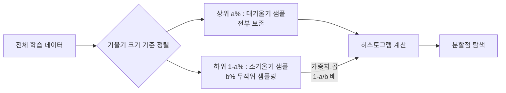
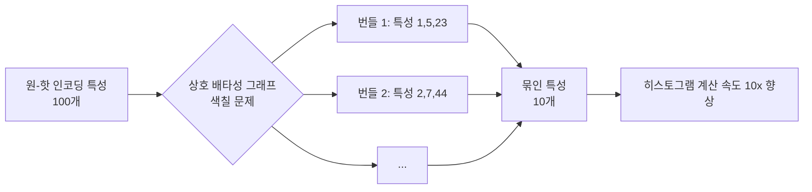
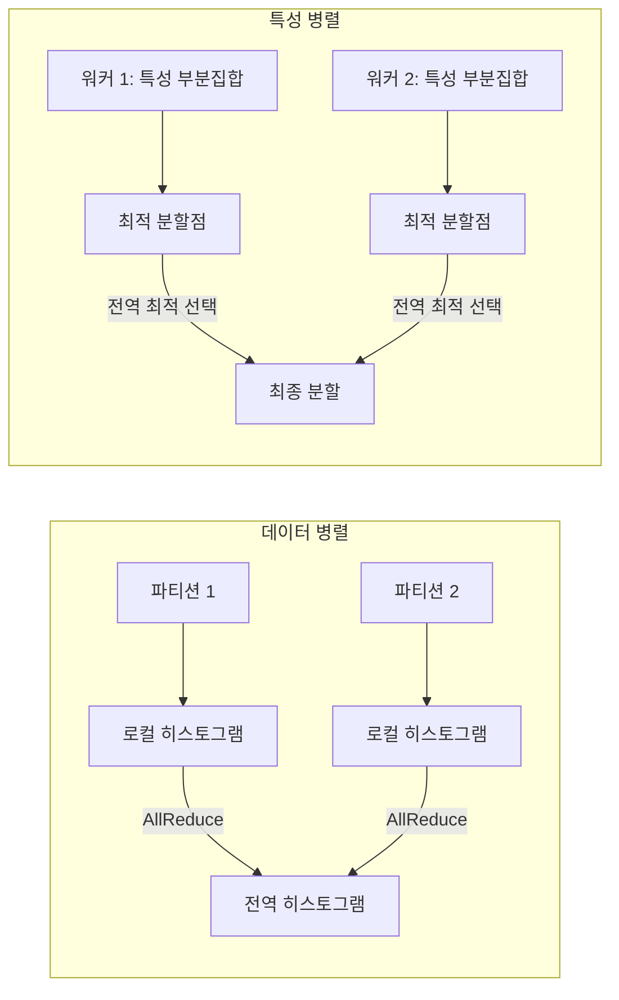

# LightGBM 내부 구조

LightGBM(Light Gradient Boosting Machine)은 Microsoft Research가 2017년 발표한 그래디언트 부스팅 프레임워크로, [[xgboost-lightgbm|XGBoost]] 대비 훨씬 빠른 학습 속도와 낮은 메모리 사용량을 달성한다. 세 가지 핵심 혁신 - **Leaf-wise 트리 성장**, **GOSS(Gradient-based One-Side Sampling)**, **EFB(Exclusive Feature Bundling)** - 이 이 성능 향상을 이끈다.

## 핵심 혁신 1: Leaf-wise 트리 성장

### Level-wise vs Leaf-wise 비교

```mermaid
flowchart TD
    subgraph Level-wise (XGBoost)
        R1[루트] --> L1[레벨 1 모든 노드 분할]
        L1 --> L2[레벨 2 모든 노드 분할]
    end
    subgraph Leaf-wise (LightGBM)
        R2[루트] --> LW1[손실 감소 최대 리프만 분할]
        LW1 --> LW2[다시 최대 리프 분할]
        LW2 --> LW3[...]
    end
```

Level-wise 방식은 같은 깊이의 모든 리프를 균등하게 분할하지만, Leaf-wise는 **손실 감소(loss reduction)가 가장 큰 단 하나의 리프**만을 매 단계에서 분할한다. 결과적으로 같은 리프 수 기준에서 더 낮은 손실을 달성한다.

단점은 균형 잡히지 않은(unbalanced) 트리가 생성되어 소규모 데이터에서 과적합되기 쉽다는 것이다. 이를 완화하기 위해 `num_leaves`(최대 리프 수)와 `min_data_in_leaf`(리프 최소 샘플 수)를 신중하게 설정해야 한다.

## 핵심 혁신 2: GOSS (Gradient-based One-Side Sampling)

### 동작 원리

큰 기울기(gradient)를 가진 샘플은 학습에 더 중요하다 - 이미 잘 학습된 샘플은 작은 기울기를 갖는다. GOSS는 이 관찰을 활용한 샘플링 전략이다.



소기울기 샘플을 샘플링할 때 가중치 $(1-a)/b$를 곱해 원래 분포를 근사한다. 이를 통해:
- 데이터 크기를 줄여 히스토그램 계산 속도 향상
- 학습에 중요한 샘플(대기울기)은 100% 보존하여 정확도 유지

## 핵심 혁신 3: EFB (Exclusive Feature Bundling)

고차원 희소 특성(sparse feature) 데이터에서, **상호 배타적인 특성들** - 동시에 0이 아닌 값을 갖지 않는 특성 쌍 - 을 하나의 번들로 묶어 특성 수를 줄인다.



번들 내 특성은 서로 다른 값 구간(offset)을 할당받아 하나의 히스토그램으로 표현된다. NLP 데이터, 클릭로그 등 원-핫 인코딩이 많은 데이터에서 극적인 속도 향상을 제공한다.

## 히스토그램 최적화

LightGBM의 히스토그램 구축도 XGBoost와 다른 최적화를 포함한다:

**히스토그램 차감(Histogram Subtraction)**: 형제 노드(sibling node)의 히스토그램을 부모 히스토그램에서 빼서 계산한다. 형제 중 작은 쪽만 직접 계산하면 나머지는 $O(1)$ 연산으로 얻을 수 있다.

$$H_{right} = H_{parent} - H_{left}$$

## 범주형 특성 기본 지원

XGBoost와 달리 LightGBM은 범주형 특성을 인코딩 없이 직접 처리한다. 범주형 값의 최적 분할을 Fisher의 방법으로 탐색한다 - 그래디언트 통계를 기준으로 범주를 정렬하고 이진 분할을 찾는다.

## 분산 학습 지원



소규모 데이터에서는 특성 병렬이 유리하고, 대규모 데이터에서는 데이터 병렬이 효율적이다.

## 주요 하이퍼파라미터

| 파라미터 | 설명 | 권장 범위 |
|----------|------|-----------|
| `num_leaves` | 최대 리프 수 (Leaf-wise 핵심) | 31-127 |
| `min_data_in_leaf` | 리프 최소 샘플 수 | 20-100 |
| `max_depth` | -1 (무제한) 또는 6-12 | -1 권장 |
| `top_rate` (a) | GOSS 대기울기 비율 | 0.2 |
| `other_rate` (b) | GOSS 소기울기 샘플링 비율 | 0.1 |
| `feature_fraction` | 트리별 특성 서브샘플링 | 0.6-0.9 |

## [[xgboost-lightgbm]] 과의 위치

[[decision-trees-random-forests]] 의 앙상블 개념을 XGBoost보다 엔지니어링 수준에서 극한까지 최적화한 구현체다. [[tabular-ml]] 관점에서 대규모 데이터셋 벤치마크에서 XGBoost를 속도 측면에서 일반적으로 앞서며, 특히 희소 고차원 특성 데이터에서 EFB 덕분에 큰 이점을 갖는다.

## 관련 문서

- [[xgboost-lightgbm]] - XGBoost vs LightGBM 세부 비교
- [[xgboost-internals]] - XGBoost 내부 구조 (2차 근사, 히스토그램)
- [[decision-trees-random-forests]] - 결정 트리 및 앙상블 기초
- [[tabular-ml]] - 테이블 데이터 ML 전반
- [[catboost-ordered-boosting]] - 범주형 특화 CatBoost 비교
