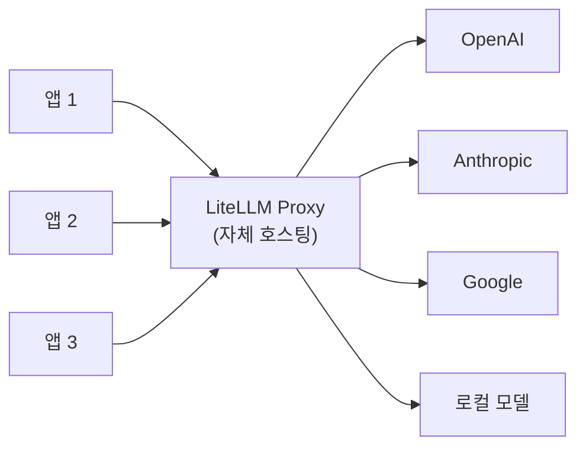

## 개요

LiteLLM은 100개 이상의 LLM 프로바이더를 OpenAI 호환 API로 통합하는 오픈소스 프록시 서버다. 자체 호스팅으로 라우팅 레이어를 완전히 제어할 수 있으며, Python SDK와 프록시 서버 두 가지 형태로 제공된다. 기존 OpenAI SDK 코드를 수정 없이 다른 프로바이더로 전환할 수 있어, 멀티 프로바이더 전략의 핵심 인프라로 사용된다. Apache 2.0 라이선스로 공개되어 상업적 사용에 제한이 없다.

2026년 기준 LLM API 게이트웨이는 "하나의 통합 대신 여러 개별 통합"을 없애는 핵심 인프라로 자리잡았으며, LiteLLM은 자체 호스팅 진영의 대표 솔루션이다. [[prompt-caching-agentic|프롬프트 캐싱]]과 [[disaggregated-serving|분리형 서빙]] 아키텍처를 함께 고려하면 대규모 운영 비용을 더 정밀하게 제어할 수 있다.

## 핵심 특징

### OpenAI 호환 통합 인터페이스

모든 LLM 프로바이더 호출을 `completion()` 함수 하나로 통일한다. 프로바이더별 SDK를 개별 학습할 필요 없이 OpenAI 포맷의 요청/응답만 이해하면 된다.

```python
from litellm import completion

# Claude 호출
response = completion(
    model="claude-opus-4-6",
    messages=[{"role": "user", "content": "Hello"}]
)

# GPT 호출 - 동일한 인터페이스
response = completion(
    model="gpt-5.4",
    messages=[{"role": "user", "content": "Hello"}]
)
```

### 프록시 서버 (AI Gateway)

독립 실행형 프록시 서버로 배포하여 팀 전체가 중앙화된 LLM 접근점을 공유한다:



### 완전한 자체 호스팅

외부 서비스 의존 없이 자체 인프라에서 운영할 수 있어 데이터 주권과 보안 요구사항이 엄격한 환경에 적합하다. 모든 요청 데이터가 자체 인프라 내에서만 처리되므로 GDPR, HIPAA 등 규제 환경에서 컴플라이언스를 보장한다.

### 프록시 서버 배포

Docker 기반 배포가 권장되며, PostgreSQL을 백엔드 데이터베이스로 사용하여 사용량 추적, 키 관리, 감사 로그를 영속화한다:

```yaml
# litellm_config.yaml
model_list:
  - model_name: gpt-4
    litellm_params:
      model: openai/gpt-5.4
      api_key: os.environ/OPENAI_API_KEY
  - model_name: gpt-4
    litellm_params:
      model: anthropic/claude-opus-4-6
      api_key: os.environ/ANTHROPIC_API_KEY

router_settings:
  routing_strategy: least-busy
  num_retries: 3
  fallbacks: [{"gpt-4": ["claude-3"]}]
```

동일 `model_name`에 복수 프로바이더를 매핑하면 자동 로드 밸런싱과 폴백이 적용된다. `routing_strategy`로 `least-busy`, `latency-based`, `cost-based` 등의 라우팅 정책을 지정할 수 있다.

## 기술 상세

### 지원 기능

| 기능 | 설명 |
|------|------|
| 텍스트/챗 완성 | 모든 프로바이더 표준화 |
| 비전/이미지 | 멀티모달 요청 통합 |
| 임베딩 | 프로바이더 간 동일 인터페이스 |
| 이미지 생성 | DALL-E, Midjourney 등 통합 |
| 스트리밍 | SSE 기반 실시간 응답 |
| 비용 추적 | 요청별 자동 비용 계산 |

### 모델 네이밍 규칙

프로바이더별 접두사로 라우팅 대상을 지정한다:

```
openrouter/google/palm-2-chat-bison  # OpenRouter 경유
anthropic/claude-opus-4-6             # Anthropic 직접
azure/gpt-5.4                        # Azure 경유
ollama/llama3                        # 로컬 Ollama
```

### 엔터프라이즈 기능

- **SSO/SAML**: 기업 인증 시스템 연동
- **감사 로그**: 모든 API 호출 기록 및 추적
- **비용 추적**: 팀/프로젝트/사용자별 지출 분석, 요청별 자동 비용 계산
- **가드레일**: 입출력 필터링 규칙 적용
- **키 관리**: 가상 키를 통한 안전한 자격증명 관리
- **로드 밸런싱**: 복수 프로바이더 간 자동 분산
- **자동 폴백**: 주 프로바이더 장애 시 자동 전환
- **레이트 리미팅**: 프로바이더별 요청 제한 관리

### 운영 특성

| 항목 | 세부 사항 |
|------|----------|
| 설치 시간 | 초기 구성 15-30분 (호스팅 대안 대비 긴 편) |
| 인프라 비용 | 월 $50-200 (일반적 배포 기준) |
| 추론 마크업 | 없음 (오픈소스 자체 호스팅) |
| 프록시 오버헤드 | 1ms 미만 (총 응답 시간의 1% 미만) |
| 책임 범위 | 서버 비용, 가동시간, 업데이트, 스케일링 모두 운영자 부담 |

### 경쟁 도구 비교

| 항목 | LiteLLM | [[portkey]] | [[openrouter]] |
|------|---------|-------------|----------------|
| 호스팅 | 자체 호스팅 | 자체/클라우드 | 클라우드 전용 |
| 오픈소스 | O (Apache 2.0) | O | X |
| 프로바이더 수 | 100+ (설정 기반) | 1,600+ | 300+ |
| 폴백 라우팅 | O | O | X |
| 설치 복잡도 | 15-30분 | 5분 미만 | 5분 미만 |
| 핵심 강점 | 완전 제어 | 거버넌스/옵저버빌리티 | 즉시 사용/마켓플레이스 |
| 과금 | 무료 (자체 호스팅) | 무료 + 엔터프라이즈 | 크레딧 기반 |

OpenAI 호환성 외에 Anthropic, Gemini SDK 번역(SDK translation) 기능도 지원하여 네이티브 호환을 넘어선 프로바이더 통합이 가능하다.

### 사용 시나리오

- **로컬 개발**: Ollama 등 로컬 모델과 클라우드 모델을 동일 코드로 전환
- **프로바이더 마이그레이션**: OpenAI에서 Claude로 전환 시 코드 변경 최소화
- **비용 최적화**: 요청별 최적 프로바이더 자동 선택, 중앙화된 비용 대시보드
- **규제 환경**: 데이터가 외부로 나가면 안 되는 환경에서 자체 호스팅
- **고가용성**: 주 프로바이더 장애 시 자동 폴백(failover)으로 서비스 연속성 확보
- **팀 관리**: 중앙 프록시로 팀 전체의 LLM 접근을 통합 관리, 가상 키로 자격증명 보호

## 관련 문서

- [[portkey]] - AI 게이트웨이 (거버넌스 중심)
- [[openrouter]] - 유니버설 AI API (클라우드 마켓플레이스)
- [[langfuse]] - LLM 옵저버빌리티 (LiteLLM 연동 지원)
- [[braintrust]] - AI 옵저버빌리티 (AI Proxy 기능)
