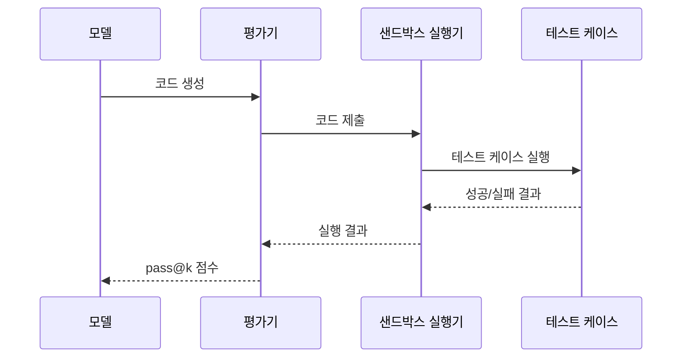

# LiveCodeBench

LiveCodeBench는 LLM의 코딩 능력을 평가하기 위해 설계된 **동적 벤치마크(live benchmark)**다. [[humaneval]]이나 MBPP 같은 정적 벤치마크의 핵심 한계인 **데이터 오염(data contamination)** 문제를 해결하기 위해, 경쟁 프로그래밍 플랫폼에서 **새로운 문제를 지속적으로 수집**하는 방식을 채택한다.

## 설계 동기: 데이터 오염 문제

기존 코딩 벤치마크([[humaneval]] 등)의 문제점:

1. 벤치마크 문제가 공개된 후 LLM 학습 데이터에 포함될 가능성
2. 모델이 실제 코딩 능력이 아닌 암기로 높은 점수를 달성
3. 시간이 지날수록 벤치마크 점수가 부풀려지는 "점수 인플레이션" 현상

LiveCodeBench는 이를 해결하기 위해 LeetCode, Codeforces, AtCoder 등 경쟁 프로그래밍 플랫폼에서 **모델 학습 컷오프 이후** 출제된 문제만 수집한다.

```mermaid
flowchart TD
    Platform[경쟁 프로그래밍 플랫폼\nLeetCode / Codeforces / AtCoder]
    Platform -->|신규 문제 자동 수집| Collector[LiveCodeBench\n수집 파이프라인]
    Collector -->|컷오프 이후 문제만| Filter[날짜 필터링]
    Filter --> Bench[LiveCodeBench\n벤치마크 세트]
    Bench --> Eval[모델 평가]
    Eval --> Score[pass@k 점수]
```

위 파이프라인에서 날짜 필터링이 핵심이다. 평가 대상 모델의 학습 컷오프를 기준으로 그 이후에 출제된 문제만 사용하므로, 암기에 의한 점수 왜곡이 원천 차단된다.

## 평가 시나리오

LiveCodeBench는 단순 코드 생성 외에 여러 시나리오를 포함한다:

| 시나리오 | 설명 |
|----------|------|
| 코드 생성(Code Generation) | 문제 설명으로부터 올바른 코드 작성 |
| 자가 수정(Self-Repair) | 오류가 있는 코드를 스스로 디버깅하여 수정 |
| 코드 실행(Code Execution) | 주어진 코드의 실행 결과 예측 |
| 테스트 출력 예측(Test Output) | 특정 입력에 대한 출력값 예측 |

이 다양한 시나리오 덕분에 단순 코드 암기가 아닌 **프로그래밍 이해력**을 종합적으로 측정한다.

## 난이도 분류

LeetCode 문제 난이도 체계(Easy/Medium/Hard)를 그대로 반영하여 세분화된 분석이 가능하다:

- **Easy**: 기본 알고리즘, 자료구조 활용
- **Medium**: 동적 프로그래밍, 그래프 탐색, 중급 알고리즘
- **Hard**: 복잡한 최적화, 고급 수학, 창의적 접근 필요

최신 모델들도 Hard 문제에서 크게 성능이 떨어지며, 여전히 충분한 변별력이 유지된다.

## 평가 지표

- **pass@1**: 1번의 생성으로 테스트를 통과할 확률 (결정론적 평가)
- **pass@k**: k번 생성 중 적어도 1번 통과할 확률 (탐색 능력 측정)

LiveCodeBench는 기본적으로 pass@1을 주요 지표로 사용하며, 생성 결과를 실제 실행하여 테스트 케이스 통과 여부로 판단한다. 이는 [[humaneval]]의 실행 기반 평가 방식을 계승한다.

## [[evaluation-harness]]와의 통합

[[evaluation-harness]] 프레임워크는 LiveCodeBench를 지원하며, 표준화된 인터페이스로 다른 벤치마크와 함께 실행할 수 있다. 단, 코드 실행 환경(샌드박스) 설정이 필요하다는 점에서 텍스트 기반 벤치마크보다 인프라 요구사항이 높다.



## 정적 vs 동적 벤치마크 비교

| 항목 | HumanEval (정적) | LiveCodeBench (동적) |
|------|-----------------|---------------------|
| 문제 업데이트 | 고정 (164문제) | 지속적 갱신 |
| 데이터 오염 위험 | 높음 | 낮음 (날짜 필터) |
| 문제 다양성 | 제한적 | 광범위 (다중 플랫폼) |
| 난이도 스펙트럼 | 비교적 쉬움 | Easy~Hard 전 구간 |
| 평가 시나리오 | 코드 생성만 | 4가지 시나리오 |

## 한계

- **플랫폼 의존성**: LeetCode 등 외부 플랫폼의 정책 변화에 취약
- **영어 중심**: 영어 문제 설명이 기본
- **실행 인프라 부담**: 코드 샌드박스 환경 구성 필요
- **알고리즘 편향**: 경쟁 프로그래밍 특성상 실무 코딩 패턴보다 알고리즘 문제에 편중

## 관련 문서

- [[humaneval]] - LiveCodeBench의 설계 선행자, 정적 코딩 벤치마크
- [[evaluation-harness]] - LiveCodeBench 실행 인프라
- [[arc-benchmark]] - 데이터 오염 문제를 공유하는 다른 도메인의 벤치마크
- [[agentic-benchmarks-overview]] - 에이전틱 벤치마크 생태계 내 코딩 벤치마크 위치
