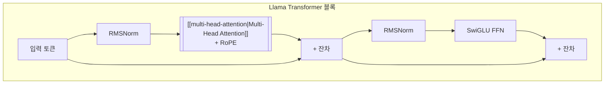

# Llama (Meta 오픈소스 LLM 패밀리)

## 개요

Llama는 Meta(구 Facebook)가 개발한 오픈소스 대규모 언어 모델 패밀리다. 2023년 2월 Llama 1 공개를 시작으로, Llama 2(2023.07), Llama 3(2024.04), Llama 3.1(2024.07), Llama 3.2(2024.09), [[llama-4|Llama 4]](2025.04)로 급속히 진화해왔다. 전체 시리즈를 통해 27회 이상 다른 위키 문서에서 참조될 만큼 생태계 전반에 걸쳐 영향력이 크다.

"오픈 웨이트" 공개 정책으로 학계와 산업의 LLM 접근성을 획기적으로 확대했으며, llama.cpp를 통한 로컬 실행, Code Llama 등 특화 변형, Meditron 같은 도메인 파인튜닝에 이르기까지 독보적인 커뮤니티 생태계를 구축했다. 다만 "오픈소스"라는 명명에 대해서는 사용 제한 조항으로 인해 Open Source Initiative(OSI)와 학계에서 "소스 공개(source-available)"에 가깝다는 비판이 있다.

## 아키텍처 공통 특성

Llama 전 세대는 자기회귀 디코더 전용(autoregressive decoder-only) [[transformer-architecture|Transformer]]를 기반으로 하며, 다음과 같은 공통 설계를 공유한다:

- **SwiGLU 활성함수**: GPT-3의 GeLU 대신 SwiGLU를 채택하여 FFN 성능 향상
- **RoPE(Rotary Positional Embeddings)**: 상대적 위치 인코딩으로, 학습 길이 이상의 컨텍스트로 외삽 가능
- **RMSNorm**: 기존 LayerNorm 대신 RMSNorm을 사용하여 학습 안정성 확보
- **[[pre-ln-vs-post-ln|Pre-LN]]**: Transformer 블록 내 LayerNorm을 어텐션/FFN 이전에 배치

RMSNorm -> 어텐션(RoPE) -> 잔차 연결 -> RMSNorm -> SwiGLU FFN -> 잔차 연결 구조는 Llama 1부터 3.2까지 일관되게 유지된다.

## 세대별 진화

### Llama 1 (2023.02)

Meta가 "연구자용"으로 제한 공개한 첫 모델이다.

- **규모**: 6.7B, 13B, 32.5B, 65.2B 파라미터 4개 변형
- **학습 데이터**: 1.4조 토큰 (CommonCrawl, GitHub, Wikipedia, Project Gutenberg, ArXiv, Stack Exchange 등 공개 소스)
- **핵심 발견**: 65B 모델이 GPT-3(175B) 대부분 벤치마크에서 우위. "작은 모델 + 더 많은 데이터"가 큰 모델만큼 효과적임을 입증
- **사건**: 2023년 3월 3일 가중치가 유출되어 사실상 전면 공개. 이 사건이 오픈소스 LLM 생태계 폭발의 기폭제가 됨

### Llama 2 (2023.07)

Microsoft와 제휴하여 상업적 사용이 가능하도록 라이선스를 전환한 전환점이다.

- **규모**: 7B, 13B, 70B 파라미터 3개 변형
- **학습 데이터**: 2조 토큰. 개인정보 큐레이션으로 정제
- **사후 학습**: SFT(Supervised Fine-Tuning) + RLHF(Reinforcement Learning from Human Feedback). 100만 건 이상의 인간 선호 데이터 사용
- **Chat 모델**: Llama 2-Chat은 당시 오픈소스 대화 모델 중 최고 성능. 유해성 평가에서 ChatGPT에 근접
- **라이선스**: "Llama 2 Community License"로 상업 사용 허용 (월간 활성 사용자 7억 미만)

### Llama 3 (2024.04)

오픈소스 LLM과 독점 모델 간 성능 격차를 크게 좁힌 세대다.

- **규모**: 8B, 70B 파라미터 2개 변형
- **학습 데이터**: 약 15조 토큰. 이전 세대 대비 7.5배 증가
- **토크나이저**: 128K 어휘 (Llama 2의 32K 대비 4배). 비영어 언어 효율성 향상
- **[[gqa-mqa|GQA]]**: Grouped-Query Attention으로 추론 효율 개선
- **성능**: Llama 3 70B가 [[gemini-3-1-pro|Gemini Pro 1.5]], Claude 3 Sonnet과 벤치마크에서 경쟁
- **스케일링 발견**: "Chinchilla-optimal" 이상으로 데이터를 투입해도 성능이 로그선형적으로 계속 향상됨을 입증

### Llama 3.1 (2024.07)

405B 파라미터 모델을 추가하여 오픈소스 최대 규모를 기록했다.

- **규모**: 8B, 70B, 405B 파라미터 3개 변형
- **컨텍스트**: 128K 토큰 윈도우 (Llama 3의 8K에서 16배 확장)
- **405B**: 당시 오픈소스 최대 모델. 독점 모델 GPT-4, Claude 3 Opus에 근접하는 성능
- **도구 사용**: 내장 코드 실행, 웹 검색, 수학 도구 호출 능력 추가

### Llama 3.2 (2024.09)

경량 모델과 멀티모달을 동시에 도입했다.

- **규모**: 1B, 3B (텍스트 전용), 11B, 90B (멀티모달)
- **경량 모델**: 1B/3B은 모바일과 엣지 디바이스를 타겟. Qualcomm, MediaTek 칩에서 네이티브 실행
- **멀티모달**: 11B/90B은 텍스트+이미지 입력을 지원. [[vision-transformer|ViT]] 인코더 + cross-attention으로 이미지를 언어 모델에 통합

## 세대별 비교

| 항목 | Llama 1 | Llama 2 | Llama 3 | Llama 3.1 | Llama 3.2 | [[llama-4\|Llama 4]] |
|------|---------|---------|---------|-----------|-----------|---------|
| 출시 | 2023.02 | 2023.07 | 2024.04 | 2024.07 | 2024.09 | 2025.04 |
| 최대 규모 | 65B | 70B | 70B | 405B | 90B | ~2T (Behemoth) |
| 학습 토큰 | 1.4T | 2T | 15T | 15T+ | 15T+ | 30T+ |
| 컨텍스트 | 2K | 4K | 8K | 128K | 128K | 10M (Scout) |
| 멀티모달 | X | X | X | X | O (11B/90B) | O (네이티브) |
| 라이선스 | 비상업 | 상업 (제한) | 상업 (제한) | 상업 (제한) | 상업 (제한) | 상업 (제한) |
| 아키텍처 | Dense | Dense | Dense + GQA | Dense + GQA | Dense + Vision | [[mixture-of-experts\|MoE]] |

## 생태계와 영향

### llama.cpp

Georgi Gerganov가 개발한 C++ 구현체로, GPU 없이도 CPU만으로 Llama 모델을 실행할 수 있게 한다. GGUF 포맷의 양자화 모델과 결합하여 로컬 LLM 실행의 사실상 표준이 되었으며, [[ollama|Ollama]], LM Studio 등 사용자 친화적 도구의 백엔드로 활용된다.

### 특화 변형

- **Code Llama**: 코드 생성/이해 특화 파인튜닝. 500B 코드 토큰 추가 학습
- **Meditron**: 의료 도메인 파인튜닝. 48B 의료 문서 토큰 학습
- **Space Llama**: 2025년 국제우주정거장에 배포된 버전

### 오픈소스 논쟁

Llama의 "오픈소스" 명명은 지속적인 논쟁을 유발한다:

- **사용 제한**: Acceptable Use Policy에서 군사 용도(2024년 11월부터 미국 기관 예외), 7억 MAU 이상 기업 사용을 제한
- **OSI 비준수**: Open Source Initiative는 Llama가 Open Source Definition(OSD)을 충족하지 않는다고 판단
- **Nature 논문**: "오픈워싱(openwashing)" - 폐쇄형으로 이해하는 것이 더 정확하다는 비판
- **실질적 효과**: 가중치와 코드가 공개되어 연구와 상업적 활용이 가능하므로, 완전 독점 모델 대비 접근성은 크게 높다

## Llama 4로의 진화

[[llama-4|Llama 4]]는 Dense 아키텍처에서 [[mixture-of-experts|MoE]]로의 전환, 10M 토큰 컨텍스트, 네이티브 멀티모달 등 근본적인 아키텍처 변화를 도입했다. Scout(17B 활성/109B 총), Maverick(17B 활성/400B 총), Behemoth(288B 활성/~2T 총) 세 모델이 계획되었으며, 별도 위키 페이지에서 상세히 다룬다.

## 참고 자료

- Touvron, H. et al. (2023). [Llama 2: Open Foundation and Fine-Tuned Chat Models](https://arxiv.org/abs/2307.09288). Meta AI
- [Llama (language model) - Wikipedia](https://en.wikipedia.org/wiki/Llama_(language_model))
- [Meta AI - Llama](https://ai.meta.com/llama/)

## 관련 문서

- [[llama-4]] -- Llama 4 Scout & Maverick (MoE 전환)
- [[transformer-architecture]] -- Llama의 기반 아키텍처
- [[mixture-of-experts]] -- Llama 4에서 채택한 MoE 구조
- [[vision-transformer]] -- Llama 3.2 멀티모달의 이미지 인코더
- [[ollama]] -- Llama 모델 로컬 실행 도구
