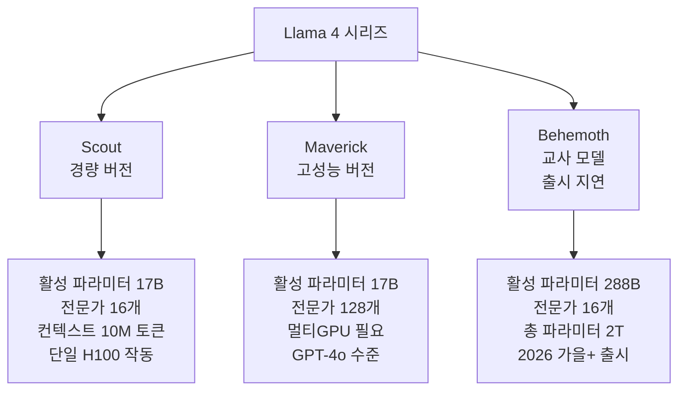
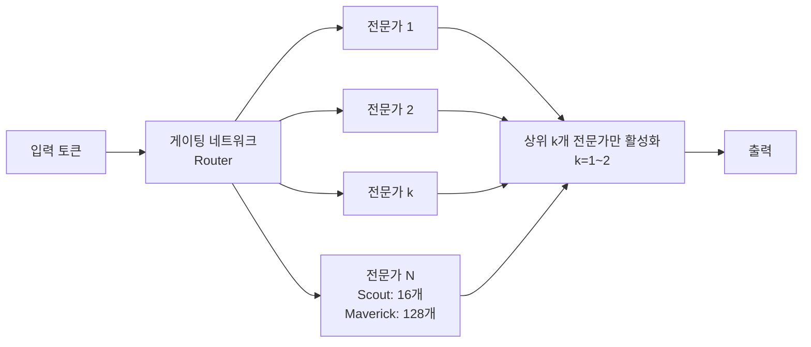
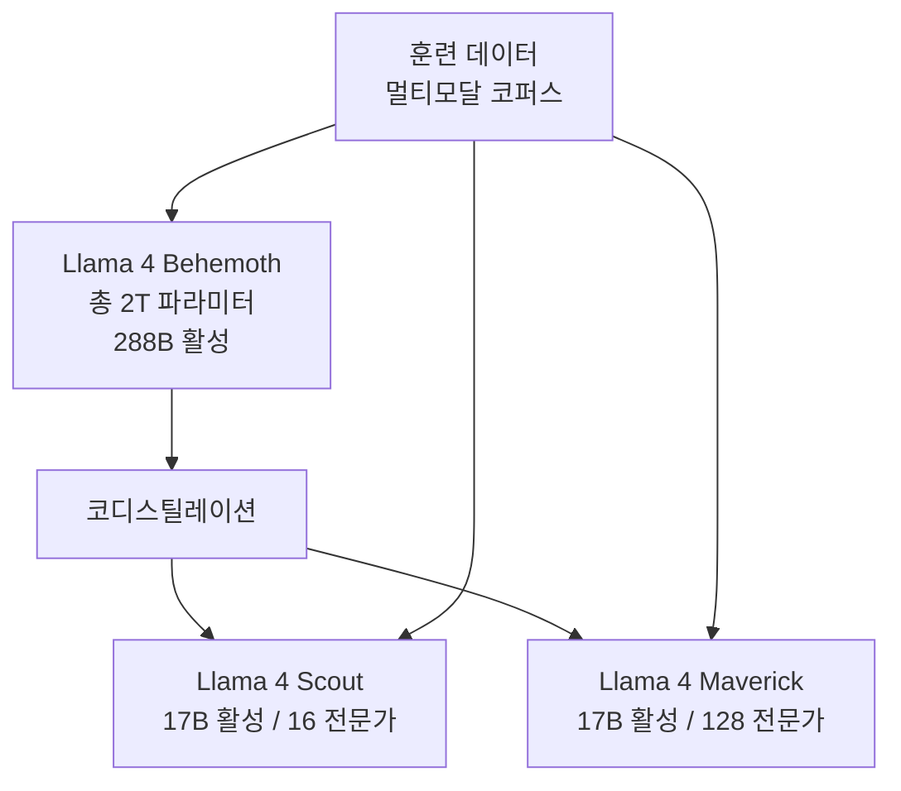

# Llama 4 Scout & Maverick

## 개요

2026년 4월 5일 Meta가 출시한 Llama 4 시리즈의 첫 두 모델이다. 활성 파라미터 170억(17B active)에 MoE(Mixture-of-Experts, 전문가 혼합) 아키텍처를 사용하는 **최초의 오픈 웨이트 네이티브 멀티모달 MoE 모델**이다. Scout는 단일 H100 GPU에서 구동 가능한 경량 버전이며, Maverick은 128개 전문가로 구성된 고성능 버전이다.

## 두 모델 비교

위 다이어그램은 Llama 4 세 모델의 포지셔닝을 보여준다.

## MoE 아키텍처 상세

Llama 4는 [[meta-llama]] 시리즈 최초로 MoE 아키텍처를 채택했다. MoE의 핵심 개념은 입력 토큰마다 전체 파라미터 중 일부(전문가)만 활성화해 효율을 높이는 것이다.

**Scout (16 전문가):**
- 총 파라미터: ~1090억 (109B)
- 활성 파라미터: 17B (약 16%)
- 실제 계산량: 17B 모델 수준이지만 지식 용량은 더 넓음
- 단일 H100 80GB에서 fp8/int4 양자화로 구동 가능

**Maverick (128 전문가):**
- 총 파라미터: ~4000억 이상 추정
- 활성 파라미터: 17B
- 128개 전문가로 더 세분화된 전문화(specialization) 가능
- 멀티GPU 서버 필요

## 네이티브 멀티모달

Llama 4는 텍스트-이미지 멀티모달을 "네이티브"로 지원한다. 기존 LLaVA, LLaMA + CLIP 방식처럼 별도 비전 인코더를 붙이는 것이 아니라, 단일 아키텍처로 텍스트와 이미지를 처리한다.

| 방식 | 설명 | 예시 |
|------|------|------|
| 어댑터 방식 | 텍스트 LLM + 비전 인코더 연결 | LLaVA, InstructBLIP |
| 네이티브 멀티모달 | 단일 아키텍처로 통합 처리 | Llama 4 Scout/Maverick |

네이티브 방식은 훈련 시 모달리티 간 정보가 더 깊게 통합되어 시각-언어 추론에서 우위를 보이는 경향이 있다. [[multimodal-llm]] 참조.

## 1000만 토큰 컨텍스트 (Scout)

Scout의 1000만(10M) 토큰 컨텍스트는 현재 공개된 모델 중 가장 긴 컨텍스트 창 중 하나다.

**10M 토큰 = 대략:**
- 영어 책 8000페이지 분량
- 코드베이스 전체 (중규모 프로젝트)
- 1년치 일간지 전문

이를 가능하게 하는 기술:
- **iRoPE (Interleaved RoPE)**: 일부 레이어에서 위치 임베딩 없이 처리해 컨텍스트 확장성 향상
- **청크 어텐션**: 긴 시퀀스를 청크로 분할해 처리하는 어텐션 효율화

## Behemoth 교사 모델의 역할

Scout와 Maverick은 Llama 4 Behemoth(총 2조 파라미터) 모델로부터 **코디스틸레이션(codistillation, 공동 증류)**을 통해 학습됐다.

코디스틸레이션은 교사 모델의 소프트 레이블(soft labels)과 실제 데이터를 함께 사용해 학생 모델을 훈련하는 기법이다. Behemoth는 STEM 벤치마크에서 GPT-4.5, Claude Sonnet 3.7, Gemini 2.0 Pro를 능가한다고 주장하나, 역량 미달로 출시가 2026년 가을 이후로 연기됐다.

## 벤치마크 성능

Meta가 공개한 Maverick 벤치마크:

| 벤치마크 | Maverick | GPT-4o | Gemini 2.0 Flash |
|---------|---------|--------|-----------------|
| MMLU | 85.5 | 85.7 | 85.0 |
| HumanEval | 87.2 | 82.5 | 83.5 |
| MATH | 73.1 | 74.6 | 71.2 |
| VQAv2 (비전) | 82.3 | 77.8 | 80.1 |

단, Meta가 직접 공개한 벤치마크이므로 독립적 검증이 필요하다.

## 접근 방법

**Hugging Face:**
- `meta-llama/Llama-4-Scout-17B-16E`
- `meta-llama/Llama-4-Maverick-17B-128E`
- 라이선스: Llama 4 Community License (700만 MAU 이하 무료, 이상 Meta 상업 계약 필요)

**Meta AI 플랫폼:**
- meta.ai에서 직접 사용 가능
- Meta AI 앱 (Instagram, WhatsApp, Messenger 통합)

**Ollama, llama.cpp:**
- Scout는 단일 고급형 소비자 GPU에서 구동 가능 (RTX 4090 또는 H100)
- Maverick은 최소 8xH100 서버 필요

## Llama 4 출시가 갖는 의의

1. **오픈 웨이트 MoE 선례**: 이전까지 MoE 모델(Mixtral, DeepSeek-MoE 등)은 있었으나 네이티브 멀티모달 MoE 오픈 웨이트는 처음
2. **성능-비용 효율**: 활성 파라미터 17B로 130B+ 모델 수준 성능을 내는 MoE 효율성 증명
3. **생태계 파급**: Llama 4 기반 파인튜닝, LoRA 어댑터, 특화 모델 생태계 활성화 예상

## 관련 문서

- [[meta-llama]] - Meta Llama 시리즈 전반
- [[multimodal-llm]] - 멀티모달 LLM 개념
- [[meta-muse-spark]] - Meta Superintelligence Labs의 클로즈드 소스 전략 (Llama와 대조)
