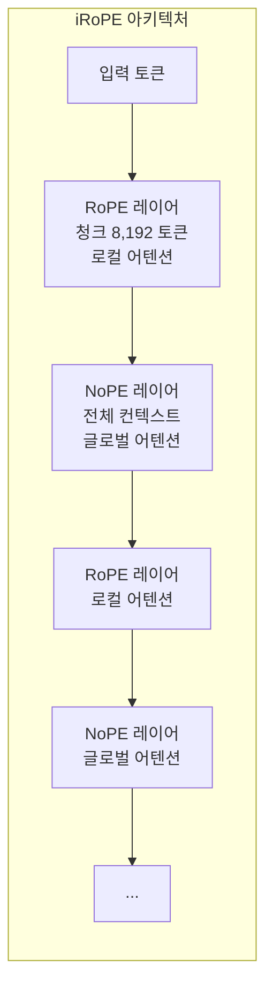

## 개요

Llama 4는 Meta가 2026년 4월 5일 출시한 오픈 [[moe|MoE(Mixture-of-Experts)]] 멀티모달 모델 패밀리다. Scout(17B/16E, 109B 총 파라미터)와 Maverick(17B/128E, 400B 총 파라미터) 두 모델이 공개되었으며, 2조 파라미터급 Behemoth는 현재 학습 중이다.

Scout는 업계 최대인 1,000만 토큰 컨텍스트 윈도우를 지원하며, 단일 H100 GPU에서 INT4 양자화로 실행 가능하다. [[deepseek-v3-2|DeepSeek-V3.2]] 대비 절반 이하의 활성 파라미터로 유사한 추론/코딩 성능을 달성한다. Maverick는 LMArena ELO 1,417점을 기록하며 [[gpt-5-4|GPT-4o]]와 Gemini 2.0 Flash를 능가하는 성능을 보인다. 두 모델 모두 텍스트-이미지-비디오 통합 멀티모달을 네이티브로 지원한다.

30조 이상의 토큰으로 사전학습되었으며, 200개 언어를 커버한다(10억 토큰 이상 100개 언어 포함). Llama 4 Community License Agreement로 공개되었다.

## 핵심 특징

- **MoE 효율성**: 17B 활성 파라미터만으로 400B급 모델(Maverick) 성능 달성. DeepSeek v3 대비 절반 이하의 활성 파라미터로 유사한 추론/코딩 성능
- **10M 컨텍스트 (Scout)**: iRoPE 아키텍처로 업계 최대 컨텍스트 윈도우 달성. 256K로 학습 후 추론 시 1,000만 토큰까지 확장
- **네이티브 멀티모달**: Early Fusion으로 텍스트-비전 토큰을 통합 백본에서 처리. 사전학습에서 최대 48개 이미지 동시 처리
- **경량 SFT + 대규모 RL**: SFT 데이터 95% 제거 후 온라인 강화학습 중심 파이프라인. 추론/코딩 능력을 극대화하는 새로운 사후학습 전략
- **Behemoth 코증류(Co-distillation)**: 2조 파라미터 Behemoth가 교사 모델로 Scout/Maverick 성능을 끌어올림

## 기술 상세

### 모델 패밀리 비교

| 항목 | Scout | Maverick | Behemoth |
|---|---|---|---|
| 활성 파라미터 | 17B | 17B | 288B |
| 전문가(Expert) 수 | 16 | 128 | 16 |
| 총 파라미터 | 109B | 400B | ~2T |
| 최대 컨텍스트 | 10M | 1M | 미공개 |
| 상태 | 출시 | 출시 | 학습 중 |
| 최소 하드웨어 | 1x H100 (INT4) | 8x H100 | 미공개 |

### iRoPE 아키텍처

Llama 4의 핵심 아키텍처 혁신은 iRoPE(interleaved Rotary Position Embedding)로, NoPE(No Positional Encoding) 레이어와 RoPE 레이어를 교대 배치한다.

- **RoPE 레이어**: 8,192 토큰 청크 내에서만 어텐션 적용 (Sliding Window의 효율적 대안)
- **NoPE 레이어**: 4개 레이어마다 1개. 전체 Causal Mask로 전체 컨텍스트 접근
- **Scaled Softmax**: NoPE 레이어에 온도 스케일링 적용. 긴 시퀀스에서 어텐션 확률이 0에 수렴하는 문제 해결

### MoE 구조

Scout와 Maverick는 서로 다른 MoE 전략을 사용한다.

- **Scout**: 모든 레이어에 MoE 적용. QK Normalization(RoPE 후 RMS 정규화) 사용
- **Maverick**: Dense 레이어와 MoE 레이어를 교대 배치. 각 토큰은 공유 전문가 + 128개 라우팅 전문가 중 1개로 라우팅

### 사전학습

| 항목 | 사양 |
|---|---|
| 학습 데이터 | 30조+ 토큰 (Llama 3의 2배 이상) |
| 언어 수 | 200개 (10억+ 토큰: 100개 이상) |
| 다국어 데이터 | Llama 3 대비 10배 증가 |
| 정밀도 | FP8 (Behemoth: 390 TFLOPs/GPU) |
| MetaP | 계층별 학습률/초기화 자동 설정 |

### 사후학습 파이프라인

경량 SFT --> 온라인 RL --> 경량 DPO 3단계 파이프라인을 사용한다.

- SFT/DPO에서 50% 이상의 쉬운 데이터 제거
- 온라인 RL에서 중간-어려운 난이도 프롬프트만 선별
- 비동기 온라인 RL로 약 10배 학습 효율성 개선
- 모달리티 혼합 시 큐레이션된 커리큘럼 전략으로 개별 모달리티 성능 유지

### 멀티모달 비전 인코더

MetaCLIP 기반 비전 인코더를 사용하며, 고정된 LLM과 함께 별도 학습하여 인코더 적응을 최적화한다. Early Fusion으로 텍스트-비전 토큰을 통합 모델 백본에 함께 통합한다.

## 벤치마크

### Instruction Tuned 모델

| 카테고리 | 벤치마크 | Scout | Maverick | Llama 3.1 405B |
|---|---|---|---|---|
| 추론/지식 | MMLU Pro | 74.3 | 80.5 | 73.4 |
| 추론/지식 | GPQA Diamond | 57.2 | 69.8 | 49.0 |
| 코딩 | LiveCodeBench | 32.8 | 43.4 | 27.7 |
| 이미지 추론 | MMMU | - | 73.4 | 69.4 |
| 이미지 추론 | MMMU Pro | 52.2 | 59.6 | - |
| 이미지 이해 | DocVQA | 94.4 | 94.4 | - |
| 다국어 | MGSM | 90.6 | 92.3 | 91.6 |

### LMArena ELO

Maverick 실험용 챗 버전: **1,417점** (GPT-4o, Gemini 2.0 Flash 상회)

### 안전 및 편향

- 정치/사회 논쟁 주제 거부율: 7% --> 2% 미만으로 감소
- 불균형 거부 비율: 1% 미만
- 정치적 편향: Llama 3.3의 절반 수준 (Grok과 유사)

## 관련 문서

- [[deepseek-v3-2]] - 경쟁 모델: DeepSeek-V3.2
- [[gemma-4]] - 경쟁 모델: Google Gemma 4
- [[claude-opus-4-6]] - 경쟁 모델: Claude Opus 4.6
- [[gpt-5-4]] - 경쟁 모델: GPT-5.4
