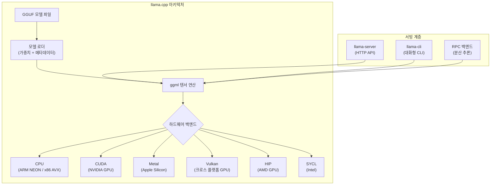
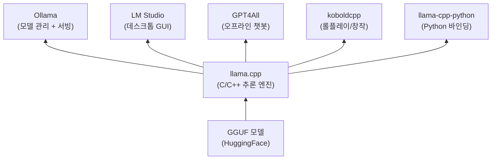

# llama.cpp

Georgi Gerganov가 2023년 3월에 시작한 C/C++ 기반 LLM 추론 라이브러리. Meta의 LLaMA 가중치를 순수 C/C++로 실행할 수 있는지 실험하던 개인 프로젝트에서 출발하여, 로컬 LLM 생태계의 핵심 인프라로 성장했다. 2026년 3월 GitHub 100K stars를 돌파했으며, [[ollama|Ollama]], LM Studio, GPT4All 등 주요 로컬 LLM 도구의 추론 백엔드로 사용된다.

## 프로젝트 개요

| 항목 | 내용 |
|---|---|
| 이름 | llama.cpp |
| 창시자 | Georgi Gerganov |
| 시작 | 2023년 3월 |
| 언어 | C/C++ |
| 라이선스 | MIT |
| 저장소 | github.com/ggml-org/llama.cpp |
| GitHub Stars | 100K+ (2026년 3월) |
| 기반 라이브러리 | ggml (범용 텐서 라이브러리) |
| 소속 | ggml.ai -- 2026년 2월 Hugging Face 합류 |

## 아키텍처

llama.cpp의 핵심은 ggml 텐서 라이브러리다. ggml은 C로 작성된 경량 텐서 연산 라이브러리로, 외부 의존성 없이 행렬 곱셈, 어텐션, 정규화 등 Transformer 연산을 구현한다. llama.cpp는 ggml 위에 LLM 특화 로직(토크나이저, KV 캐시, 샘플링)을 쌓은 구조다.



### 하드웨어 백엔드

llama.cpp의 설계 철학은 "최소 설정으로 최대한 다양한 하드웨어에서 실행"이다.

- **CPU**: ARM NEON, x86 AVX/AVX2/AVX-512 최적화. 2코어 + 8GB DDR2에서도 4B 모델을 약 2 tokens/s로 실행 가능
- **Apple Metal**: Apple Silicon(M1/M2/M3/M4) GPU 네이티브 지원. 1급 시민(first-class citizen)으로 취급
- **CUDA**: NVIDIA GPU용 커스텀 커널. 양자화 행렬 곱셈, Flash Attention 등 최적화
- **Vulkan**: 크로스 플랫폼 GPU 백엔드. NVIDIA, AMD, Intel, Qualcomm 등 범용 지원
- **HIP**: AMD GPU 지원 (ROCm 기반)
- **SYCL**: Intel GPU/가속기 지원
- **RPC**: 원격 프로시저 호출로 여러 머신에 걸쳐 분산 추론 가능

## GGUF 포맷과 양자화

llama.cpp는 모델을 [[gguf-format|GGUF(GGML Unified Format)]] 포맷으로 저장하고 로드한다. GGUF는 단일 파일에 가중치, 토크나이저, 하이퍼파라미터, 양자화 메타데이터를 모두 포함하는 자기 완결적(self-contained) 바이너리 포맷이다.

### 양자화 기법

[[ai-inference-quantization-2026|양자화]]는 llama.cpp의 핵심 가치 제안이다. FP16 가중치를 저비트 정수로 변환하여 메모리 사용량과 연산 비용을 대폭 줄인다. llama.cpp는 1.5비트부터 8비트까지 다양한 양자화 수준을 지원한다.

**주요 양자화 포맷**:

| 포맷 | 비트 | 특징 | 용도 |
|------|------|------|------|
| Q4_K_M | 4-bit | K-Quant, 중간 품질 | 범용 권장 (VRAM 제한 환경) |
| Q5_K_M | 5-bit | K-Quant, 높은 품질 | 품질-효율 균형 |
| Q6_K | 6-bit | K-Quant, 거의 원본 수준 | 고품질 요구 |
| Q8_0 | 8-bit | 최소 품질 손실 | 충분한 VRAM 보유 시 |
| Q3_K_M | 3-bit | K-Quant, 공격적 압축 | 극단적 VRAM 제한 |
| IQ2_XXS | 2-bit | Importance Quantization | 실험적 초저비트 |

K-Quant(K-means 기반 양자화)는 블록 내 가중치 분포를 고려하여 양자화 에러를 최소화한다. 동일 비트 수에서도 naive 양자화 대비 상당한 품질 향상을 달성한다.

## llama-server: HTTP API

llama-server는 llama.cpp의 내장 HTTP 서버로, OpenAI 호환 REST API를 제공한다. 별도의 Python/Node.js 래퍼 없이 C++ 네이티브 서버가 직접 요청을 처리하므로 오버헤드가 최소화된다.

```bash
# llama-server 실행
llama-server -m model.gguf --port 8080 --n-gpu-layers 99

# OpenAI 호환 API 호출
curl http://localhost:8080/v1/chat/completions \
  -H "Content-Type: application/json" \
  -d '{"model": "model", "messages": [{"role": "user", "content": "Hello"}]}'
```

주요 엔드포인트: `/v1/chat/completions`, `/v1/completions`, `/v1/embeddings`, `/health`, `/slots`. 내장 WebUI도 포함되어 브라우저에서 직접 모델과 대화할 수 있다.

## Ollama와의 관계

[[ollama|Ollama]]는 llama.cpp를 추론 엔진으로 감싸고, 모델 다운로드-관리-서빙을 Docker 스타일 CLI로 통합한 플랫폼이다. `ollama run llama3` 같은 한 줄 명령 뒤에서 llama.cpp가 실제 추론을 수행한다. Ollama가 사용자 경험(UX) 계층이라면, llama.cpp는 그 아래의 추론 엔진 계층이다.

## Hugging Face 합류 (2026년 2월)

2026년 2월, Gerganov와 ggml.ai 팀이 Hugging Face에 합류했다. Hugging Face 측은 "llama.cpp는 로컬 추론의 기본 빌딩 블록이고, transformers는 모델 정의의 기본 빌딩 블록"이라며, 두 프로젝트 간의 원활한 모델 배포 파이프라인을 구축하는 것이 목표라고 밝혔다. 이후 `-hf` 플래그로 다운로드한 모델이 표준 Hugging Face 캐시 디렉토리에 저장되고, Hugging Face Inference Endpoints에서 GGUF를 기본 지원하는 등 통합이 심화되고 있다.

## 로컬 LLM 생태계에서의 위치

llama.cpp는 로컬 LLM 추론의 사실상 표준(de facto standard) 저수준 엔진이다. 상위 레벨 도구들이 llama.cpp를 백엔드로 채택하면서 계층 구조가 형성되었다.



## 관련 문서
- [[mlc-llm]] -- MLC-LLM

- [[gguf-format|GGUF Format]] -- llama.cpp가 개발한 모델 파일 포맷
- [[ollama|Ollama]] -- llama.cpp 기반 로컬 LLM 실행 플랫폼
- [[ai-inference-quantization-2026|AI 추론 양자화]] -- 양자화 기법 상세
