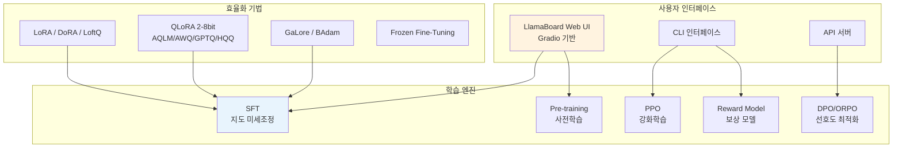
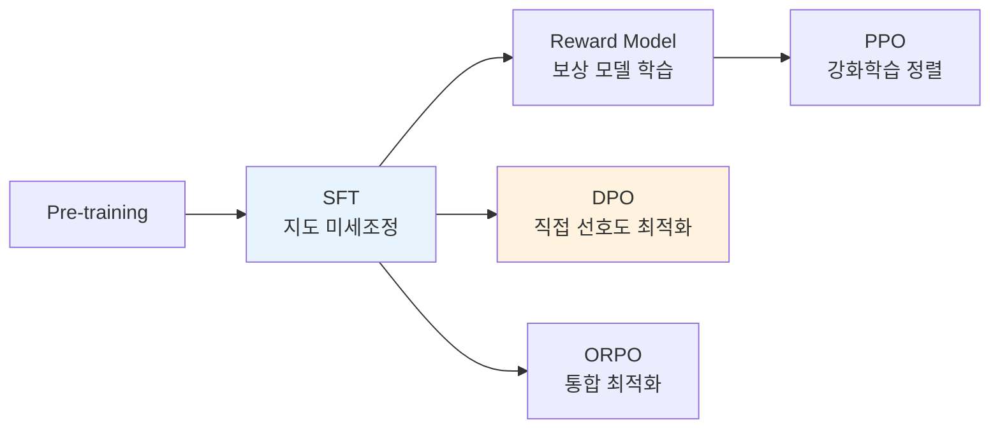

# LLaMA-Factory: 100+ 모델 통합 파인튜닝 프레임워크

## 개요

LLaMA-Factory(LlamaFactory)는 100개 이상의 LLM/VLM을 코드 작성 없이 파인튜닝할 수 있는 통합 프레임워크다. ACL 2024에서 발표되었으며, GitHub에서 70,000개 이상의 스타를 획득해 파인튜닝 도구 중 가장 큰 커뮤니티를 보유하고 있다. 핵심 차별점은 **LlamaBoard**라는 Gradio 기반 웹 UI를 제공하여 비개발자도 모델 파인튜닝을 수행할 수 있다는 점이다.

hiyouga가 개발을 주도하며, [[supervised-fine-tuning]]부터 [[rlhf-pipeline]]까지 전체 포스트트레이닝 파이프라인을 단일 인터페이스에서 처리한다.

## 아키텍처



## LlamaBoard -- 노코드 웹 인터페이스

LlamaBoard는 LLaMA-Factory의 가장 대표적인 기능으로, Gradio 기반의 통합 웹 UI다.

### 4개 탭 구성

| 탭 | 기능 |
|----|------|
| **Train** | 모델/데이터셋/하이퍼파라미터 선택 및 학습 실행 |
| **Evaluate & Predict** | 학습된 모델 벤치마크 평가 및 예측 |
| **Chat** | 모델과 실시간 대화 테스트 |
| **Export** | 학습된 모델 내보내기 (병합, 양자화) |

### 주요 UI 기능

- 기본값 추천으로 초보자도 즉시 시작 가능
- 학습 중 **실시간 loss 곡선** 시각화
- 데이터셋 미리보기 -- 학습 전 데이터 검증
- 다국어 지원: 영어, 중국어, 러시아어

## 지원 모델

LLaMA-Factory는 100개 이상의 모델 아키텍처를 지원한다. 주요 모델:

| 제조사 | 모델 |
|--------|------|
| Meta | Llama, Llama 2, Llama 3, Llama 4 |
| DeepSeek | DeepSeek-V2/V3 |
| Alibaba | Qwen, Qwen2, Qwen2.5, Qwen2.5-Omni, Qwen3 |
| Google | Gemma, Gemma 2 |
| Microsoft | Phi-3, Phi-4 |
| Mistral | Mistral, Mixtral |
| GLM | GLM-4, GLM-4.1V |
| 기타 | BLOOM, Falcon, InternLM, InternVL3, StarCoder 2, MiniCPM, Yuan 2 등 |

## 학습 방법

### 기본 학습 단계



- **Pre-training**: 도메인 특화 사전학습
- **[[supervised-fine-tuning|SFT]]**: 지시-응답 데이터로 미세조정
- **[[reward-model-training|Reward Model]]**: 선호도 데이터로 보상 모델 학습
- **[[ppo-for-llms|PPO]]**: 보상 모델 기반 강화학습 정렬
- **[[direct-preference-optimization|DPO]]**: 보상 모델 없는 직접 선호도 최적화
- **ORPO**: SFT와 선호도 최적화를 단일 단계로 통합

### 효율적 파인튜닝 기법

LLaMA-Factory는 풍부한 파라미터 효율적 학습 기법을 지원한다:

**양자화 기반 ([[lora-qlora-finetuning]] 관련)**:
- 16-bit 전체 파인튜닝
- Frozen Fine-Tuning (일부 레이어 고정)
- LoRA / DoRA / LoftQ / PiSSA / LoRA+
- 2/3/4/5/6/8-bit QLoRA (AQLM, AWQ, GPTQ, LLM.int8, HQQ, EETQ 지원)

**고급 최적화**:
- GaLore -- Gradient Low-Rank Projection
- BAdam -- Block-wise Adam
- LongLoRA -- 긴 컨텍스트 효율적 학습
- LLaMA Pro -- 블록 확장
- Mixture-of-Depths -- 연산 효율적 깊이 제어
- OFT -- Orthogonal Fine-Tuning (v0.9.4)
- FP8 학습 (v0.9.4)

## 최신 버전 (v0.9.4)

2025년 말 릴리스된 "Goodbye 2025" 버전의 주요 기능:

| 기능 | 설명 |
|------|------|
| OFT | Orthogonal Fine-Tuning 지원 |
| Megatron-LM | MCoreAdapter를 통한 대규모 병렬 학습 |
| KTransformers | 추론 백엔드 추가 |
| MPO | 새로운 정렬 알고리즘 |
| FP8 | 8-bit 부동소수점 학습 |
| Transformers v5 | 최신 HuggingFace Transformers 호환 |

## 실행 방법

### LlamaBoard (웹 UI)

```bash
# 설치
pip install llamafactory

# 웹 UI 실행
llamafactory-cli webui
```

### CLI

```bash
# SFT 학습
llamafactory-cli train examples/train_lora/llama3_lora_sft.yaml

# 평가
llamafactory-cli eval examples/eval/llama3_lora_eval.yaml

# 채팅
llamafactory-cli chat examples/chat/llama3_lora_chat.yaml

# 모델 내보내기
llamafactory-cli export examples/export/llama3_lora_export.yaml
```

### Docker

```bash
docker run -it --gpus all \
  -v ./data:/app/data \
  -p 7860:7860 \
  hiyouga/llamafactory:latest
```

## 다른 도구와의 비교

| 특성 | LLaMA-Factory | TRL | Axolotl | Unsloth |
|------|---------------|-----|---------|---------|
| 모델 지원 수 | 100+ | HF 호환 전체 | HF 호환 전체 | 주요 모델 |
| Web UI | LlamaBoard (내장) | 없음 | 없음 | Unsloth Studio |
| 진입 장벽 | 매우 낮음 | 중간 | 중간 | 낮음 |
| 학술적 기반 | ACL 2024 논문 | 다수 논문 참조 | 커뮤니티 중심 | 커뮤니티 중심 |
| 커뮤니티 규모 | 70K+ stars | 15K+ stars | 8K+ stars | 25K+ stars |
| 성능 최적화 수준 | 기본 | 기본 | 높음 | 매우 높음 |

## [[huggingface-hub]] 통합

- 모든 모델/데이터셋을 Hub에서 직접 로딩
- 학습 완료 모델을 Hub에 업로드
- [[lora-qlora-finetuning]] 어댑터 자동 병합 및 내보내기
- [[mixed-precision-training]] 옵션 자동 설정

## 참고 자료

- 공식 문서: https://llamafactory.readthedocs.io
- GitHub: https://github.com/hiyouga/LlamaFactory
- 논문: "LlamaFactory: Unified Efficient Fine-Tuning of 100+ Language Models" (ACL 2024, arXiv:2403.13372)
