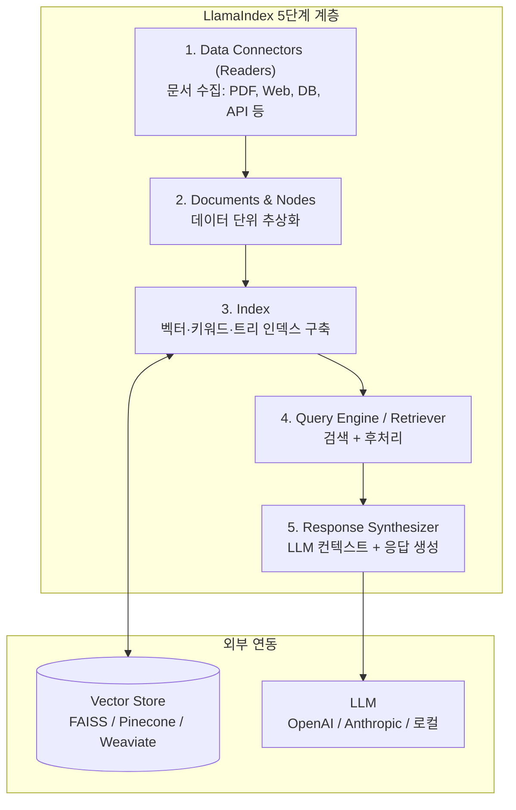
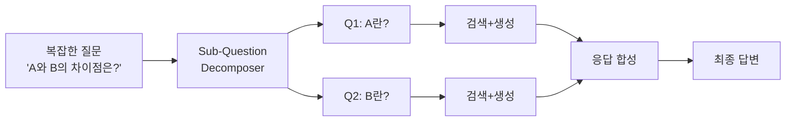

# LlamaIndex

LLM 기반 애플리케이션의 데이터 수집, 인덱싱, 질의(query)를 위한 Python 프레임워크. "LLM이 당신의 데이터 위에서 동작하게 한다"는 미션을 갖고 있으며, RAG 파이프라인의 데이터 레이어(ingestion - indexing - querying)에 특화된 추상화를 제공한다.

## 개요

| 항목 | 내용 |
|---|---|
| 이름 | LlamaIndex (구 GPT Index) |
| 개발사 | LlamaIndex, Inc. |
| 라이선스 | MIT |
| 저장소 | github.com/run-llama/llama_index |
| 언어 | Python (TypeScript: llama_index.ts) |

Jerry Liu와 Simon Suo가 2022년 말 GPT Index라는 이름으로 시작했으며, 이후 LlamaIndex로 개명했다. RAG 파이프라인의 데이터 수집과 인덱싱에 집중한다는 점에서 LangChain과 차별화된다.

## 핵심 추상화 계층

LlamaIndex는 5단계 데이터 처리 계층으로 구성된다.



### 1. Data Connectors (LlamaHub)

LlamaHub는 100개 이상의 데이터 소스 커넥터를 제공하는 허브다.

```python
from llama_index.core import SimpleDirectoryReader
from llama_index.readers.web import SimpleWebPageReader

# 로컬 파일
docs = SimpleDirectoryReader("./data").load_data()

# 웹 페이지
web_docs = SimpleWebPageReader().load_data(["https://example.com"])
```

PDF, Notion, Slack, GitHub, Confluence, Jira, YouTube 자막 등 다양한 소스를 지원한다.

### 2. Index 유형

| 인덱스 유형 | 특징 | 적합한 용도 |
|---|---|---|
| VectorStoreIndex | 임베딩 기반 시맨틱 검색 | 일반 RAG |
| SummaryIndex | 문서 전체 요약 기반 | 긴 문서 질의 |
| KeywordTableIndex | 키워드 추출 기반 BM25 | 정확한 키워드 매칭 |
| KnowledgeGraphIndex | 트리플 기반 그래프 | 관계 중심 질의 |
| DocumentSummaryIndex | 문서 요약 + 검색 조합 | 대용량 코퍼스 |

### 3. Query Engine

```python
from llama_index.core import VectorStoreIndex

index = VectorStoreIndex.from_documents(docs)
query_engine = index.as_query_engine(similarity_top_k=3)
response = query_engine.query("LlamaIndex의 주요 특징은?")
print(response)
```

Query Engine은 검색(Retriever) + 응답 합성(Response Synthesizer)을 캡슐화한다. 응답 모드로는 `refine`, `tree_summarize`, `simple_summarize`, `compact` 등이 있다.

## 고급 RAG 패턴

LlamaIndex는 [[rag-pipeline|RAG 파이프라인]]의 고급 패턴을 내장한다.

### 하이브리드 검색

```python
from llama_index.retrievers.bm25 import BM25Retriever
from llama_index.core.retrievers import VectorIndexRetriever
from llama_index.core.retrievers import QueryFusionRetriever

vector_retriever = VectorIndexRetriever(index=index, similarity_top_k=5)
bm25_retriever = BM25Retriever.from_defaults(docstore=index.docstore, similarity_top_k=5)

retriever = QueryFusionRetriever(
    [vector_retriever, bm25_retriever],
    num_queries=4,   # 쿼리 확장
    mode="reciprocal_rerank",
)
```

### Sub-Question Query Engine

복잡한 질문을 하위 질문으로 분해하여 각각 검색한 뒤 통합하는 패턴.



## LlamaIndex vs Haystack

| 항목 | LlamaIndex | [[haystack|Haystack]] |
|---|---|---|
| 핵심 강점 | 데이터 수집·인덱싱 다양성 | 파이프라인 엔지니어링 |
| 컴포넌트 교체 | 자유도 높음 | 타입 안전 검증 |
| 고급 RAG 패턴 | 풍부 (Sub-Q, HyDE 등) | 커스텀 구현 필요 |
| 멀티모달 지원 | 있음 (이미지, 오디오) | 제한적 |
| 에이전트 지원 | LlamaAgents (별도) | 있음 |

## LlamaCloud

LlamaIndex의 관리형 SaaS 버전. 문서 파싱, 인덱싱, 검색을 API로 제공한다. 로컬 파이프라인을 클라우드로 마이그레이션하거나, 엔터프라이즈 규모의 문서 처리가 필요할 때 활용한다.

## 실무 관점

LlamaIndex는 **다양한 데이터 소스를 LLM에 연결하는 데이터 인제스천 레이어**로서 강점을 갖는다. LlamaHub의 폭넓은 커넥터, 풍부한 인덱스 유형, Sub-Question · HyDE · 하이브리드 검색 등 고급 RAG 패턴이 잘 정리되어 있다. 프로덕션 파이프라인 엔지니어링 관점에서는 Haystack이 더 엄격한 타입 안전성을 제공하며, 범용 LLM 앱 구성에는 LangChain이 더 넓은 에코시스템을 갖는다.

## 관련 문서

- [[rag-pipeline|RAG 파이프라인]]
- [[haystack|Haystack]]
- [[faiss|FAISS]]
- [[weaviate|Weaviate]]
- [[pinecone|Pinecone]]
- [[langchain|LangChain]]
