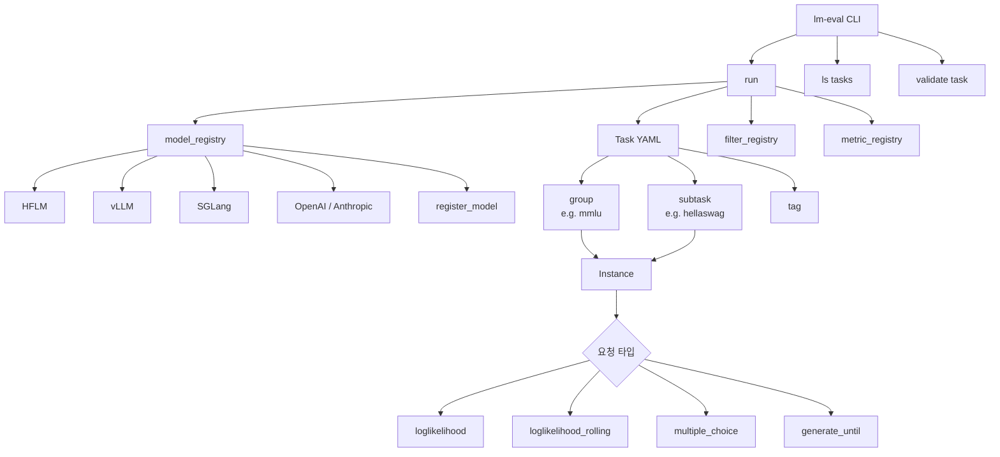

# lm-evaluation-harness (EleutherAI)

EleutherAI 가 유지하는 LLM few-shot/zero-shot 학술 벤치마크 통합 실행 harness. 60+ 표준 benchmark 와 수백 개 subtask 를 단일 인터페이스로 실행하며, **HuggingFace Open LLM Leaderboard, NVIDIA NeMo, Cohere, BigScience, Mosaic ML 등이 공식 백엔드로 채택**한 사실상의 표준이다. 같은 EleutherAI 가 GPT-3 논문(2020) 이 보고만 하고 평가 코드를 공개하지 않았던 문제를 해결하기 위해 시작한 프로젝트다.

이 페이지는 lm-evaluation-harness 의 내부 구조 (모델 어댑터, 레지스트리, Task 시스템, 멀티 GPU 패턴) 를 정리한다. harness 들 간 비교는 [[evaluation-harness-comparison]] 참조. 기존 [[evaluation-harness]] 허브 페이지의 lm-eval 섹션을 보강한다.

## 한 줄 요약

> "over 60 standard academic benchmarks for LLMs, with hundreds of subtasks and variants implemented"
>
> -- README

핵심 추상화는 (1) `LM` 모델 어댑터 + `register_model` 레지스트리, (2) YAML 기반 `Task` 정의, (3) `Instance` 단위 요청 스케줄링, (4) `Filter`/`Metric`/`Aggregation` 레지스트리.

## 채택 사례

- HuggingFace Open LLM Leaderboard 백엔드
- NVIDIA, Cohere, BigScience, Mosaic ML 내부 검증
- 다수 논문에서 baseline 기준 harness 로 인용

## 컴포넌트 다이어그램



## 설치 / 백엔드 분리 패턴

```bash
git clone --depth 1 https://github.com/EleutherAI/lm-evaluation-harness
cd lm-evaluation-harness
pip install -e .
```

백엔드별 추가 설치 (모든 의존성을 import time 에 강제하지 않기 위해 분리):

| Backend | extras |
|---|---|
| HuggingFace transformers (+ GGUF, quantization) | `pip install "lm_eval[hf]"` |
| vLLM | `pip install "lm_eval[vllm]"` |
| API providers (OpenAI, Anthropic 등) | `pip install "lm_eval[api]"` |

지원 백엔드: HF transformers, vLLM (TP/DP), SGLang, OpenAI Completions/Chat, Anthropic Claude, OpenAI-compatible local server, NVIDIA NeMo, Megatron-LM, Windows ML (ONNX Runtime GenAI).

## CLI 구조

`lm-eval` 는 세 서브커맨드로 분리된다.

```
lm-eval run <args>          # 평가 실행
lm-eval ls tasks            # 사용 가능한 task/group/tag 나열
lm-eval validate <task>     # task 설정 검증
```

### `run` 핵심 인자 (interface.md 인용)

```
--model <type>          # 모델 프로바이더 (기본 hf)
--model_args key=val    # 모델 생성자 인자
--tasks <task_list>     # 공백/콤마 구분 task 이름
--limit <int_or_float>  # 디버깅용 샘플 제한
--num_fewshot N         # few-shot 예시 수
--batch_size <int>      # 'auto' 도 가능
--device <device>       # cuda, cpu, mps
--gen_kwargs key=val    # temperature, top_p 등
--output_path DIR       # 결과 저장
--log_samples           # 샘플별 입출력 보존
--cache_requests        # true/refresh/delete
--apply_chat_template   # chat 템플릿 자동 적용
--wandb_args            # W&B 로깅
```

추론 모델 지원: `think_end_token`, `enable_thinking`.

## 멀티 GPU 패턴

Data parallelism (`accelerate`):
```bash
accelerate launch -m lm_eval --model hf \
    --tasks lambada_openai,arc_easy \
    --batch_size 16
```

Model parallelism:
```bash
lm_eval --model hf \
    --tasks lambada_openai,arc_easy \
    --model_args parallelize=True \
    --batch_size 16
```

vLLM TP + DP:
```bash
lm_eval --model vllm \
    --model_args pretrained={model},tensor_parallel_size={GPUs},data_parallel_size={replicas} \
    --tasks lambada_openai \
    --batch_size auto
```

## 핵심 추상화: 모델 어댑터 (`LM`)

`docs/model_guide.md` 인용:

> "You must subclass `lm_eval.api.model.LM`. The guide also mentions `lm_eval.api.registry.TemplateLM` as an abstraction layer and notes that `lm_eval.models.huggingface.HFLM` is available for subclassing if appropriate."

### 구현해야 하는 3개 메서드

```python
def loglikelihood(self, requests: list[Instance]) -> list[tuple[float, bool]]:
    """context-target 쌍에서 target 의 log prob + greedy 일치 여부."""

def generate_until(self, requests: list[Instance]) -> list[str]:
    """프롬프트 + {"until": [...], "max_gen_toks": 128} 등 받아 텍스트 생성."""

def loglikelihood_rolling(self, requests: list[Instance]) -> list[tuple[float, bool]]:
    """전체 시퀀스의 log prob (perplexity 계산용)."""
```

옵션 (chat 지원 시):
- `tokenizer_name` (property)
- `chat_template(chat_template: Union[bool, str] = False) -> str`
- `apply_chat_template(chat_history: List[Dict[str, str]]) -> str`

## 레지스트리 패턴 (`lm_eval/api/registry.py`)

```python
model_registry: Registry[type[LM]] = Registry("model")
filter_registry: Registry[type[Filter]] = Registry("filter")
aggregation_registry: Registry[Callable[..., float]] = Registry("aggregation")
metric_registry: Registry[Callable] = Registry("metric")
metric_agg_registry: Registry[Callable] = Registry("metric_aggregation")
higher_is_better_registry: Registry[bool] = Registry("higher_is_better")
```

대문자 alias (backward compat):
```python
MODEL_REGISTRY = model_registry
FILTER_REGISTRY = filter_registry
AGGREGATION_REGISTRY = aggregation_registry
METRIC_REGISTRY = metric_registry
HIGHER_IS_BETTER_REGISTRY = higher_is_better_registry
```

등록 데코레이터:
```python
@register_model("my-model")
class MyModel(LM):
    def __init__(self, **kwargs):
        ...
```

요청 타입별 기본 metric:
```python
DEFAULT_METRIC_REGISTRY = {
    "loglikelihood": ["perplexity", "acc"],
    "loglikelihood_rolling": ["word_perplexity", "byte_perplexity", "bits_per_byte"],
    "multiple_choice": ["acc", "acc_norm"],
    "generate_until": ["exact_match"],
}
```

플러그인 레지스트리는 25+ 모델 백엔드를 import time 에 모두 로드하지 않고 lazy 로 등록 가능하게 한다.

## Task 시스템

Task 는 YAML 기반 (사용자 추가 시 `lm_eval/tasks/<task_name>/<task>.yaml`). 분류:

- **Groups**: 집계 metric 을 가진 task 묶음 (e.g. `mmlu`)
- **Subtasks**: 개별 벤치마크 (e.g. `hellaswag`)
- **Tags**: 필터링용 카테고리

`Instance` 객체가 단일 요청 단위. 요청 타입은 `loglikelihood`, `loglikelihood_rolling`, `multiple_choice`, `generate_until` 4종.

[[big-bench-hard]] 의 23개 task 는 lm-eval 의 `bbh` group 으로 흡수되어 평가됨 -- BIG-bench 본체보다 lm-eval 위에서 더 자주 평가된다.

## 다른 harness 와의 포지셔닝

- **사실상 표준 (de facto)**: HF Open LLM Leaderboard, 학술 논문 baseline 의 기본값
- **모델 백엔드 폭**: 11+ provider (HF/vLLM/SGLang/OpenAI/Anthropic/NeMo/Megatron/...)
- **task 폭**: 60+ standard benchmark, 수백 subtask
- **약점**:
  - agent task / tool-use eval 빈약 (대부분 single-turn)
  - long-horizon eval 없음
  - sandbox/Docker 통합 없음
- **vs HELM**: HELM 은 7-metric multi-dimensional, lm-eval 은 accuracy 중심
- **vs lighteval**: lighteval 은 HF 자체가 만든 차세대 후보, [[inspect-ai]] 를 backend 로 채택

자세한 비교는 [[evaluation-harness-comparison]] 참조.

## 출처

- README: https://github.com/EleutherAI/lm-evaluation-harness
- Interface: https://github.com/EleutherAI/lm-evaluation-harness/blob/main/docs/interface.md
- Model guide: https://github.com/EleutherAI/lm-evaluation-harness/blob/main/docs/model_guide.md
- Tasks README: https://github.com/EleutherAI/lm-evaluation-harness/blob/main/lm_eval/tasks/README.md
- Registry: https://github.com/EleutherAI/lm-evaluation-harness/blob/main/lm_eval/api/registry.py
- DeepWiki: https://deepwiki.com/EleutherAI/lm-evaluation-harness

## 관련 문서

- [[evaluation-harness]] -- 평가 harness 허브 페이지
- [[evaluation-harness-comparison]] -- 9개 harness 횡단 비교
- [[big-bench-hard]] -- BBH (lm-eval `bbh` group 으로 흡수됨)
- [[lighteval]] -- HF 의 차세대 평가 toolkit
- [[inspect-ai]] -- UK AISI Solver/Scorer/Tool/Sandbox 모델
- [[helm-stanford]] -- HELM (multi-metric holistic)
- [[mteb]] -- 임베딩 평가 (lm-eval 과 다른 축)
