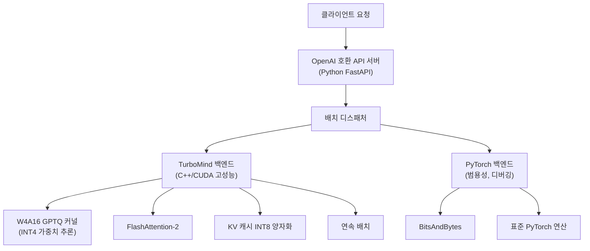
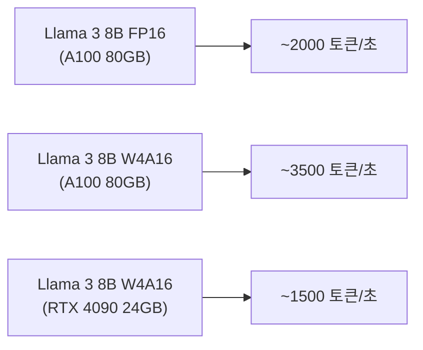

# LMDeploy

## 정체성

| 항목 | 내용 |
|------|------|
| 이름 | LMDeploy |
| 개발사 | Shanghai AI Laboratory (상하이 인공지능실험실) |
| 라이선스 | Apache 2.0 |
| GitHub | [InternLM/lmdeploy](https://github.com/InternLM/lmdeploy) |
| 출시 | 2023년 (공개) |
| 언어/스택 | Python + C++/CUDA (TurboMind 백엔드), Triton (PyTorch 백엔드) |
| 지원 하드웨어 | NVIDIA CUDA (A10/A100/H100), 실험적 CPU/MPS |

LMDeploy는 InternLM 시리즈를 포함한 다양한 LLM의 **고효율 양자화 및 서빙**에 특화된 오픈소스 추론 엔진이다. 고유의 **TurboMind 백엔드**가 연속 배치, 플래시어텐션, KV 캐시 양자화를 통합하며, W4A16 양자화(가중치 4비트, 활성화 16비트)에서 특히 강점을 보인다. InternLM 가족 모델의 공식 추론 도구이기도 하다.

---

## 아키텍처 개요



---

## TurboMind 백엔드

TurboMind는 LMDeploy의 핵심 고성능 추론 백엔드로, C++/CUDA로 구현되어 있다.

### 주요 최적화

**1. W4A16 GPTQ 최적화 커널**

가중치를 4비트 정수(INT4)로 저장하고 추론 시 16비트 활성화와 연산:

```
일반 FP16 추론: 가중치 FP16 → 연산 FP16
W4A16 추론: 가중치 INT4 (저장) → 활성화 시 FP16 역양자화 → 연산 FP16
```

**메모리 절감**: 70B 모델 기준 FP16 140GB → W4 40GB 이하 (단일 A100 80GB로 가능)

**2. KV 캐시 INT8 양자화**

KV 캐시를 INT8로 저장해 메모리 절감:

```
FP16 KV 캐시: batch=32, seq=2048, 70B → ~50GB
INT8 KV 캐시: 절반 수준으로 절감, 처리량 약 1.5배 향상
```

**3. 연속 배치 (Continuous Batching)**

TurboMind의 스케줄러가 완료된 시퀀스 자리에 즉시 새 요청 삽입.

**4. Paged KV 캐시**

vLLM의 PagedAttention 아이디어를 채택해 KV 캐시를 페이지 단위로 관리, 메모리 단편화 방지.

---

## 핵심 기능

### 1. 양자화 (Quantization)

#### W4A16 (TurboMind 권장)

```python
from lmdeploy import pipeline, TurbomindEngineConfig

# W4A16로 변환된 모델 (또는 사전 변환 AWQ 모델)
engine_config = TurbomindEngineConfig(model_format="awq")
pipe = pipeline("internlm/internlm2_5-7b-chat-4bit", engine_config)

response = pipe("한국의 수도는 어디인가요?")
print(response.text)
```

#### 모델 양자화 (사전 처리)

```bash
# HF 모델을 W4A16 AWQ 형식으로 변환
lmdeploy lite auto_awq \
  internlm/internlm2_5-7b-chat \
  --work-dir ./internlm2_5-7b-chat-4bit \
  --calib-dataset ptb \
  --calib-samples 128
```

### 2. 지원 모델

| 모델 계열 | TurboMind 지원 | PyTorch 지원 |
|-----------|--------------|-------------|
| InternLM 1/2/2.5/3 | O (최우선) | O |
| Llama 2/3/3.1 | O | O |
| Mistral / Mixtral | O | O |
| Qwen 1/1.5/2/2.5 | O | O |
| Baichuan 2 | 제한적 | O |
| DeepSeek V2/V3 | O | O |
| Gemma 2 | O | O |
| Phi-3 / Phi-3.5 | O | O |
| InternVL (멀티모달) | O | O |

### 3. API 서버

OpenAI 호환 HTTP 서버:

```bash
# 서버 시작
lmdeploy serve api_server \
  internlm/internlm2_5-7b-chat \
  --server-port 23333 \
  --tp 1 \
  --cache-max-entry-count 0.9

# 클라이언트 사용 (OpenAI SDK 호환)
from openai import OpenAI

client = OpenAI(base_url="http://localhost:23333/v1", api_key="none")
response = client.chat.completions.create(
    model="internlm/internlm2_5-7b-chat",
    messages=[{"role": "user", "content": "안녕하세요!"}],
)
```

### 4. PyTorch 백엔드

TurboMind가 지원하지 않는 모델이나 디버깅 시 사용:

```python
from lmdeploy import pipeline, PytorchEngineConfig

engine_config = PytorchEngineConfig(tp=2)  # 2 GPU 텐서 병렬
pipe = pipeline("meta-llama/Meta-Llama-3-70B-Instruct", engine_config)
```

### 5. 비전-언어 모델 (VLM) 지원

InternVL2, LLaVA, Qwen-VL 등 멀티모달 모델 서빙:

```python
from lmdeploy import pipeline
from lmdeploy.vl import load_image

pipe = pipeline("OpenGVLab/InternVL2-8B")
image = load_image("test.jpg")
response = pipe(("이 이미지에서 무엇이 보이나요?", image))
```

---

## vLLM과의 비교

| 특성 | LMDeploy (TurboMind) | vLLM |
|------|---------------------|------|
| INT4 가중치 추론 성능 | 매우 우수 (자체 CUDA 커널) | 좋음 |
| KV 캐시 양자화 | INT8 기본 지원 | FP8 지원 (신규) |
| PagedAttention | 자체 구현 | 원조 |
| InternLM 계열 최적화 | 최우선 지원 | 일반 지원 |
| MoE 모델 (Mixtral/DeepSeek) | 지원 | 지원 (Expert 병렬) |
| 멀티모달 VLM | InternVL 특화 | 더 넓은 지원 |
| 커뮤니티 규모 | 중간 | 대규모 |
| 디버깅 용이성 | PyTorch 백엔드 활용 | 중간 |

**LMDeploy가 유리한 경우**: InternLM 계열 모델, W4A16 메모리 최적화가 최우선, 중국어 특화 모델

**vLLM이 유리한 경우**: 더 넓은 모델 생태계, 대규모 미국 커뮤니티 기반, AWS/GCP 클라우드 통합

---

## 성능 특성

### W4A16 vs FP16 처리량 (대략적 수치)



W4A16은 메모리 절감으로 더 큰 배치 처리가 가능해지고, 결과적으로 단위 시간당 처리량이 FP16보다 높아질 수 있다.

---

## 실무 사용 가이드

### 빠른 시작 (pip 설치)

```bash
pip install lmdeploy
```

### 대화형 채팅 (CLI)

```bash
lmdeploy chat internlm/internlm2_5-7b-chat
```

### 배치 추론

```python
from lmdeploy import pipeline

pipe = pipeline("internlm/internlm2_5-7b-chat")

queries = [
    "Python 리스트 컴프리헨션이란?",
    "머신러닝과 딥러닝의 차이는?",
    "트랜스포머 아키텍처를 설명해줘",
]

responses = pipe(queries)
for q, r in zip(queries, responses):
    print(f"Q: {q}")
    print(f"A: {r.text}\n")
```

### Docker 배포

```bash
docker run --gpus all \
  -p 23333:23333 \
  openmmlab/lmdeploy:latest \
  lmdeploy serve api_server \
  internlm/internlm2_5-7b-chat \
  --server-port 23333 \
  --tp 1
```

---

## 한계 / 트레이드오프

### TurboMind 지원 모델 제한

TurboMind 백엔드는 명시적으로 지원하는 아키텍처만 고성능 처리. 목록 외 모델은 PyTorch 백엔드로 폴백(fallback)되어 성능이 낮아짐.

### Windows 미지원

CUDA Linux 전용. WSL2에서는 제한적 동작.

### 문서화 영어/중국어 혼재

공식 문서가 중국어와 영어를 병행하며, 일부 최신 기능은 중국어 문서에만 먼저 업데이트되는 경향.

### 커뮤니티 규모

vLLM 대비 국제 커뮤니티가 작아 영어 StackOverflow 질문/이슈 해결에 시간이 걸릴 수 있음.

---

## 관련 문서

- [[vllm]] - PagedAttention 원조 추론 엔진
- [[quantization]] - 양자화 기법 일반 개념
- [[continuous-batching]] - 연속 배치 처리 개념
- [[text-generation-inference-tgi]] - HuggingFace 공식 추론 엔진
- [[flash-attention]] - FlashAttention 최적화
- [[llama-cpp]] - CPU 지원 경량 추론
