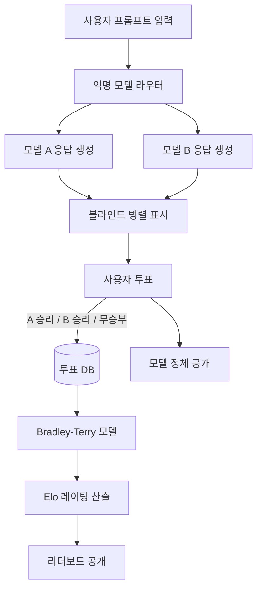

# LMSYS Chatbot Arena

## 개요

**LMSYS Chatbot Arena**는 UC Berkeley LMSYS 조직이 운영하는 크라우드소싱 기반 LLM 블라인드 비교 플랫폼이다. 사용자가 프롬프트를 입력하면 익명의 두 모델이 동시에 응답을 생성하고, 사용자가 어느 쪽이 더 나은지 투표한다. 이 쌍대 비교(pairwise comparison) 결과를 Elo 레이팅 시스템으로 집계하여 LLM 순위를 산출한다.

2023년 5월 출시 이후 2026년 4월 현재까지 누적 200만 건 이상의 투표가 집계되었으며, 인간 선호도(human preference) 기반 LLM 평가의 사실상 표준(de facto standard) 벤치마크로 자리잡았다. [[mt-bench|MT-Bench]]와 함께 LMSYS가 운영하는 양대 평가 축이다.

## 시스템 아키텍처

이 다이어그램은 Chatbot Arena의 블라인드 투표에서 리더보드 산출까지의 전체 흐름을 보여준다.

## Elo 레이팅 시스템

### 산출 방식

Chatbot Arena는 체스에서 유래한 Elo 레이팅을 LLM 비교에 적용한다. 핵심은 **Bradley-Terry 모델** -- 두 모델의 승률을 레이팅 차이의 로지스틱 함수로 모델링한다.

$$P(A > B) = \frac{1}{1 + 10^{(R_B - R_A)/400}}$$

모델 A의 레이팅 $R_A$가 모델 B의 $R_B$보다 400점 높으면, A가 이길 확률은 약 91%다. 새로운 투표 결과가 들어올 때마다 기대 승률과 실제 결과의 차이를 기반으로 레이팅이 업데이트된다.

### 부트스트랩 신뢰 구간

공식 리더보드는 부트스트랩 리샘플링(bootstrap resampling)으로 각 모델의 레이팅에 95% 신뢰 구간을 함께 표시한다. 이를 통해 두 모델의 순위 차이가 통계적으로 유의미한지 판단할 수 있다.

## 카테고리 분류

Chatbot Arena는 프롬프트의 성격에 따라 여러 카테고리별 리더보드를 운영한다.

| 카테고리 | 설명 | 평가 초점 |
|---|---|---|
| Overall | 전체 종합 순위 | 범용 대화 능력 |
| Hard Prompts | 난이도 높은 프롬프트 | 추론, 복잡한 지시 |
| Coding | 코드 생성/디버깅 | 프로그래밍 역량 |
| Math | 수학 문제 풀이 | 수리적 추론 |
| Vision | 이미지 이해 | 멀티모달 역량 |
| IF (Instruction Following) | 지시 따르기 | 포맷, 제약 조건 준수 |
| Multi-Turn | 다턴 대화 | 맥락 유지, 일관성 |
| Creative Writing | 창의적 글쓰기 | 문체, 표현력 |

카테고리별 순위는 종종 크게 다르다 -- 코딩에서 1위인 모델이 창의적 글쓰기에서는 10위 밖일 수 있다. 이는 LLM 평가가 단일 점수로 환원될 수 없음을 보여준다.

## 방법론적 의의

### 블라인드 비교의 힘

모델 이름을 숨긴 블라인드 비교는 **브랜드 편향(brand bias)**을 제거한다. 사용자는 GPT-4인지 Claude인지 모르는 상태에서 순수하게 응답 품질만으로 판단한다. 이는 [[humaneval|HumanEval]] 같은 자동 벤치마크가 포착하지 못하는 인간 선호의 미묘한 차원을 측정한다.

### 자동 벤치마크와의 보완 관계

자동 벤치마크는 정답이 있는 과제(코딩, 수학, 지식 QA)에서 객관적이지만, 개방형 대화, 문체, 도움됨(helpfulness) 같은 주관적 차원을 측정하기 어렵다. Chatbot Arena는 이 간극을 메운다. [[evaluation-harness|평가 하네스]] 결과와 Arena 순위를 교차 비교하면 모델의 강약점을 입체적으로 파악할 수 있다.

### 대규모 크라우드소싱 평가

기존 인간 평가는 소수의 전문 평가자에 의존하여 비용이 높고 규모 확장이 어려웠다. Chatbot Arena는 "누구나 참여할 수 있는 평가"를 실현하여 월간 수만 건의 투표를 수집한다.

## 주목할 만한 발견

Chatbot Arena 데이터에서 도출된 주요 인사이트들:

- **스타일 vs 실질**: 길고 상세한 답변이 짧고 정확한 답변보다 선호도가 높은 "장문 편향(verbosity bias)"이 관찰됨
- **모델 수렴**: 최상위 모델 간 Elo 격차가 2024년 이후 지속적으로 줄어드는 추세
- **카테고리 불일치**: 종합 순위와 특정 카테고리 순위의 상관관계가 예상보다 낮음
- **Hard Prompt 분별력**: Hard Prompts 카테고리가 모델 간 실질적 능력 차이를 가장 잘 드러냄

## 한계와 비판

### 인구 편향 (Population Bias)

참여자가 주로 영어권 기술 커뮤니티에 편중되어 있다. 비영어 언어, 비기술 도메인에서의 평가는 상대적으로 부족하다.

### 프롬프트 분포

사용자가 자유롭게 입력하므로 프롬프트 분포가 통제되지 않는다. 특정 유형의 질문(코딩, 롤플레이 등)이 과대 대표될 수 있다.

### 인기 편향 (Popularity Bias)

자주 비교되는 유명 모델은 레이팅이 안정적이지만, 덜 알려진 모델은 표본 크기가 작아 레이팅 변동이 크다.

### 게이밍 가능성

모델 제공자가 Arena에서 높은 점수를 받기 위해 모델을 의도적으로 "장문 + 친절한 톤"으로 튜닝하는 이른바 "Arena hacking" 가능성이 제기된다.

## 유사 플랫폼

- **Chatbot Arena Hard**: LMSYS에서 Hard Prompts만 분리하여 운영하는 고난이도 트랙
- **WildBench**: Chatbot Arena의 방법론을 LLM 자동 판정으로 스케일링한 시도
- **AlpacaEval 2.0**: GPT-4가 판정하는 자동화된 인간 선호 근사

## 관련 문서

- [[mt-bench]] -- LMSYS의 또 다른 평가 축, 고정 프롬프트 기반 자동 평가
- [[humaneval]] -- 코드 생성 자동 벤치마크
- [[evaluation-harness]] -- 자동 평가 프레임워크
- [[ai-benchmarks-overview]] -- AI 벤치마크 전체 개요
- [[frontier-model-comparison-2026-04]] -- 2026년 4월 프론티어 모델 비교
- [[agent-benchmark-comparison-2026-04]] -- 에이전트 벤치마크 비교
