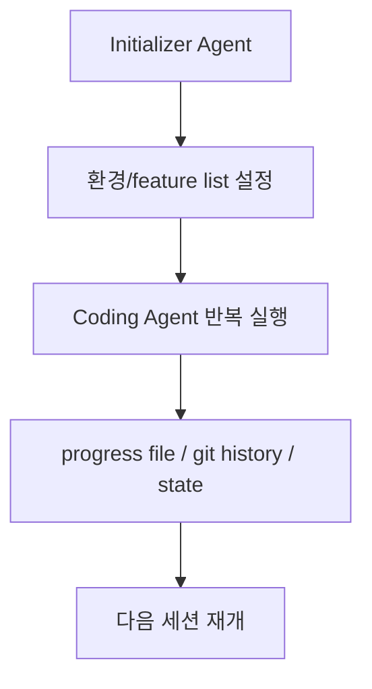

# Agent Harnesses for Long-Running Coding Sessions

컨텍스트 윈도우를 넘어 몇 시간 동안 자율적으로 코딩을 이어가게 하는 에이전트 실행 구조.

## 왜 중요한가

Anthropic이 2025년 11월 "Effective harnesses for long-running agents"에서 [[claude-agent-sdk|initializer + coding agent]] 2단 구조와 claude-progress.txt 기반 세션 이어받기 패턴을 공개했고, 2026년 3월에는 generator-evaluator 3-agent 구조로 확장한 후속편을 내며 "harness engineering"을 공식 카테고리로 띄웠다.

## 대표 레퍼런스

- [Effective harnesses for long-running agents](https://www.anthropic.com/engineering/effective-harnesses-for-long-running-agents)
- [Harness design for long-running application development](https://www.anthropic.com/engineering/harness-design-long-running-apps)
- [Scaling Managed Agents: Decoupling the brain from the hands](https://www.anthropic.com/engineering/managed-agents)
- [Claude Agent SDK Overview](https://code.claude.com/docs/en/agent-sdk/overview)
- [anthropics/claude-agent-sdk-typescript](https://github.com/anthropics/claude-agent-sdk-typescript)

## 해석 포인트

Agent Harnesses for Long-Running Coding Sessions은 **모델 능력보다 개발자 경험과 운영 통합면이 중요한 도구 축** 으로 이해할 때 가장 명확하다. 이번 source 묶음이 `anthropic.com×3, code.claude.com×1, github.com×1`처럼 분산돼 있다는 것은, 이 주제가 단일 주장보다 여러 층위의 검증을 거치고 있다는 뜻이다.

실무적으로는 개념 정의 자체보다 **어떤 병목을 해결하고 어떤 비용을 새로 만들까**를 묻는 편이 유익하다. 그래서 이 토픽은 통합 난이도, 관측 가능성, 운영 비용, 교체 가능성를 기준으로 비교·실험하는 식으로 다루는 것이 좋다.

## 2026년 4월 큐레이션 요약

- 정의: 컨텍스트 윈도우를 넘어 몇 시간 동안 자율적으로 코딩을 이어가게 하는 에이전트 실행 구조.
- 왜 중요한가: Anthropic이 2025년 11월 "Effective harnesses for long-running agents"에서 [[claude-agent-sdk|initializer + coding agent]] 2단 구조와 claude-progress.txt 기반 세션 이어받기 패턴을 공개했고, 2026년 3월에는 generator-evaluator 3-agent 구조로 확장한 후속편을 내며 "harness engineering"을 공식 카테고리로 띄웠다.
- 직접 수집 원문: 5개
- 주요 도메인: anthropic.com×3, code.claude.com×1, github.com×1

## 핵심 메커니즘

컨텍스트 윈도우를 넘어 몇 시간 동안 자율적으로 코딩을 이어가게 하는 에이전트 실행 구조. 이 유형의 topic은 보통 하나의 제품보다 **반복 가능한 패턴 / 평가 기준 / 설계 trade-off**로 읽는 편이 유용하다. 이번 source 묶음에서도 `anthropic.com, code.claude.com, github.com`가 함께 나오면서 개념, 구현, 평가가 연결되어 있다.

이 구조는 long-running harness의 핵심이 모델 자체보다 **세션 사이를 이어 주는 artifact 설계**에 있다는 점을 보여준다. [[langgraph-durable-execution|LangGraph의 durable execution]]과 비교하면 세션 재개 방식의 차이를 이해할 수 있다.

## 실무 관점

도구/프레임워크 페이지는 기능 목록보다 생태계 위치가 중요하다. 어떤 모델·런타임·개발 흐름과 잘 맞는지, 그리고 팀 워크플로우에 어떤 경계 조건을 추가하는지까지 같이 봐야 한다.

## 관련 문서

- [[ai-hot-topics-2026-04|2026년 4월 AI 개발 핫토픽 100선]]
- [[model-context-protocol|MCP 2026 Roadmap & Enterprise Readiness]]
- [[effective-harnesses-for-long-running-agents|Effective Harnesses for Long-Running Agents]] — 장기 실행 agent harness 설계 글
- [[scaling-managed-agents|Scaling Managed Agents]] — brain/hands/session 분리 인프라 설계
