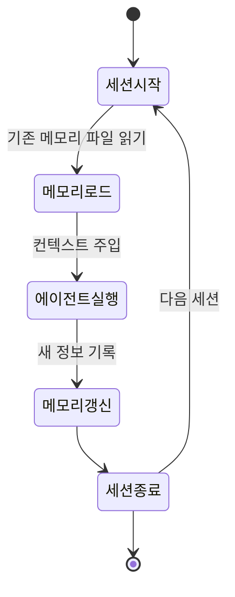

# Anthropic Managed Agents 메모리 API 퍼블릭 베타

Anthropic의 Managed Agents 플랫폼에 2026년 4월 23일 세션 간 기억 유지(persistent memory) 기능이 퍼블릭 베타로 추가됐다. 메모리는 파일시스템에 파일로 저장되며, API 또는 Claude Console을 통해 내보내기·편집·삭제할 수 있다.

## 개념 정의

에이전트 메모리(agent memory)란 단일 세션을 넘어 정보를 보존하는 메커니즘이다. 기존 LLM 에이전트는 컨텍스트 윈도우가 닫히면 이전 대화 내용을 모두 잃었다. Managed Agents 메모리 API는 이 한계를 파일시스템 기반 영속 저장소로 해결한다.



위 상태 다이어그램은 메모리가 세션 생명주기 내에서 어떻게 로드·갱신되는지를 보여준다.

## 아키텍처

### 파일시스템 저장 방식
메모리는 구조화된 파일로 저장된다. 각 에이전트 인스턴스는 고유 메모리 네임스페이스를 가지며, 여러 세션에 걸쳐 동일한 네임스페이스에 접근한다.

```python
# Managed Agents 메모리 활용 예시 (베타 API 기준)
import anthropic

client = anthropic.Anthropic()

# 에이전트 세션 생성 (메모리 네임스페이스 지정)
session = client.managed_agents.sessions.create(
    agent_id="my-stateful-agent",
    memory_namespace="user-123-preferences",
)

# 메모리 내보내기
memory_export = client.managed_agents.memory.export(
    namespace="user-123-preferences"
)

# 메모리 편집
client.managed_agents.memory.update(
    namespace="user-123-preferences",
    content="사용자는 파이썬을 선호하며 타입 힌트를 항상 요구함"
)
```

> 위 코드는 공개된 베타 API 설명 기반으로 작성됐으며, 실제 인터페이스는 변경될 수 있다. [교차검증 필요] 공식 문서(https://docs.anthropic.com/en/managed-agents/overview)에서 최신 API 명세를 확인할 것.

### 지원 작업
- **내보내기(export)**: 메모리 파일 전체를 JSON 또는 텍스트 형식으로 추출
- **편집(edit)**: API 또는 Claude Console에서 직접 수정
- **삭제(delete)**: 특정 메모리 항목 또는 네임스페이스 전체 삭제
- **읽기**: 에이전트 실행 시 자동으로 로드

## Managed Agents 플랫폼 맥락

Managed Agents 자체는 2026년 4월 8일 퍼블릭 베타에 진입했다. 메모리 기능은 2주 후인 4월 23일 추가됐으며, 둘 다 동일한 `managed-agents-2026-04-01` 베타 API 헤더를 사용한다.

| 기능 | 출시일 | 상태 |
|------|--------|------|
| Managed Agents 기본 | 2026-04-08 | 퍼블릭 베타 |
| 메모리 API | 2026-04-23 | 퍼블릭 베타 |

## [[agent-memory-systems]]와의 관계

[[agent-memory-systems]] 개념 페이지에서 다루는 메모리 유형 분류에 비추면, Managed Agents 메모리는 다음과 같이 위치한다:

| 메모리 유형 | 설명 | Managed Agents 해당 여부 |
|------------|------|------------------------|
| 인컨텍스트 메모리 | 현재 컨텍스트 윈도우 내 | 기존 방식 |
| 외부 저장소 메모리 | 벡터DB, 파일시스템 등 | **해당 (파일시스템)** |
| 파라메트릭 메모리 | 모델 가중치에 내재화 | 미해당 |
| 에피소딕 메모리 | 과거 에피소드 요약 저장 | 활용 가능 |

Managed Agents 메모리는 외부 저장소 방식이지만, 개발자가 별도 벡터DB를 구축하지 않아도 Anthropic 플랫폼이 관리해준다는 점에서 진입장벽을 크게 낮춘다.

## 실무 활용 패턴

### 사용자 선호도 기억
```
메모리 예시:
- 프로그래밍 언어: Python 3.11+ 선호
- 코드 스타일: 타입 힌트 필수, docstring 한국어
- 응답 길이: 간결하게, 코드 먼저
```

### 프로젝트 컨텍스트 유지
장기 프로젝트에서 아키텍처 결정, 완료된 태스크, 알려진 버그 등을 메모리에 유지해 매 세션마다 컨텍스트를 재주입하는 비용을 줄인다.

### 멀티에이전트 공유 메모리
동일 네임스페이스에 여러 에이전트가 접근하면 사실상 공유 메모리 공간으로 활용할 수 있다. 단, 동시 쓰기 충돌 처리 방식은 공식 문서 확인이 필요하다. [교차검증 필요]

## [[claude-code]]와의 통합

[[claude-code]]는 자체 메모리 시스템(CLAUDE.md, project notes 등)을 가지고 있으나, Managed Agents 메모리 API와는 별개다. Claude Code를 Managed Agents 위에서 실행하면 두 메모리 시스템을 조합할 수 있다.

## 한계 및 주의사항

- **베타 단계**: API 인터페이스와 파일 형식이 GA 전에 변경될 수 있다
- **보안**: 메모리 파일에 민감 정보 저장 시 접근 권한 관리 필요
- **컨텍스트 선택 전략**: 메모리가 커질수록 컨텍스트 주입 전략(전체 vs. 관련성 기반 선택)이 중요해진다
- **메모리 부패(memory decay)**: 오래된 또는 부정확한 정보가 쌓이는 문제는 명시적 갱신/삭제 루틴으로 관리해야 한다

## 관련 문서

- [[agent-memory-systems]]
- [[claude-code]]
- [[deep-agents-memory]]
- [[managed-agents-memory-beta]]
- [[claude-agent-sdk]]
