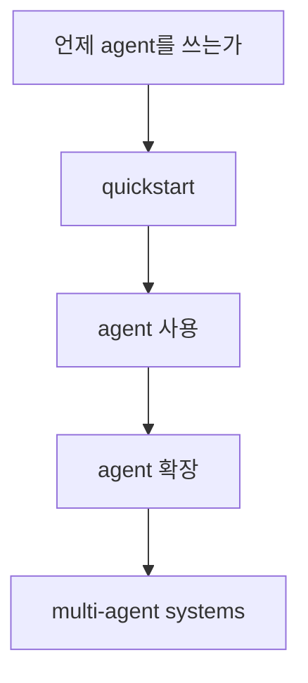

# Mastra Agents Overview

Mastra agents overview 문서 요약이다. agent를 언제 써야 하는지, quickstart 이후 어떻게 확장하고 multi-agent 시스템으로 발전시키는지 정리한다.

## 구조도

Mastra의 agent 문서는 단일 agent 생성법보다, 언제 agent abstraction이 적합한지와 어떻게 확장하는지가 중심이다.

## 핵심 구조

- 문서는 “when to use agents”에서 출발해 quickstart, agent 사용, agent 확장, multi-agent systems 순서로 agent abstraction을 설명한다.
- 즉 Mastra에서 agent는 단순 helper가 아니라, 앱 안의 작업 단위를 구조화하는 핵심 컴포넌트다.
- multi-agent가 같은 문서에 바로 이어지는 점은 Mastra가 처음부터 협업형 구조를 염두에 둔다는 신호다.

## 왜 중요한가

- TS 프레임워크 계열에서는 “언제 workflow를 쓰고 언제 agent를 쓰는가” 경계가 특히 중요하다.
- Mastra docs가 이 질문을 전면에 내세우는 건, agent를 무분별하게 늘리는 대신 적합한 문제에 쓰게 만들기 위함으로 읽힌다.
- 또한 expand your agent 섹션은 기능 목록보다 성장 경로를 보여 준다.

## 실무 관점

- 처음에는 단일 agent로 시작하고, 실제 병목이 보일 때 multi-agent로 올라가는 식이 안전하다.
- 따라서 이 문서는 [[mastra-workflows-overview|Mastra Workflows Overview]]와 나란히 읽어야 설계 판단이 쉬워진다.
- Mastra를 채택하는 팀은 agent와 workflow를 각각 어떤 문제에 배치할지 규칙을 먼저 정하는 편이 좋다.

## 관련 문서

- [[mastra|Mastra]]
- [[mastra-get-started|Mastra Get Started]]
- [[mastra-workflows-overview|Mastra Workflows Overview]]
- [[mastra-memory-overview|Mastra Memory Overview]]
