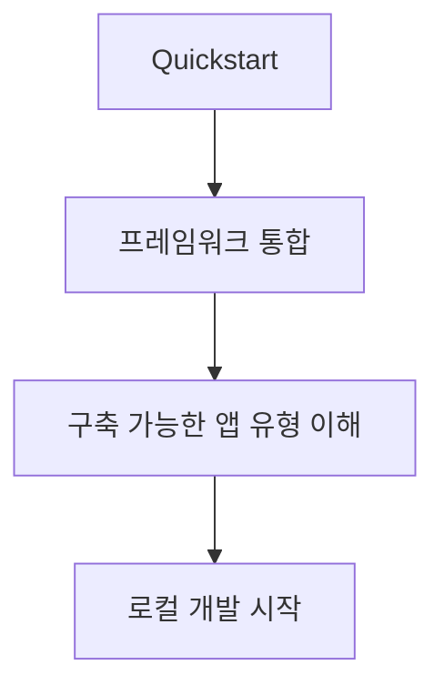

# Mastra Get Started

Mastra 공식 docs의 get started 페이지 요약이다. TypeScript 기반 agent·workflow 프레임워크로서 Mastra가 어떤 출발점을 제공하는지 정리한다.

## 구조도

Mastra docs의 출발점은 단일 API 설명보다 “어떤 종류의 agent/workflow 앱을 빠르게 띄울 수 있는가”를 보여 주는 onboarding surface다.

## 핵심 구조

- get started 문서는 Quickstart, framework integration, buildable app categories를 중심으로 Mastra의 입문 경로를 정리한다.
- 이는 Mastra가 단순 SDK가 아니라, 애플리케이션 프레임워크에 가깝다는 점을 보여 준다.
- 즉 개발자는 모델 호출 하나보다 전체 앱 구조 안에서 agent를 어떻게 배치할지 먼저 생각하게 된다.

## 왜 중요한가

- Mastra는 TS 생태계에서 agent, workflow, integration을 하나의 개발 경험으로 묶으려는 시도로 읽을 수 있다.
- 따라서 quickstart의 가치도 “첫 API 호출”보다 “프레임워크 친화적 시작면”에 있다.
- Next.js나 다른 웹 프레임워크와 결합하는 팀에게는 이 onboarding surface가 실무 전환 속도를 크게 좌우한다.

## 실무 관점

- Mastra 도입 초반에는 어떤 앱 유형을 먼저 만들지와 어떤 프레임워크에 통합할지를 함께 결정하는 편이 좋다.
- 또한 Studio나 local playground를 어떤 팀 루프에서 사용할지도 early decision이 된다.
- 이 페이지는 Mastra 허브의 입문 안내서 역할을 하며, 다른 TS agent 프레임워크와 비교할 기준점을 제공한다.

## 관련 문서

- [[mastra|Mastra]]
- [[vercel-ai-sdk|Vercel AI SDK 6]]
- [[openai-agents-sdk|OpenAI Agents SDK]]
