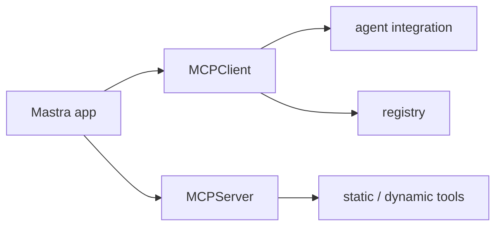

# Mastra MCP Overview

Mastra MCP overview 문서 요약이다. MCPClient, MCPServer, registry, static/dynamic tools를 중심으로 Mastra의 MCP 통합 표면을 정리한다.

## 구조도

Mastra의 MCP 문서는 agent에 도구를 붙이는 관점과 서버를 노출하는 관점을 함께 다루는 것이 특징이다.

## 핵심 구조

- 문서는 MCPClient 설정, agent와의 연결, MCPServer 설정, registry 연결, static/dynamic tools를 다룬다.
- 즉 Mastra는 MCP를 소비자(client) 관점과 제공자(server) 관점 양쪽에서 본다.
- 이 양면성은 앱이 외부 capability를 쓰는 동시에 자체 capability를 노출할 수도 있음을 뜻한다.

## 왜 중요한가

- 최근 agent 프레임워크에서 MCP는 선택 기능이 아니라 핵심 통합면이 됐다.
- Mastra가 registry와 dynamic tools까지 포함해 설명하는 점은 실제 생태계 연결을 강하게 의식하고 있음을 보여 준다.
- 따라서 단순 protocol 지식보다 운영 경계와 discovery 흐름이 중요하다.

## 실무 관점

- client와 server 역할을 한 코드베이스에 같이 둘 경우 책임 경계가 흐려질 수 있으므로 설계 원칙이 필요하다.
- dynamic tools를 쓰면 유연성이 커지지만, 승인과 관측 체계도 함께 설계해야 한다.
- 이 문서는 [[model-context-protocol-mcp|Model Context Protocol (MCP)]]와 비교해서 읽기 좋다.

## 관련 문서

- [[mastra|Mastra]]
- [[model-context-protocol-mcp|Model Context Protocol (MCP)]]
- [[mcp-architecture|MCP Architecture]]
