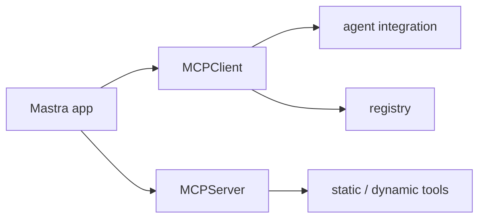

# Mastra MCP Overview

Mastra MCP overview 문서 요약이다. MCPClient, MCPServer, registry, static/dynamic tools를 중심으로 Mastra의 MCP 통합 표면을 정리한다.

## 구조도

Mastra의 MCP 문서는 agent에 도구를 붙이는 관점과 서버를 노출하는 관점을 함께 다루는 것이 특징이다.

## 핵심 구조

- 문서는 MCPClient 설정, agent와의 연결, MCPServer 설정, registry 연결, static/dynamic tools를 다룬다.
- 즉 Mastra는 MCP를 소비자(client) 관점과 제공자(server) 관점 양쪽에서 본다.
- 이 양면성은 앱이 외부 capability를 쓰는 동시에 자체 capability를 노출할 수도 있음을 뜻한다.

## 왜 중요한가

- 최근 [[mastra|agent]] 프레임워크에서 [[model-context-protocol-mcp|MCP]]는 선택 기능이 아니라 핵심 통합면이 됐다.
- Mastra가 registry와 dynamic tools까지 포함해 설명하는 점은 실제 생태계 연결을 강하게 의식하고 있음을 보여 준다.
- 따라서 단순 protocol 지식보다 운영 경계와 discovery 흐름이 중요하다.

## 실무 관점

- client와 server 역할을 한 코드베이스에 같이 둘 경우 책임 경계가 흐려질 수 있으므로 설계 원칙이 필요하다.
- dynamic tools를 쓰면 유연성이 커지지만, 승인과 관측 체계도 함께 설계해야 한다. [[mcp-architecture|MCP Architecture]]에서 server/client 역할 분리를 먼저 이해하는 것이 좋다.
- 이 문서는 [[model-context-protocol-mcp|Model Context Protocol (MCP)]]와 비교해서 읽기 좋다.

## 원문이 다루는 흐름

참조 source는 `Mastra MCP Overview`를 하나의 정의로 닫지 않고, 주변 설계 맥락과 읽기 순서를 함께 제공한다. 그래서 짧은 소개문만으로 끝내기보다 **구조와 적용 포인트**를 같이 정리해야 위키 문서로서 가치가 생긴다.

- 위키에 남겨야 할 축: 입문 경로, 핵심 구조, 다음에 읽을 세부 문서

## 읽기 포인트

- 이 문서는 **원문을 어떤 순서로 읽어야 실무 판단으로 이어지는가**라는 질문을 붙잡고 읽으면 훨씬 덜 얕아진다.
- 소개 문단만 읽고 끝내지 말고, 원문 snapshot에서 실제 섹션 이름·예시·제약 조건을 다시 확인하는 습관이 중요하다.
- summary 문서는 결론 고정본이 아니라 읽기 가이드다. 따라서 입문, 세부 문서, 운영 문서를 어떤 순서로 볼지까지 안내해야 위키 품질이 올라간다.
- 공식 문서/논문/저장소가 함께 있으면 발표 글 하나만 믿지 말고, 사양 문서와 구현 저장소를 교차 확인하는 것이 안전하다.

## source 메모

- **MCP overview | MCP | Mastra Docs** — snapshot: `raw/recursive-sources/2026-04-10-mastra-instructor-advanced/mastra-mcp-overview.md` · source: https://mastra.ai/docs/mcp/overview · 볼 섹션: 핵심 heading 추출이 제한적

## 관련 문서

- [[mastra|Mastra]]
- [[model-context-protocol-mcp|Model Context Protocol (MCP)]]
- [[mcp-architecture|MCP Architecture]]
