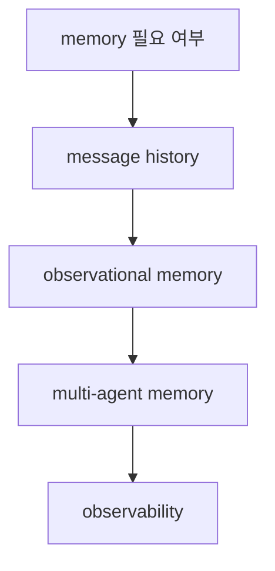

# Mastra Memory Overview

[[mastra|Mastra]] memory overview 문서 요약이다. message history, observational memory, multi-agent memory, observability를 중심으로 메모리 계층을 정리한다.

## 구조도

Mastra의 memory 문서는 단순 채팅 로그 저장보다, 에이전트 행동에 어떤 기억 계층을 둘지 설계하는 문서에 가깝다.

## 핵심 구조

- 문서는 when to use memory에서 출발해 message history, observational memory, memory in multi-agent systems, observability를 설명한다.
- 이는 memory를 단순 persistence가 아니라 행동 품질을 조정하는 runtime 계층으로 본다는 뜻이다.
- 특히 multi-agent memory를 별도 항목으로 다루는 점이 Mastra의 협업 지향성을 보여 준다.

## 왜 중요한가

- 장기 실행 agent에서는 무엇을 기억할지보다 무엇을 어떤 형태로 기억할지가 더 중요하다.
- observational memory 같은 용어는 단순 대화 기록을 넘어, 실행 중 관측값을 어떻게 축적하는지에 관심이 있음을 드러낸다.
- 이는 [[agent-memory-systems|Agent Memory Systems]]와 자연스럽게 연결된다.

## 실무 관점

- memory를 넣기 전에 message history와 higher-level observations를 분리하는 것이 좋다. [[langgraph-persistence|LangGraph Persistence]]의 checkpoint 방식과 비교하면 설계 차이를 이해하기 쉽다.
- multi-agent 시스템에서는 shared memory와 per-agent memory를 섞을지 정책이 먼저 필요하다.
- observability와 memory를 함께 설계해야 나중에 디버깅과 audit가 쉬워진다.

## 원문이 다루는 흐름

참조 source는 `Mastra Memory Overview`를 하나의 정의로 닫지 않고, 주변 설계 맥락과 읽기 순서를 함께 제공한다. 그래서 짧은 소개문만으로 끝내기보다 **구조와 적용 포인트**를 같이 정리해야 위키 문서로서 가치가 생긴다.

- 위키에 남겨야 할 축: 입문 경로, 핵심 구조, 다음에 읽을 세부 문서

## 읽기 포인트

- 이 문서는 **원문을 어떤 순서로 읽어야 실무 판단으로 이어지는가**라는 질문을 붙잡고 읽으면 훨씬 덜 얕아진다.
- 소개 문단만 읽고 끝내지 말고, 원문 snapshot에서 실제 섹션 이름·예시·제약 조건을 다시 확인하는 습관이 중요하다.
- summary 문서는 결론 고정본이 아니라 읽기 가이드다. 따라서 입문, 세부 문서, 운영 문서를 어떤 순서로 볼지까지 안내해야 위키 품질이 올라간다.
- 공식 문서/논문/저장소가 함께 있으면 발표 글 하나만 믿지 말고, 사양 문서와 구현 저장소를 교차 확인하는 것이 안전하다.

## source 메모

- **Memory overview | Memory | Mastra Docs** — snapshot: `raw/recursive-sources/2026-04-10-mastra-instructor-advanced/mastra-memory-overview.md` · source: https://mastra.ai/docs/memory/overview · 볼 섹션: 핵심 heading 추출이 제한적

## 관련 문서

- [[mastra|Mastra]]
- [[mastra-agents-overview|Mastra Agents Overview]]
- [[agent-memory-systems|Agent Memory Systems]]
