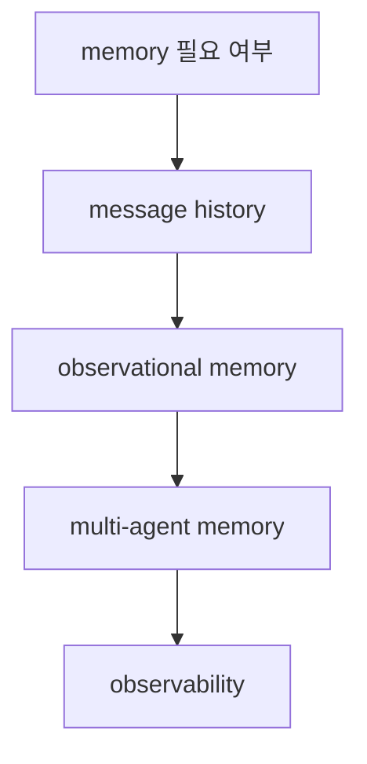

# Mastra Memory Overview

Mastra memory overview 문서 요약이다. message history, observational memory, multi-agent memory, observability를 중심으로 메모리 계층을 정리한다.

## 구조도

Mastra의 memory 문서는 단순 채팅 로그 저장보다, 에이전트 행동에 어떤 기억 계층을 둘지 설계하는 문서에 가깝다.

## 핵심 구조

- 문서는 when to use memory에서 출발해 message history, observational memory, memory in multi-agent systems, observability를 설명한다.
- 이는 memory를 단순 persistence가 아니라 행동 품질을 조정하는 runtime 계층으로 본다는 뜻이다.
- 특히 multi-agent memory를 별도 항목으로 다루는 점이 Mastra의 협업 지향성을 보여 준다.

## 왜 중요한가

- 장기 실행 agent에서는 무엇을 기억할지보다 무엇을 어떤 형태로 기억할지가 더 중요하다.
- observational memory 같은 용어는 단순 대화 기록을 넘어, 실행 중 관측값을 어떻게 축적하는지에 관심이 있음을 드러낸다.
- 이는 [[agent-memory-systems|Agent Memory Systems]]와 자연스럽게 연결된다.

## 실무 관점

- memory를 넣기 전에 message history와 higher-level observations를 분리하는 것이 좋다.
- multi-agent 시스템에서는 shared memory와 per-agent memory를 섞을지 정책이 먼저 필요하다.
- observability와 memory를 함께 설계해야 나중에 디버깅과 audit가 쉬워진다.

## 관련 문서

- [[mastra|Mastra]]
- [[mastra-agents-overview|Mastra Agents Overview]]
- [[agent-memory-systems|Agent Memory Systems]]
