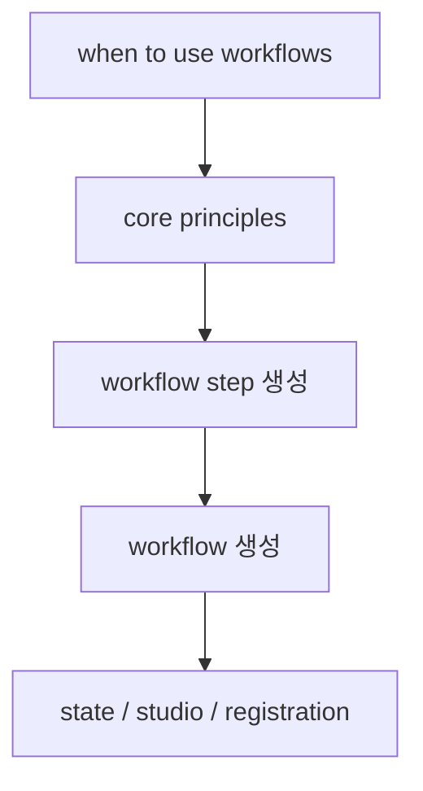

# Mastra Workflows Overview

Mastra workflows overview 문서 요약이다. workflow를 언제 써야 하는지, core principles, state, Studio, workflow composition을 중심으로 정리한다.

## 구조도

Mastra workflow 문서는 함수 체이닝 설명이 아니라, 상태를 가진 실행 그래프를 어떻게 앱 구조에 등록하고 재사용할지에 초점을 둔다.

## 핵심 구조

- 문서는 workflow를 언제 써야 하는지부터 core principles, workflow step, workflow state, studio, registration까지 전체 lifecycle을 다룬다.
- 이는 workflow를 단일 API 기능이 아니라 운영 가능한 실행 단위로 본다는 뜻이다.
- 특히 state와 workflows-as-steps를 같은 문서에서 다루는 점이 중요하다.

## 왜 중요한가

- agent 프레임워크를 실제 제품으로 옮기려면 결국 반복 가능한 흐름을 workflow로 정리해야 한다.
- Mastra가 Studio와 registration까지 연결하는 이유도 workflow를 디버깅/운영 단위로 보기 때문으로 읽힌다.
- 따라서 agent 중심 문서보다 시스템 설계에 더 직접적이다.

## 실무 관점

- 복잡한 다단계 프로세스나 승인/상태 추적이 필요한 경우 workflow가 agent보다 더 적합할 수 있다.
- Mastra를 도입하는 팀은 agent와 workflow를 분리해서 생각하기보다, 어디까지를 자유 reasoning에 맡기고 어디부터를 workflow로 고정할지 결정해야 한다.
- 이 문서는 [[mastra-agents-overview|Mastra Agents Overview]]와의 역할 분담을 보는 데 유용하다.

## 관련 문서

- [[mastra|Mastra]]
- [[mastra-agents-overview|Mastra Agents Overview]]
- [[mastra-memory-overview|Mastra Memory Overview]]
