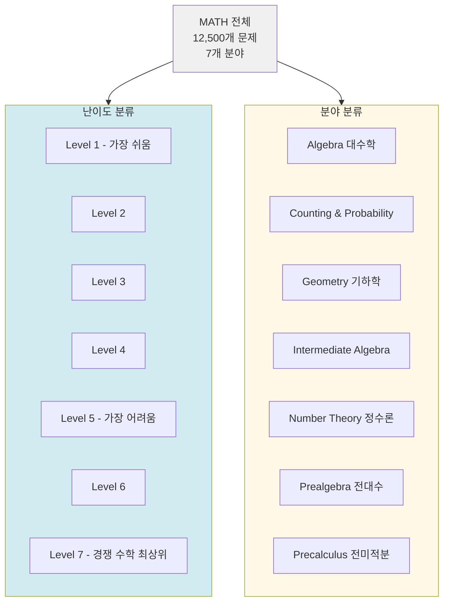

# MATH 벤치마크

MATH는 LLM의 수학적 추론 능력을 경쟁 수학 문제로 평가하는 벤치마크다. Hendrycks et al. (2021, UC Berkeley)이 제안했으며, AMC(American Mathematics Competition), AIME, MATH 올림피아드 스타일의 12,500개 문제를 7단계 난이도로 구성한다. 단순 산술이 아닌 **심층 수학적 추론과 풀이 과정**을 요구한다.

## 벤치마크 구조



전체 12,500개 중 훈련셋 7,500개, 테스트셋 5,000개로 분리된다.

## 문제 형식과 평가

MATH 문제는 자유 응답(free-response) 형식이며, LaTeX로 표현된 최종 답을 요구한다.

```
문제 예시 (Level 5, Algebra):

What is the value of x in the equation:
\[\sqrt{2x+1} + \sqrt{x-3} = 4\]

정답: x = 8 (또는 \boxed{8})
```

### 평가 방식

- 모델의 출력에서 `\boxed{...}` 안의 표현을 추출
- 정규화 후 참조 정답과 문자열/수식 동치 비교
- **정확 일치(exact match)**: 부분 점수 없음

평가 파이프라인이 까다로운 이유는 `\frac{2}{4}`와 `\frac{1}{2}`를 동일하게 처리해야 하고, 다양한 표기 방식을 정규화해야 하기 때문이다. [[evaluation-harness|lm-evaluation-harness]]의 MATH 구현은 `sympy`를 활용한 기호 동치 검사를 사용한다.

## 7단계 난이도 상세

| 레벨 | 기준 | 대표 문제 유형 |
|------|------|--------------|
| 1-2 | 중학교 수준 | 기본 대수, 분수, 간단한 확률 |
| 3-4 | 고등학교 수준 | 이차방정식, 수열, 좌표기하 |
| 5-6 | AMC 10/12 수준 | 복잡한 조합, 정수론, 고급 기하 |
| 7 | AIME/올림피아드 수준 | 경쟁 수학 최상위 |

## 주요 모델 성능 추이

| 모델 | 전체 정확도 | Level 5 정확도 |
|------|------------|---------------|
| GPT-3 (2020) | 5.2% | ~2% |
| Minerva 540B (2022) | 50.3% | ~30% |
| GPT-4 (2023) | 42.5% | ~25% |
| GPT-4 + CoT (2023) | 52.9% | - |
| Claude 3.5 Sonnet | 71.1% | - |
| o1-preview (2024) | 85.5% | - |
| o1 (2024) | 94.8% | - |

특히 OpenAI o1 계열의 등장으로 2024년 말 MATH 벤치마크가 빠르게 포화되고 있다.

## [[gsm8k]]와의 비교

[[gsm8k|GSM8K(Grade School Math 8K)]]는 초등학교 수준의 서술형 수학 문제 8,500개로 구성된 벤치마크다. MATH와는 난이도 스펙트럼이 전혀 다르다.

| 비교 항목 | MATH | GSM8K |
|-----------|------|-------|
| 난이도 | 경쟁 수학 ~ 올림피아드 | 초등/중학교 수준 |
| 문제 수 | 12,500 | 8,500 |
| 필요 능력 | 심층 수학 추론 | 다단계 산술 추론 |
| 2024년 SOTA | ~95% | ~99% |
| 현재 포화 | 진행 중 | 거의 포화 |

GSM8K가 포화 상태에 접근하면서, MATH Level 5-7이 수학 추론의 실질적 평가 기준이 되고 있다.

## Chain-of-Thought 가속

MATH는 단계별 풀이(chain-of-thought)가 없으면 성능이 크게 떨어지는 벤치마크다. 짧은 답만 요구하면 복잡한 문제에서 모델이 추론 과정을 건너뛰고 오답을 낸다. **풀이 과정 포함 여부가 성능에 10-20% 이상 영향**을 준다.

## 후속 벤치마크와 확장

- **MATH-500**: MATH 테스트셋에서 500개 선별 서브셋, 빠른 평가용
- **OlympiadBench**: 올림피아드 수준만 별도 수집
- **FrontierMath**: 2024년 EpochAI 제안, 연구 수준의 수학 문제로 현재 모든 모델이 2% 미만의 성능

## 관련 문서

- [[gsm8k]] - 수학 추론의 입문 벤치마크, MATH와 대비
- [[evaluation-harness]] - MATH를 포함한 통합 평가 프레임워크
- [[mmlu-benchmark-details]] - 수학을 포함한 광범위한 지식 평가 벤치마크
- [[humaneval-mbpp]] - 코드 추론 능력 평가의 상호 참조 벤치마크
