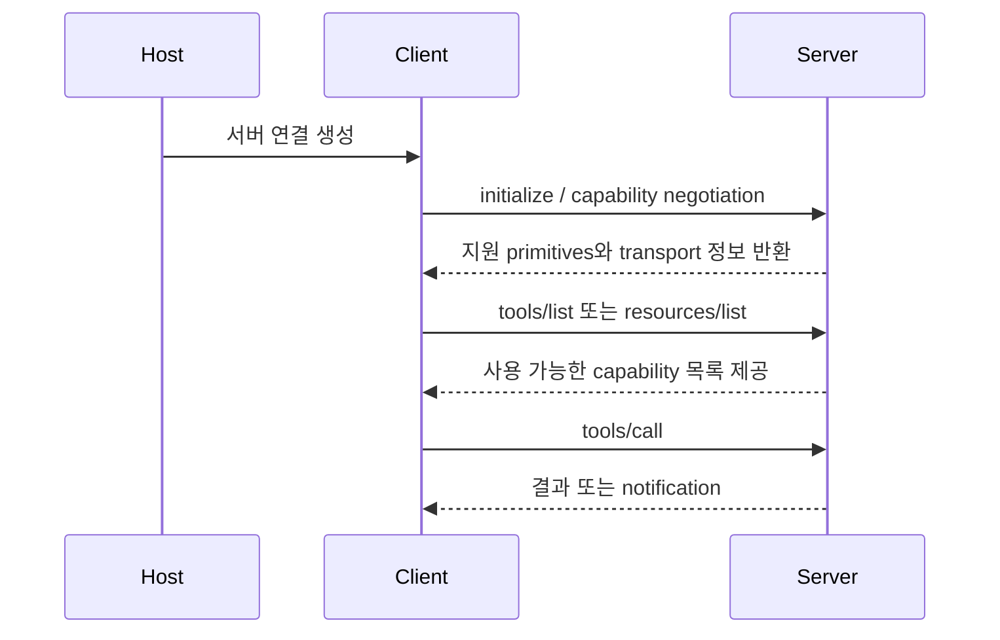

# MCP Architecture

Model Context Protocol의 architecture 문서 요약이다. host / client / [[model-context-protocol-mcp|server]] 구조를 더 구체적으로 이해하기 위한 문서다.

## 핵심 내용

- MCP를 이루는 각 주체의 역할과 경계를 설명한다.
- 데이터, 도구, 프롬프트가 어떤 구조 안에서 이동하는지 이해하게 돕는다.
- 스펙보다 더 구조적 관점에서 프로토콜을 본다.

## 왜 중요한가

What is MCP?가 입문서라면, architecture 문서는 실제 시스템 관점에서 프로토콜을 이해하게 해 준다. 구현과 운영을 준비하는 팀에게 특히 중요하다.

## 실무 적용 관점

MCP 연동에서 문제가 생기면 기능보다 경계를 먼저 봐야 한다. host, client, server가 각각 어디까지 책임지는지 이해하는 것이 설계와 디버깅의 출발점이다.

## 원문이 다루는 흐름

원문은 대체로 `Architecture overview - Model Context Protocol` → `Develop with MCP` → `Architecture overview` → `Pseudo Code` → `Pseudo-code using MCP Python SDK patterns` 순서로 전개된다. 따라서 `MCP Architecture` 페이지도 세부 API 목록보다 **입문 → 구조 이해 → 운영 확장**의 흐름으로 읽는 편이 좋다.

- 따라가야 할 순서: Architecture overview - Model Context Protocol, Develop with MCP, Architecture overview, Pseudo Code, Pseudo-code using MCP Python SDK patterns
- 위키에 남겨야 할 축: 입문 경로, 핵심 구조, 다음에 읽을 세부 문서

## 읽기 포인트

- 이 문서는 **원문을 어떤 순서로 읽어야 실무 판단으로 이어지는가**라는 질문을 붙잡고 읽으면 훨씬 덜 얕아진다.
- 소개 문단만 읽고 끝내지 말고, 원문 snapshot에서 실제 섹션 이름·예시·제약 조건을 다시 확인하는 습관이 중요하다.
- summary 문서는 결론 고정본이 아니라 읽기 가이드다. 따라서 입문, 세부 문서, 운영 문서를 어떤 순서로 볼지까지 안내해야 위키 품질이 올라간다.
- 공식 문서/논문/저장소가 함께 있으면 발표 글 하나만 믿지 말고, 사양 문서와 구현 저장소를 교차 확인하는 것이 안전하다.

## source 메모

- **MCP Architecture** — snapshot: `raw/recursive-sources/2026-04-10-sdk-mcp/mcp-architecture.md` · source: https://modelcontextprotocol.io/docs/learn/architecture · 볼 섹션: Architecture overview - Model Context Protocol, Develop with MCP, Architecture overview, Pseudo Code

## 참여자와 계층 표

| 층위 | 원문 핵심 요소 | 위키식 해석 |
|---|---|---|
| 참여자 | host / client / server | host는 AI 앱, client는 연결 어댑터, server는 capability 제공자다 |
| data layer | lifecycle, tools, resources, prompts, notifications | JSON-RPC 의미론과 capability 계약이 여기 있다 |
| transport layer | stdio / streamable HTTP / auth | 로컬 프로세스 연결인지 원격 서비스 연결인지 운영 모델을 결정한다 |
| utility primitives | sampling, elicitation, logging, tasks | 단순 tool call을 넘어 richer interaction을 만들기 위한 부가 계약이다 |

## 초기화 이후의 흐름

이 다이어그램의 핵심은 MCP가 "툴만 부르는 규약"이 아니라 **초기화-발견-실행-알림**까지 포함하는 상태ful 연결 모델이라는 점이다.

## 관련 문서

- [[model-context-protocol-mcp|Model Context Protocol (MCP)]]
- [[mcp-specification-2025-11-25|MCP Specification 2025-11-25]]
- [[what-is-mcp|What is the Model Context Protocol (MCP)?]]
- [[tool-calling-optimization]] -- MCP 도구 호출 성능 최적화 개념
- [[agentic-ai-foundation]] -- MCP 아키텍처가 지탱하는 에이전트 AI 기반 개념

