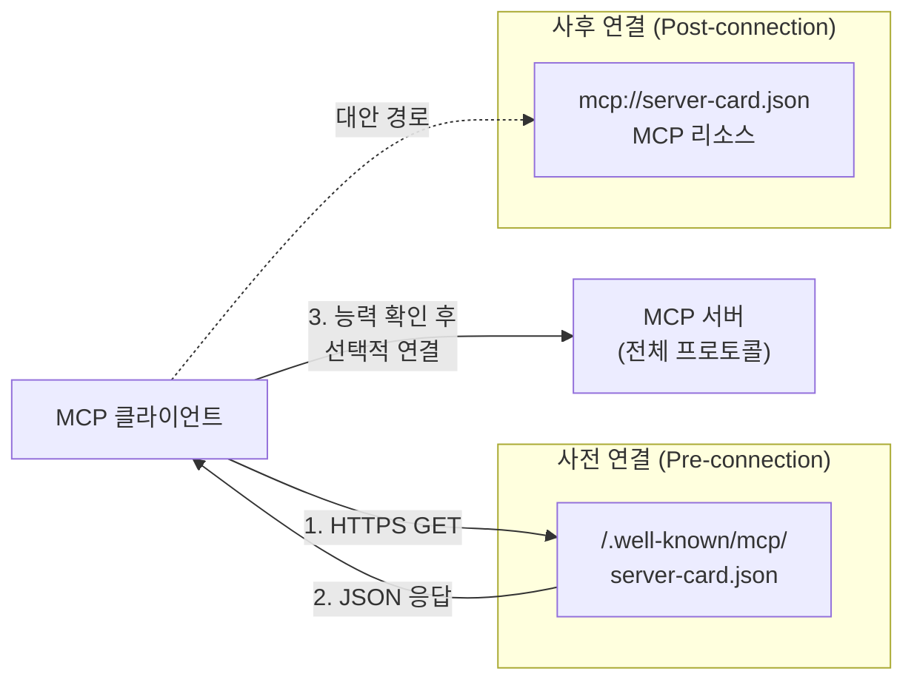
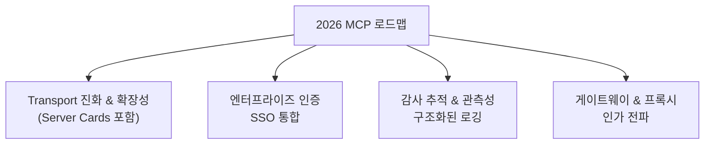

# MCP Server Cards / .well-known Discovery

## 정의

**MCP Server Cards**는 SEP-1649에서 제안된 [[model-context-protocol-mcp|Model Context Protocol]] 서버의 표준화된 발견(discovery) 메커니즘이다. 서버가 `/.well-known/mcp/server-card.json` 엔드포인트에 구조화된 JSON 메타데이터를 노출하여, 클라이언트가 **전체 초기화 핸드셰이크 없이** 서버의 기능과 메타데이터를 파악할 수 있게 한다.

## 왜 지금 중요한가

현재 MCP 생태계에서 사용자는 엔드포인트를 수동으로 설정해야 하고, 클라이언트는 도메인의 서버를 발견할 수 없으며, "모든 기능 조회에 전체 초기화 시퀀스가 필요"하여 지연시간과 비효율적 캐싱을 초래한다. 2026 MCP 로드맵에서 **Transport 진화와 확장성**의 핵심 우선순위로 명시되었으며, 이것은 MCP가 개발자 도구에서 **엔터프라이즈 인프라**로 전환하기 위한 필수 조건이다.

## SEP-1649 상세

### 발견 메커니즘

서버는 두 가지 채널로 카드를 노출할 수 있다:

1. **HTTP 기반 `.well-known/` 엔드포인트** - 연결 전 발견용. HTTPS 필수, `Content-Type: application/json` 반환 필수
2. **MCP 리소스 `mcp://server-card.json`** - 연결 후 접근용

### 서버 카드 스키마

서버 카드에 포함되는 주요 메타데이터 필드:

| 필드 | 설명 |
|---|---|
| **서버 식별** | name, title, version |
| **프로토콜 호환성** | 지원하는 MCP 프로토콜 버전 |
| **전송 설정** | transport 구성 세부사항 |
| **기능 선언** | tools, resources, prompts 목록 |
| **인증 요구사항** | 필요한 인증 방식 |
| **문서/아이콘** | 설명 문서 URL, 아이콘 URL |
| **프리미티브 정의** | 정적 또는 동적 프리미티브 선언 |

### 해결하는 문제

| 현재 마찰점 | Server Cards 해결책 |
|---|---|
| 엔드포인트 수동 설정 | 도메인 기반 자동 발견 |
| 기능 조회에 전체 초기화 필요 | 사전 연결 메타데이터 조회 |
| 레지스트리/크롤러에 활성 연결 필요 | `.well-known` 경량 조회 |
| 서버 능력의 비효율적 캐싱 | 정적 카드 + 캐시 가능 |

## 2026 MCP 로드맵에서의 위치

MCP 2026 로드맵은 네 가지 우선순위를 식별한다:

Server Cards는 **Transport 진화와 확장성** 축에 위치하며, "`.well-known`을 통해 제공 가능한 표준 메타데이터 포맷으로 활성 연결 없이 서버 기능을 발견 가능하게 한다"는 것이 로드맵의 명시적 목표다.

## 엔터프라이즈 갭

WorkOS의 분석에 따르면, 엔터프라이즈 규모로 MCP를 배포하는 조직은 "인증, 관측성, 게이트웨이 패턴, 설정 이식성에서 실질적 격차"가 존재한다고 지적한다.

| 엔터프라이즈 갭 | 현재 상태 |
|---|---|
| **감사 추적** | 커스텀 로깅을 수작업으로 조합 |
| **관리형 인증** | 정적 클라이언트 시크릿에 의존 |
| **게이트웨이 패턴** | 인가 전파, 세션 시맨틱스, 검사 경계 미규정 |
| **설정 이식성** | MCP 서버 설정이 특정 클라이언트에 종속 |

아직 로드맵 범위 밖인 영역: 멀티테넌시, 레이트 리밋, 비용 어트리뷰션. DPoP와 Workload Identity Federation은 "수평선 너머(on the horizon)"로 표현된다.

## MCP Registry와의 관계

Server Cards는 독립적으로도 동작하지만, MCP Registry와 결합하면 완전한 발견 인프라를 구성한다:

- **Server Cards** = 개별 서버의 자기 기술(self-description)
- **MCP Registry** = 다수 서버의 중앙 카탈로그
- 레지스트리가 `.well-known` 엔드포인트를 크롤링하여 카탈로그를 자동 구축하는 모델

이것은 웹의 `robots.txt` + 검색 엔진 크롤러 모델과 유사한 패턴이다.

## 보안 관점

[[cisco-defenseclaw|Cisco DefenseClaw]]의 MCP Scanner는 Server Cards와 함께 동작하여:
- 서버 메타데이터의 무결성 검증
- 인증/인가 요구사항의 적정성 평가
- [[owasp-agentic-top-10|OWASP Agentic Top 10]] ASI-04(Supply Chain) 대응

## 웹 표준과의 유사성

Server Cards/`.well-known` 발견 패턴은 기존 웹 표준에서 검증된 모델을 차용한다:

| 웹 표준 | MCP 대응 | 목적 |
|---|---|---|
| `robots.txt` | `/.well-known/mcp/server-card.json` | 기계가 읽을 수 있는 서버 메타데이터 |
| `sitemap.xml` | MCP Registry | 다수 리소스의 중앙 색인 |
| `/.well-known/openid-configuration` | Server Card 인증 필드 | 인증 방식 자동 발견 |
| `manifest.json` (PWA) | Server Card 기능 선언 | 클라이언트에 기능 고지 |

이 유사성은 의도적이다. 웹 생태계에서 수십 년간 검증된 발견 패턴을 재활용함으로써 학습 곡선을 줄이고 기존 인프라(CDN, 캐시, 크롤러)와의 호환성을 확보한다.

## 커뮤니티 현황

GitHub Issue #1649에 **49개 이상의 코멘트**가 달려 있어, 구현 세부사항, 보안 함의, MCP 클라이언트/레지스트리 간 통합 시나리오에 대한 활발한 생태계 논의가 진행 중이다.

## 대표 자료

- [2026 MCP 로드맵](https://blog.modelcontextprotocol.io/posts/2026-mcp-roadmap/)
- [GitHub SEP-1649: MCP Server Cards](https://github.com/modelcontextprotocol/modelcontextprotocol/issues/1649)
- [WorkOS: 2026 MCP Roadmap Enterprise Readiness](https://workos.com/blog/2026-mcp-roadmap-enterprise-readiness)

## 관련 문서

- [[cisco-defenseclaw]] - MCP Scanner가 Server Cards를 검증하는 도구
- [[owasp-agentic-top-10]] - ASI-04 공급망 취약점과 서버 발견
- [[nist-ai-agent-standards]] - 에이전트 프로토콜 상호운용성 표준
- [[zero-trust-ai-agents]] - Server Cards가 구현하는 에이전트 신원 검증
