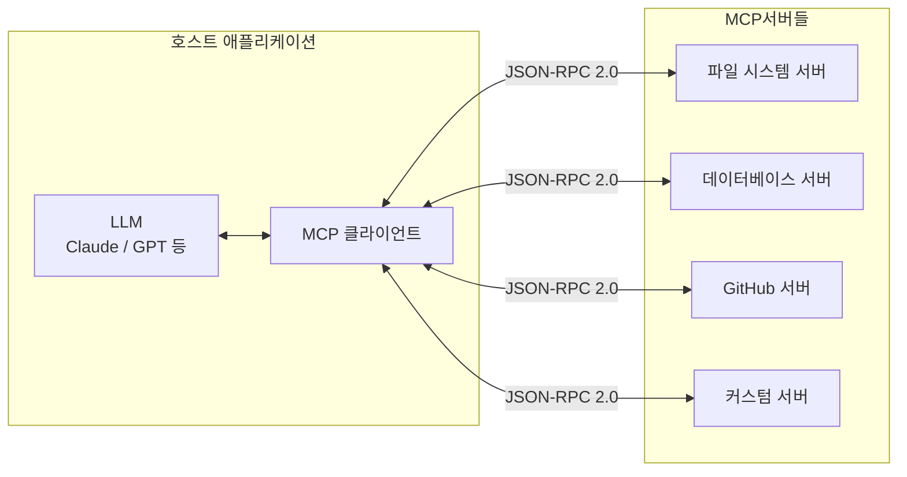
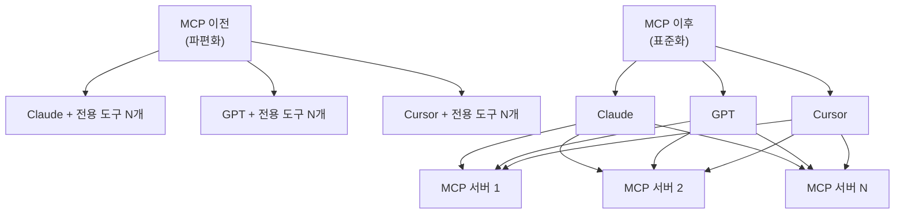
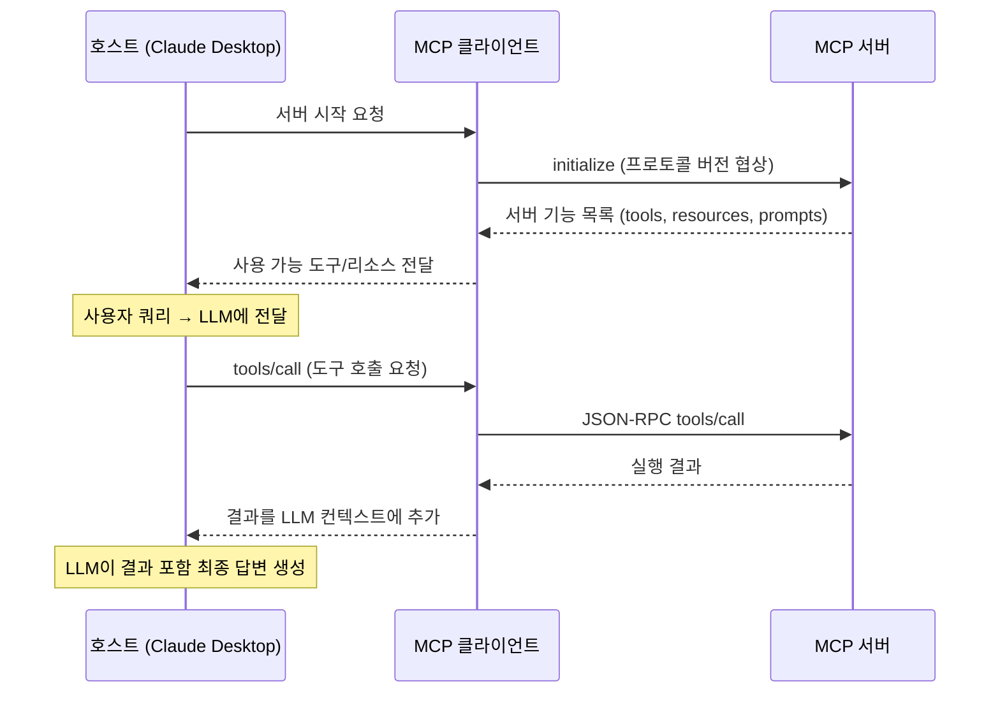

# Model Context Protocol (MCP)

MCP(Model Context Protocol)는 Anthropic이 2024년 11월 발표한 오픈 표준으로, LLM 애플리케이션과 외부 데이터·도구 사이의 통신을 표준화한 프로토콜이다. USB-C가 다양한 장치를 공통 규격으로 연결하듯, MCP는 어떤 AI 시스템이든 어떤 도구·데이터 소스와도 연결할 수 있는 범용 인터페이스를 목표로 한다.

## 아키텍처 개요



MCP는 클라이언트-서버 아키텍처를 따른다:

- **호스트(Host)**: LLM 애플리케이션 (Claude Desktop, IDE, 커스텀 앱)
- **클라이언트(Client)**: 호스트 내부에서 서버와 연결을 관리
- **서버(Server)**: 특정 도구·데이터를 제공하는 독립 프로세스

---

## 왜 MCP가 필요한가

MCP 이전에는 각 LLM 제공사나 에이전트 프레임워크가 도구 연결 방식을 각자 구현했다. 문제점:

1. **파편화**: OpenAI function calling, LangChain tools, LlamaIndex tools 등 각자 다른 규격
2. **중복 구현**: 같은 Slack 연동을 여러 프레임워크마다 따로 구현
3. **유지보수 지옥**: LLM을 바꾸면 모든 도구 연동을 다시 만들어야 함

MCP는 이 문제를 "한 번 서버 만들면 어디서든 쓰인다"는 방식으로 해결한다.



---

## 세 가지 핵심 원시 타입

MCP 서버는 세 종류의 기능을 제공할 수 있다.

### 1. 도구 (Tools)

LLM이 호출할 수 있는 함수. 외부 시스템과 상호작용하거나 계산을 수행한다.

```json
{
  "name": "read_file",
  "description": "파일 내용을 읽어 반환합니다",
  "inputSchema": {
    "type": "object",
    "properties": {
      "path": {
        "type": "string",
        "description": "읽을 파일의 절대 경로"
      }
    },
    "required": ["path"]
  }
}
```

- 모델 제어(model-controlled): LLM이 언제 호출할지 결정
- 실행 결과를 컨텍스트로 다시 전달

### 2. 리소스 (Resources)

서버가 노출하는 데이터. 파일, DB 레코드, API 응답 등 정적·동적 콘텐츠.

```json
{
  "uri": "file:///project/src/main.py",
  "mimeType": "text/x-python",
  "name": "메인 소스 파일"
}
```

- URI 기반 주소 지정
- 애플리케이션 제어(application-controlled): 클라이언트 앱이 어떤 리소스를 LLM에 노출할지 결정

### 3. 프롬프트 (Prompts)

재사용 가능한 프롬프트 템플릿. 특정 워크플로우를 위한 최적화된 프롬프트 제공.

```json
{
  "name": "code_review",
  "description": "코드 리뷰 요청 프롬프트",
  "arguments": [
    {
      "name": "code",
      "description": "리뷰할 코드",
      "required": true
    }
  ]
}
```

---

## 전송 방식

MCP는 두 가지 전송 채널을 지원한다.

| 방식 | 설명 | 사용 상황 |
|------|------|---------|
| stdio | 표준 입출력 스트림 | 로컬 프로세스, CLI 도구 |
| HTTP + SSE | Server-Sent Events 기반 스트리밍 | 원격 서버, 웹 서비스 |

stdio 방식이 로컬 개발에서 가장 간단하다. Claude Desktop은 설정 파일에서 MCP 서버를 stdio로 실행한다.

```json
{
  "mcpServers": {
    "filesystem": {
      "command": "npx",
      "args": ["-y", "@modelcontextprotocol/server-filesystem", "/Users/user/project"]
    }
  }
}
```

---

## 메시지 흐름



모든 메시지는 JSON-RPC 2.0 형식을 따른다.

---

## MCP 서버 구현 예시

### Python SDK로 최소 서버

```python
from mcp.server import Server
from mcp.server.stdio import stdio_server
from mcp.types import Tool, TextContent
import mcp.types as types

server = Server("my-wiki-server")

@server.list_tools()
async def list_tools() -> list[Tool]:
    """사용 가능한 도구 목록 반환."""
    return [
        Tool(
            name="search_wiki",
            description="AI 위키에서 개념을 검색합니다",
            inputSchema={
                "type": "object",
                "properties": {
                    "query": {
                        "type": "string",
                        "description": "검색어",
                    }
                },
                "required": ["query"],
            },
        )
    ]

@server.call_tool()
async def call_tool(name: str, arguments: dict) -> list[TextContent]:
    """도구 실행."""
    if name == "search_wiki":
        query = arguments.get("query", "")
        # 실제 구현에서는 위키 파일시스템 검색
        result = f"'{query}'에 대한 위키 검색 결과: ..."
        return [TextContent(type="text", text=result)]

    raise ValueError(f"알 수 없는 도구: {name}")

async def main() -> None:
    async with stdio_server() as streams:
        await server.run(streams[0], streams[1], server.create_initialization_options())

if __name__ == "__main__":
    import asyncio
    asyncio.run(main())
```

### TypeScript SDK로 리소스 서버

```typescript
import { Server } from "@modelcontextprotocol/sdk/server/index.js";
import { StdioServerTransport } from "@modelcontextprotocol/sdk/server/stdio.js";
import {
  ListResourcesRequestSchema,
  ReadResourceRequestSchema,
} from "@modelcontextprotocol/sdk/types.js";
import { readFileSync, readdirSync } from "fs";
import { join } from "path";

const server = new Server(
  { name: "wiki-resources", version: "1.0.0" },
  { capabilities: { resources: {} } }
);

const WIKI_DIR = "/Users/user/ai-wiki/wiki";

server.setRequestHandler(ListResourcesRequestSchema, async () => {
  const files = readdirSync(WIKI_DIR, { recursive: true })
    .filter((f): f is string => typeof f === "string" && f.endsWith(".md"))
    .map((f) => ({
      uri: `wiki://${f}`,
      mimeType: "text/markdown",
      name: f.replace(".md", ""),
    }));

  return { resources: files };
});

server.setRequestHandler(ReadResourceRequestSchema, async (request) => {
  const filePath = request.params.uri.replace("wiki://", "");
  const content = readFileSync(join(WIKI_DIR, filePath), "utf-8");

  return {
    contents: [
      {
        uri: request.params.uri,
        mimeType: "text/markdown",
        text: content,
      },
    ],
  };
});

const transport = new StdioServerTransport();
await server.connect(transport);
```

---

## 주요 공식 MCP 서버

Anthropic과 커뮤니티가 유지하는 참조 서버들.

| 서버 | 기능 | 패키지 |
|------|------|--------|
| Filesystem | 로컬 파일 읽기/쓰기 | `@modelcontextprotocol/server-filesystem` |
| GitHub | 레포/이슈/PR 접근 | `@modelcontextprotocol/server-github` |
| PostgreSQL | DB 스키마 + 쿼리 | `@modelcontextprotocol/server-postgres` |
| SQLite | 로컬 SQLite 접근 | `@modelcontextprotocol/server-sqlite` |
| Brave Search | 웹 검색 | `@modelcontextprotocol/server-brave-search` |
| Puppeteer | 브라우저 자동화 | `@modelcontextprotocol/server-puppeteer` |
| Playwright | 브라우저 테스트 자동화 | [[playwright-mcp]] |
| Memory | 지식 그래프 기반 메모리 | `@modelcontextprotocol/server-memory` |

---

## 인증 (Authorization)

2025년 기준 MCP 인증 체계는 여전히 발전 중이다. [[mcp-authorization]] 및 [[mcp-authorization-draft]] 참조.

현재 접근 방식:
- **환경 변수**: API 키를 서버 시작 시 환경 변수로 전달 (가장 일반적)
- **OAuth 2.0**: HTTP 전송 방식에서 Bearer 토큰 사용
- **로컬 신뢰**: stdio 서버는 로컬 프로세스이므로 별도 인증 생략 가능

보안 고려사항:
- 서버가 로컬 파일시스템이나 DB에 접근하므로 최소 권한 원칙 적용
- 신뢰할 수 없는 MCP 서버는 프롬프트 인젝션 공격 벡터가 될 수 있음
- 사용자 승인(human-in-the-loop) 없이 민감 작업 자동 실행 금지

---

## LLM 함수 호출과의 비교

MCP는 [[function-calling]]을 대체하는 것이 아니라 계층이 다르다.

| 항목 | 함수 호출 (Function Calling) | MCP |
|------|---------------------------|-----|
| 레이어 | LLM API 레벨 | 애플리케이션 아키텍처 레벨 |
| 범위 | 단일 모델-도구 연결 | 표준 통신 프로토콜 |
| 이식성 | 제공사마다 다름 | 제공사 무관 |
| 서버 수명 | 요청별 | 지속적 프로세스 |
| 상태 | 무상태 | 상태 유지 가능 |

실제로 MCP 서버가 내부적으로 LLM function calling을 사용해 구현될 수 있으며, MCP는 그 위에 표준화된 레이어를 추가하는 방식이다.

---

## 채택 현황 (2025 기준)

MCP 발표 이후 급속히 확산됐다.

- **공식 통합**: Claude Desktop, VS Code (Copilot), Zed, Sourcegraph Cody
- **에이전트 프레임워크**: LangChain, LlamaIndex, OpenAI Agents SDK
- **서드파티 서버**: 수백 개의 커뮤니티 서버 공개 (Notion, Slack, Jira 등)
- **클라우드 제공사**: AWS, Google Cloud 등 MCP 서버 출시

MCP의 성공 요인은 단순한 설계(JSON-RPC + 3가지 원시 타입)와 Anthropic이 직접 Claude Desktop을 통해 보여준 레퍼런스 구현이었다.

---

## 관련 문서

- [[mcp-authorization]] - MCP 인증 구현 상세
- [[mcp-authorization-draft]] - 인증 드래프트 스펙
- [[playwright-mcp]] - Playwright 기반 MCP 서버
- [[function-calling]] - LLM 함수 호출 기초
- [[ai-agent-security]] - 에이전트 도구 사용 시 보안 고려사항
- [[agentic-engineering]] - 에이전트 엔지니어링 전반
