# Megatron Bridge 체크포인트 변환

Megatron Bridge는 NVIDIA Megatron-LM 형식과 HuggingFace Transformers 형식 간의 체크포인트를 양방향으로 변환하는 도구다. 2025년 10월 릴리스된 이 도구는 텐서 병렬(TP)과 파이프라인 병렬(PP) 분할이 적용된 Megatron 체크포인트를 단일 HuggingFace 모델로 병합하거나, 반대로 HuggingFace 모델을 원하는 TP/PP 설정으로 분할할 수 있다.

## 왜 체크포인트 변환이 필요한가

대규모 모델 학습은 보통 Megatron-LM으로 수행된다. Megatron은 TP × PP = N개 GPU에 모델을 분산해 저장하므로, 학습 완료 후 체크포인트는 N개 파일 조각으로 나뉘어 있다. 이를 다음과 같은 상황에 활용하려면 변환이 필요하다.

- HuggingFace `transformers` 라이브러리로 추론/파인튜닝
- vLLM, TensorRT-LLM 등 서빙 엔진으로 이식
- 다른 TP/PP 설정으로 재학습 (클러스터 변경 시)

```mermaid
flowchart LR
    subgraph Megatron["Megatron 체크포인트 (TP=4, PP=2)"]
        M1[rank_0_0.pt]
        M2[rank_0_1.pt]
        M3[rank_1_0.pt]
        M4[rank_1_1.pt]
        M5[rank_2_0.pt]
        M6[rank_2_1.pt]
        M7[rank_3_0.pt]
        M8[rank_3_1.pt]
    end

    subgraph HF["HuggingFace 체크포인트"]
        H1[model.safetensors]
        H2[config.json]
        H3[tokenizer.json]
    end

    Megatron -->|"megatron-bridge merge\n--tp 4 --pp 2"| HF
    HF -->|"megatron-bridge split\n--tp 8 --pp 4"| Megatron2["Megatron 체크포인트 (TP=8, PP=4)"]
```



## Megatron TP/PP 분할 방식

### 텐서 병렬(Tensor Parallelism)

TP는 개별 행렬을 열(column) 또는 행(row)으로 분할한다. Linear 레이어의 경우:
- Column-split: 가중치 행렬을 열 방향으로 N등분. 각 GPU가 출력의 1/N을 담당
- Row-split: 가중치 행렬을 행 방향으로 N등분. 각 GPU가 입력의 1/N을 받아 부분 합산

Attention 레이어는 헤드 단위로 분할되고, MLP 레이어는 두 Linear의 연속적 분할로 처리된다.

### 파이프라인 병렬(Pipeline Parallelism)

PP는 레이어를 연속 블록으로 묶어 GPU에 배분한다. 레이어 0~7은 GPU 0, 레이어 8~15는 GPU 1 방식이다. 체크포인트에서 PP 차원은 파일 인덱스(`rank_PP_TP.pt`)로 인코딩된다.

## 변환 시 처리 과제

### 가중치 재조합

TP로 분할된 가중치를 병합할 때 단순 concatenation이 아니라 분할 방향(column vs row)을 정확히 알아야 한다. 잘못된 차원으로 병합하면 모델이 올바르게 동작하지 않는다. Megatron Bridge는 각 레이어 타입별 분할 메타데이터를 참조해 올바른 병합 연산을 선택한다.

### 레이어 이름 매핑

Megatron과 HuggingFace는 동일한 아키텍처에 대해 다른 이름 체계를 사용한다.

| Megatron | HuggingFace (Llama 예시) |
|----------|--------------------------|
| `layers.0.self_attention.query_key_value` | `model.layers.0.self_attn.q_proj`, `k_proj`, `v_proj` |
| `layers.0.mlp.dense_h_to_4h` | `model.layers.0.mlp.gate_proj`, `up_proj` |
| `layers.0.input_layernorm` | `model.layers.0.input_layernorm` |

QKV가 Megatron에서는 하나의 행렬로 결합되어 있지만, HuggingFace에서는 Q, K, V가 별도 weight로 분리되는 경우가 많아, 이 분해/결합 처리가 변환기의 핵심 작업이다.

### 수치 정밀도

fp16/bf16 혼합 정밀도 학습 체크포인트의 경우, 변환 과정에서 데이터 타입을 유지하거나 명시적으로 캐스팅해야 한다. Megatron Bridge는 `--dtype` 플래그로 출력 정밀도를 제어한다.

## 사용 방법 (CLI)

```bash
# Megatron -> HuggingFace 변환
megatron-bridge merge \
  --input-dir /checkpoints/megatron/iter_100000 \
  --output-dir /checkpoints/hf/llama-70b \
  --model-type llama \
  --tp 8 --pp 4 \
  --dtype bf16

# HuggingFace -> Megatron 변환 (TP=4, PP=2로 재분할)
megatron-bridge split \
  --input-dir /checkpoints/hf/llama-70b \
  --output-dir /checkpoints/megatron/retrain \
  --model-type llama \
  --tp 4 --pp 2
```

## 지원 모델 아키텍처

2025년 10월 릴리스 기준 공식 지원 아키텍처: LLaMA/LLaMA-2/LLaMA-3, Mistral, Falcon, GPT-NeoX, Mixtral(MoE). 지원 범위는 각 모델의 레이어 이름 매핑 테이블이 구현되어 있는지에 달려 있다.

## 주의 사항

- PP=1이 아닌 경우 파이프라인 스테이지 경계에서 임베딩 레이어 처리 방식에 주의
- MoE 모델(Mixtral 등)은 전문가(expert) 가중치의 분할 방식이 별도로 처리됨
- TP 변환 시 헤드 수가 새 TP 설정의 약수여야 한다 (64 헤드 → TP=8: OK, TP=6: 불가)

## 관련 문서

- [[deepspeed-zero-internals]] - DeepSpeed ZeRO와 Megatron의 상호 보완적 사용
- [[deepspeed-arctic-lts]] - 장문 시퀀스 학습 후 체크포인트 관리
- [[pruning-structured-unstructured]] - 변환 후 프루닝으로 모델 경량화
