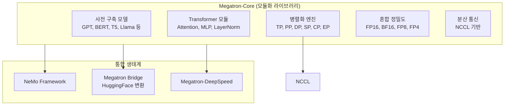
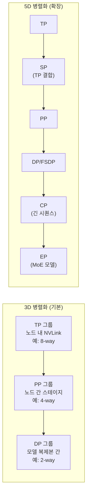

# Megatron-LM: NVIDIA의 대규모 모델 학습 프레임워크

## 개요

Megatron-LM은 NVIDIA가 개발한 GPU 최적화 대규모 Transformer 모델 학습 프레임워크다. 2019년 논문 "Megatron-LM: Training Multi-Billion Parameter Language Models Using Model Parallelism"에서 텐서 병렬화(Tensor Parallelism, TP)를 체계화했으며, 이후 파이프라인 병렬화(Pipeline Parallelism, PP), 시퀀스 병렬화(Sequence Parallelism, SP), 컨텍스트 병렬화(Context Parallelism, CP), 전문가 병렬화(Expert Parallelism, EP)를 추가하여 5차원 이상의 병렬화를 지원한다.

GPT-3(175B), MT-NLG(530B) 등 대규모 모델 학습에 사용되었으며, 2026년 현재 Megatron-Core라는 모듈화된 라이브러리로 발전하여 PyTorch 기반 대규모 학습의 핵심 인프라 역할을 한다. [[data-parallelism-fsdp]], [[tensor-pipeline-parallelism]], [[distributed-communication]]의 이론을 실제 프로덕션 수준으로 구현한 프레임워크다.

## 아키텍처

### Megatron-Core

Megatron-Core는 Megatron-LM에서 추출한 모듈화된 GPU 최적화 학습 라이브러리다. 구성 가능한 빌딩 블록을 제공하여 대규모 Transformer 모델을 유연하게 구축할 수 있다.

**핵심 구성요소**:
- Transformer 컴포넌트: Attention, MLP, LayerNorm 등 모듈화된 레이어
- 병렬화 전략: TP, PP, DP, EP, CP의 조합 가능한 구현
- [[mixed-precision-training]] 지원: FP16, BF16, FP8, FP4
- 사전 구축 모델 아키텍처: GPT, BERT, T5 등

2025년부터 Megatron-Core 개발이 GitHub으로 이전되어, 모든 개발과 CI가 공개적으로 진행된다.

## 병렬화 전략

Megatron-LM이 구현한 병렬화 전략은 [[tensor-pipeline-parallelism]]에서 설명하는 이론의 실제 구현이다.

### 텐서 병렬화 (TP)

Transformer 레이어 내부의 연산을 여러 GPU에 분할한다. MHA(Multi-Head Attention) 블록은 어텐션 헤드를 GPU에 균등 배분하고, MLP 블록은 첫 번째 선형 레이어를 열 방향(column-wise)으로, 두 번째를 행 방향(row-wise)으로 분할한다. 레이어당 AllReduce 2회가 필요하므로 NVLink/NVSwitch의 고대역폭이 필수적이며, 노드 내 GPU에서만 적용하는 것이 원칙이다.

### 파이프라인 병렬화 (PP)

모델의 레이어를 순차적 스테이지(stage)로 나누어 각 GPU에 배치한다. Megatron-LM은 1F1B(One Forward One Backward) 스케줄과 Interleaved 1F1B 스케줄을 구현하여 파이프라인 버블을 최소화한다. Interleaved 1F1B는 각 GPU에 비연속적 레이어 청크를 여러 개 할당하여 버블을 추가로 감소시킨다.

### 시퀀스 병렬화 (SP)

TP와 결합하여, TP로 분할되지 않는 연산(LayerNorm, Dropout 등)의 활성화(activation) 메모리를 시퀀스 차원을 따라 분산한다. TP 단독 사용 시 이 연산들이 각 GPU에 중복 저장되는 문제를 해결한다.

### 컨텍스트 병렬화 (CP)

긴 시퀀스(128K+ 토큰)를 처리할 때 시퀀스를 여러 GPU에 분할한다. 2026년 1월에 도입된 Dynamic Context Parallelism은 가변 길이 시퀀스 학습에서 적응형 CP 크기 조정을 통해 최대 1.48배 속도 향상을 달성했다.

### 전문가 병렬화 (EP)

Mixture-of-Experts(MoE) 모델에서 전문가(expert)를 GPU에 분산 배치한다. DeepSeek-V3, Qwen3 등 최신 MoE 모델 학습을 지원한다.

### 3D/5D 병렬화 조합

MT-NLG(530B) 학습에서는 8-way TP(노드 내) + 35-way PP(노드 간) + DP로 총 4,480개 A100 GPU를 활용했다. 이 규모에서 [[nccl]]의 토폴로지 인식 통신과 [[gpu-cluster-scheduling]]의 적절한 GPU 배치가 성능에 결정적 영향을 미친다.

## 대규모 모델 학습 사례

| 모델 | 파라미터 | 병렬화 구성 | 비고 |
|------|---------|-----------|------|
| GPT-3 | 175B | TP + PP + DP | Megatron-LM 초기 적용 |
| MT-NLG | 530B | 8-way TP + 35-way PP + DP | NVIDIA + Microsoft 협업 |
| Nemotron | 수백B | Megatron-Core 기반 | NVIDIA 자체 모델 |

## DeepSpeed와의 관계

Megatron-LM과 Microsoft DeepSpeed는 경쟁이 아닌 상호보완 관계에 있으며, Megatron-DeepSpeed라는 통합 프로젝트가 존재한다.

| 영역 | Megatron-LM | DeepSpeed | Megatron-DeepSpeed |
|------|------------|-----------|-------------------|
| 핵심 강점 | TP, PP 구현 | [[deepspeed-zero]] 메모리 최적화 | 양쪽 장점 결합 |
| 텐서 병렬화 | 원조 구현 | Megatron 활용 | Megatron TP 사용 |
| 메모리 최적화 | 제한적 | ZeRO Stage 1/2/3, Infinity | ZeRO + Megatron 결합 |
| 파이프라인 | 1F1B, Interleaved | PipeDream 변형 | 양쪽 스케줄 선택 가능 |
| CPU/NVMe 오프로딩 | 미지원 | ZeRO-Infinity | DeepSpeed 오프로딩 통합 |
| MoE 학습 | EP 지원 | MoE 지원 | 확장된 MoE 지원 |

MT-NLG(530B) 학습이 이 결합의 대표 사례로, Megatron-LM의 TP로 노드 내 모델을 분할하고 DeepSpeed의 PP로 노드 간 파이프라인을 구성했다.

### PyTorch FSDP와의 비교

PyTorch 네이티브 [[data-parallelism-fsdp]]의 FSDP2 + TorchTitan이 Megatron-LM의 대안으로 부상하고 있다. Megatron-LM은 프로덕션 검증 수준의 성숙도와 NVIDIA 하드웨어 최적화가 강점이고, TorchTitan은 PyTorch 네이티브 통합과 간결한 API가 강점이다.

## 생태계 통합

### NeMo Framework

NVIDIA NeMo는 Megatron-Core 위에 구축된 엔드투엔드 학습 프레임워크로, 데이터 전처리부터 학습, 평가, 배포까지의 전체 파이프라인을 제공한다.

### Megatron Bridge (2025년 10월)

HuggingFace와 Megatron 체크포인트 간 양방향 변환을 제공하는 도구다. HuggingFace Hub의 모델을 Megatron-Core로 가져와 대규모 학습을 수행하고, 결과를 다시 HuggingFace 형식으로 내보낼 수 있다.

## 실전 도입 가이드

### 적합한 사용 사례

| 규모 | 권장 도구 | 이유 |
|------|----------|------|
| 소규모 파인튜닝 (1-7B) | [[unsloth]], TRL | Megatron-LM은 오버킬 |
| 중규모 학습 (7-70B) | Megatron-Core 또는 FSDP2 | TP+PP 필요 시 Megatron 유리 |
| 대규모 사전학습 (70B+) | Megatron-Core + NeMo | 프로덕션 검증된 대규모 학습 |
| MoE 모델 | Megatron-Core | EP + TP + PP 조합 필요 |

### 핵심 설정 순서

1. **TP 크기 결정**: 노드 내 GPU 수 기준 (보통 4 또는 8)
2. **PP 크기 결정**: 모델 크기와 노드 수에 따라 스테이지 수 설정
3. **DP 크기 산출**: 총 GPU / (TP x PP) = DP 크기
4. **마이크로배치 수 조정**: PP 스테이지 수의 4배 이상으로 설정하여 버블 최소화
5. **[[mixed-precision-training]] 설정**: BF16 기본, 대규모에서 FP8 고려

### 흔한 실수

- **TP를 노드 간에 적용**: AllReduce가 레이어마다 발생하므로 InfiniBand 대역폭으로는 심각한 병목. NVLink 범위 내에서만 적용
- **PP 스테이지 불균형**: 임베딩/출력 레이어의 연산량 차이로 특정 스테이지 병목 발생
- **[[nccl]] 통신 디버깅 미비**: `NCCL_DEBUG=INFO`로 토폴로지 탐색과 알고리즘 선택 확인 필수

## 관련 문서

- [[tensor-pipeline-parallelism]] -- Megatron-LM이 체계화한 TP/PP 이론
- [[data-parallelism-fsdp]] -- 3D 병렬화의 DP 축 (FSDP2 비교)
- [[deepspeed-zero]] -- Megatron-DeepSpeed 결합 파트너
- [[nccl]] -- Megatron-LM의 통신 백엔드
- [[distributed-communication]] -- 집합 통신 연산 상세
- [[mixed-precision-training]] -- FP8/FP4 포함 혼합 정밀도 전략
- [[gpu-cluster-scheduling]] -- 대규모 학습의 GPU 배치 전략
