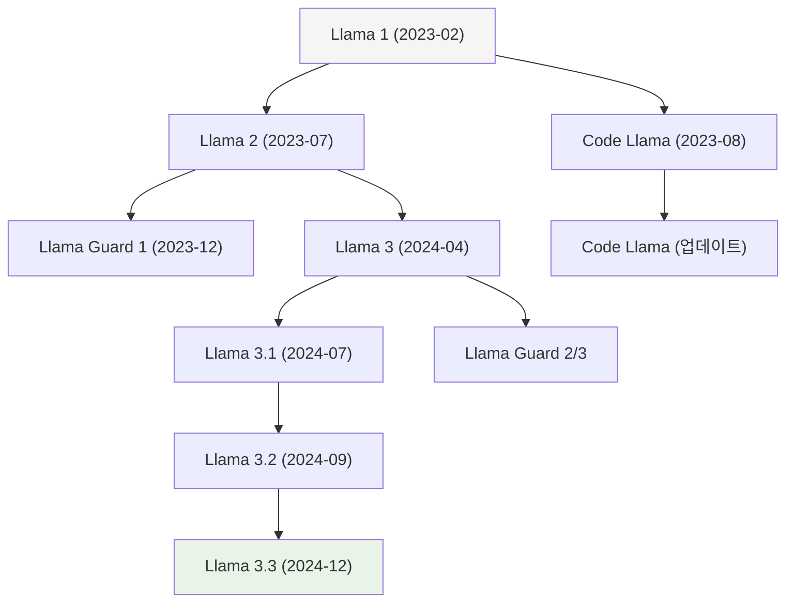
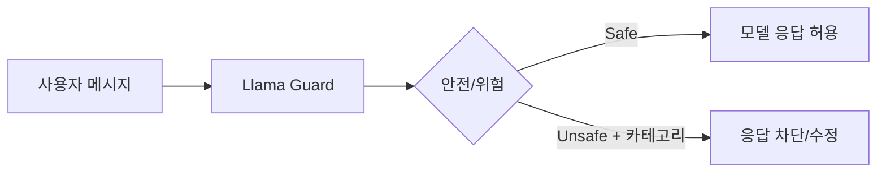
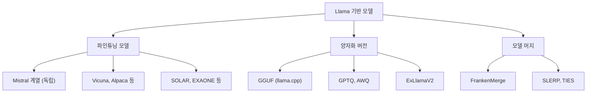
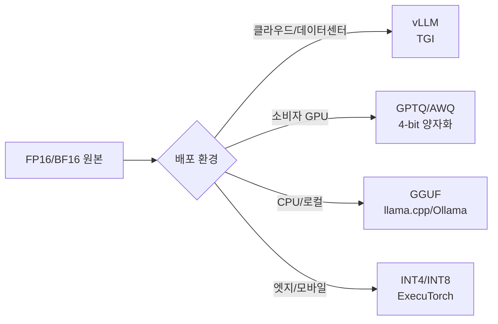

# Meta Llama

Meta Llama는 Meta AI Research가 개발한 오픈 웨이트(open-weight) 대형 언어 모델 패밀리다. GPT, Claude 등 폐쇄형 모델과 달리 모델 가중치를 공개해 커뮤니티 파인튜닝, 로컬 배포, 상업적 활용을 허용하는 생태계를 구축했다. 2023년 이후 오픈소스 LLM의 사실상 기준점이 되었다.

## 모델 패밀리 계보



위 계보는 Llama 1 출시 이후 약 2년간의 주요 분기를 보여준다. 메인 시리즈, 코드 특화 시리즈, 안전성 특화 시리즈로 갈라진다.

---

## Llama 1 (2023년 2월)

Meta의 첫 공개 LLM. 학술 연구 목적으로만 가중치를 공개했다.

| 파라미터 | 컨텍스트 | 학습 토큰 |
|---------|---------|---------|
| 7B, 13B, 33B, 65B | 2,048 토큰 | 1T-1.4T |

**핵심 아키텍처 선택**
- Transformer 디코더 기반, GPT-3와 유사
- Pre-Norm (RMSNorm), SwiGLU 활성화 함수
- Rotary Position Embedding (RoPE) 도입
- 65B 모델이 GPT-3 175B 수준 성능 달성 주장

**한계**: 상업적 사용 금지, 채팅/지시 따르기(instruction-following) 튜닝 없음.

---

## Llama 2 (2023년 7월)

상업적 사용을 허용하는 라이선스로 전환한 버전. 챗봇 형태의 Llama 2-Chat 동시 출시.

| 파라미터 | 컨텍스트 | 학습 토큰 | 비고 |
|---------|---------|---------|------|
| 7B, 13B, 34B, 70B | 4,096 토큰 | 2T | 34B는 비공개 |

**주요 개선**
- RLHF (Reinforcement Learning from Human Feedback) + RLAIF로 안전성 강화
- Grouped Query Attention (GQA) 도입 (70B)
- 70B 모델이 GPT-3.5에 준하는 성능 달성

**Llama 2-Chat**: SFT + RLHF로 대화 특화 파인튜닝. 해로운 콘텐츠 억제에 중점.

---

## Code Llama (2023년 8월)

Llama 2 기반 코드 생성 특화 모델. 세 가지 변형 제공.

| 변형 | 설명 | 컨텍스트 |
|-----|------|---------|
| Code Llama | 기본 코드 완성 | 100K 토큰 |
| Code Llama - Instruct | 지시 따르기 + 코드 설명 | 100K 토큰 |
| Code Llama - Python | Python 특화 파인튜닝 | 100K 토큰 |

**특징**
- 500B 코드 토큰으로 추가 학습
- Fill-in-the-Middle (FIM) 지원: 코드 중간 삽입 가능
- 7B, 13B, 34B, 70B 제공

---

## Llama Guard (2023년 12월 ~)

콘텐츠 안전성 분류를 위한 특화 모델. 일반 언어 생성이 아닌 **안전성 판단** 목적.



**버전별 특성**

| 버전 | 기반 | 분류 카테고리 |
|-----|------|------------|
| Llama Guard 1 | Llama 2-7B | MLCommons 위험 분류 6개 |
| Llama Guard 2 | Llama 3-8B | MLCommons 확장 11개 |
| Llama Guard 3 | Llama 3.1-8B | 다국어 지원, 멀티모달 |

**활용 방식**
- 프롬프트 필터링 (입력 단계)
- 응답 필터링 (출력 단계)
- 파이프라인에 인라인으로 삽입

---

## Llama 3 (2024년 4월)

아키텍처와 학습 데이터를 대폭 개선한 세대. 8B와 70B 두 크기로 출시.

| 파라미터 | 컨텍스트 | 학습 토큰 | 어휘 크기 |
|---------|---------|---------|---------|
| 8B, 70B | 8,192 토큰 | 15T+ | 128,256 |

**핵심 변화**
- 어휘 크기를 32K → 128K로 확장 (다국어, 코드 커버리지 향상)
- 8B 모델이 Llama 2-70B 수준 성능 달성
- GQA 전 모델에 적용
- 데이터 품질에 집중: 중복 제거, 필터링 강화

---

## Llama 3.1 (2024년 7월)

405B 파라미터 초대형 모델 공개. GPT-4급 성능 주장.

| 파라미터 | 컨텍스트 | 비고 |
|---------|---------|------|
| 8B, 70B, 405B | 128K 토큰 | 405B는 FP8/BF16 |

**주요 추가 사항**
- 컨텍스트 8K → 128K로 대폭 확장
- 도구 호출(tool calling) 네이티브 지원
- 405B: GPT-4o, Claude 3.5 Sonnet 대비 벤치마크 상위권 달성
- 8개 언어 다국어 지원

**실무 의미**: 405B는 상업적 허용 오픈 웨이트 최강급으로 자체 서버 배포 시 API 비용 절감 가능.

---

## Llama 3.2 (2024년 9월)

멀티모달(비전) 및 경량 엣지 모델 추가.

| 모달리티 | 파라미터 | 특징 |
|---------|---------|------|
| 텍스트 전용 | 1B, 3B | 스마트폰/엣지 배포 |
| 비전 | 11B, 90B | 이미지 이해 가능 |

**1B / 3B 경량 모델**
- 스마트폰 온디바이스 추론 목적
- Qualcomm, MediaTek 칩 최적화
- 128K 컨텍스트 유지

**11B / 90B 비전 모델**
- 이미지 + 텍스트 입력 처리
- 문서 이해, 차트 해석, 이미지 캡셔닝

---

## Llama 3.3 (2024년 12월)

70B 모델을 405B 수준으로 업그레이드한 효율화 버전.

| 파라미터 | 컨텍스트 | 성능 목표 |
|---------|---------|---------|
| 70B | 128K | Llama 3.1-405B 동급 |

**배경**: 405B는 배포 비용이 높다. 70B 크기에서 동등 성능을 달성해 실용성 극대화.

---

## 오픈 웨이트 생태계

Meta Llama의 오픈 웨이트 정책이 만들어낸 생태계:



**파생 생태계 주요 요소**

| 항목 | 설명 |
|-----|------|
| llama.cpp | C++ 기반 추론 엔진, GGUF 포맷 대중화 |
| Ollama | 로컬 LLM 실행 도구, Llama 계열 기본 지원 |
| HuggingFace Hub | 수천 개의 Llama 파생 모델 호스팅 |
| LoRA/QLoRA | [[lora-qlora-finetuning]] 기법으로 소비자급 GPU에서 파인튜닝 가능 |

---

## 라이선스 변천

| 버전 | 라이선스 | 상업적 사용 |
|-----|---------|----------|
| Llama 1 | 비상업 연구용 | 불가 |
| Llama 2 | Meta Llama 2 Community | MAU 7억 이하 가능 |
| Llama 3+ | Meta Llama 3 Community | MAU 7억 이하 가능 |

**주의**: "오픈소스"라는 표현이 자주 쓰이지만, 엄밀히는 **오픈 웨이트(open-weight)** 다. OSI 정의의 오픈소스가 아니며 상업적 사용에 조건이 있다. MAU 7억 초과 서비스는 Meta와 별도 협의 필요.

---

## Meta AI Research 연구 기여

Llama 시리즈와 함께 발표된 주요 연구:

| 논문/기술 | 내용 |
|---------|------|
| LLaMA 원논문 (2023) | 소규모 고품질 데이터로 대형 모델 능가 |
| Toolformer 영향 | 도구 호출 내재화 |
| LIMA 논문 | 1,000개 고품질 예제로 충분한 정렬(alignment) 가능 |
| Self-Play Fine-Tuning (SPIN) | 합성 데이터로 파인튜닝 |

---

## 배포 및 서빙

**추론 최적화 옵션**



**하드웨어 요구사항 (70B 기준)**

| 포맷 | 최소 VRAM | 권장 환경 |
|-----|---------|---------|
| BF16 전체 | ~140GB | A100 x2 이상 |
| GPTQ 4-bit | ~35GB | A100 단일 또는 3090 x2 |
| GGUF Q4_K_M | ~40GB RAM | CPU 서버 |

---

## 실무 활용 패턴

**1. 로컬 개발/테스트 (Ollama)**

```python
import ollama

# 8B 모델 로컬 실행
response = ollama.chat(
    model="llama3.1:8b",
    messages=[{"role": "user", "content": "Transformer 아키텍처를 설명해줘"}]
)
logger.info(response["message"]["content"])
```

**2. vLLM 고속 서빙**

```python
from vllm import LLM, SamplingParams

llm = LLM(
    model="meta-llama/Meta-Llama-3.1-8B-Instruct",
    tensor_parallel_size=1,
    dtype="bfloat16",
)
params = SamplingParams(temperature=0.7, max_tokens=512)
outputs = llm.generate(["한국어로 요약해줘: ..."], params)
```

**3. HuggingFace Transformers**

```python
from transformers import AutoTokenizer, AutoModelForCausalLM
import torch

model_id = "meta-llama/Meta-Llama-3.1-8B-Instruct"
tokenizer = AutoTokenizer.from_pretrained(model_id)
model = AutoModelForCausalLM.from_pretrained(
    model_id,
    torch_dtype=torch.bfloat16,
    device_map="auto",
)

messages = [
    {"role": "system", "content": "당신은 AI 전문가입니다."},
    {"role": "user", "content": "RAG가 무엇인가요?"},
]
input_ids = tokenizer.apply_chat_template(
    messages, add_generation_prompt=True, return_tensors="pt"
).to(model.device)

output = model.generate(input_ids, max_new_tokens=256)
logger.info(tokenizer.decode(output[0][input_ids.shape[-1]:], skip_special_tokens=True))
```

---

## 경쟁 모델과의 비교

| 모델 | 회사 | 오픈 여부 | 최대 파라미터 | 특징 |
|-----|------|---------|------------|------|
| Llama 3.1 | Meta | 오픈 웨이트 | 405B | 상업 허용 최강급 |
| [[gemma-4]] | Google | 오픈 웨이트 | 27B | 경량 고성능 |
| Mistral | Mistral AI | 오픈 웨이트 | 141B (Mixtral) | MoE 아키텍처 |
| [[gpt-models]] | OpenAI | 폐쇄형 | 미공개 | API만 제공 |
| [[claude-models]] | Anthropic | 폐쇄형 | 미공개 | 안전성 중시 |
| Qwen | Alibaba | 오픈 웨이트 | 72B+ | 다국어 강점 |

---

## 파인튜닝 가이드

[[lora-qlora-finetuning]]을 활용하면 소비자급 하드웨어에서도 Llama 파인튜닝이 가능하다.

**최소 하드웨어 요구**

| 모델 크기 | 방법 | 최소 GPU VRAM |
|---------|------|------------|
| 8B | QLoRA 4-bit | 12GB (3080 Ti) |
| 70B | QLoRA 4-bit | 48GB (A6000) |
| 405B | QLoRA 4-bit | 160GB (A100 x2+) |

**TRL + PEFT 조합 예시**

```python
from trl import SFTTrainer
from peft import LoraConfig
from transformers import TrainingArguments

lora_config = LoraConfig(
    r=16,
    lora_alpha=32,
    target_modules=["q_proj", "v_proj"],
    lora_dropout=0.05,
    bias="none",
    task_type="CAUSAL_LM",
)

trainer = SFTTrainer(
    model=model,
    train_dataset=dataset,
    peft_config=lora_config,
    dataset_text_field="text",
    args=TrainingArguments(
        output_dir="./llama-finetuned",
        num_train_epochs=3,
        per_device_train_batch_size=4,
        gradient_accumulation_steps=4,
        warmup_steps=100,
        learning_rate=2e-4,
        bf16=True,
    ),
)
trainer.train()
```

---

## 왜 중요한가

**오픈 웨이트 LLM 표준화**
Llama가 공개되기 전 연구 커뮤니티는 GPT-3 API에 의존하거나 자체 소형 모델을 학습해야 했다. Llama 등장 이후 "공통 베이스 모델 + 파인튜닝"이 표준 패턴으로 자리잡았다.

**규제/보안 민감 산업 진입 가능성**
금융, 의료, 국방 등 외부 API 사용이 불가능한 도메인에서 온프레미스 LLM 배포가 현실화됐다.

**커뮤니티 혁신 촉진**
Alpaca, Vicuna, WizardLM, Mistral 등 수백 개의 파생 모델이 Llama 기반으로 탄생했다. 이 생태계가 상업 모델 개발 속도에도 영향을 준다.

---

## 관련 문서

- [[lora-qlora-finetuning]] - Llama 파인튜닝에 가장 많이 쓰이는 기법
- [[gemma-4]] - Google의 오픈 웨이트 경쟁 모델
- [[gpt-models]] - OpenAI의 폐쇄형 LLM 패밀리
- [[claude-models]] - Anthropic의 폐쇄형 LLM 패밀리
- [[transformer-architecture]] - Llama 아키텍처 기반
- [[gguf-quantization]] - 로컬 배포용 양자화 포맷
- [[vllm-serving]] - 고성능 Llama 서빙 엔진
