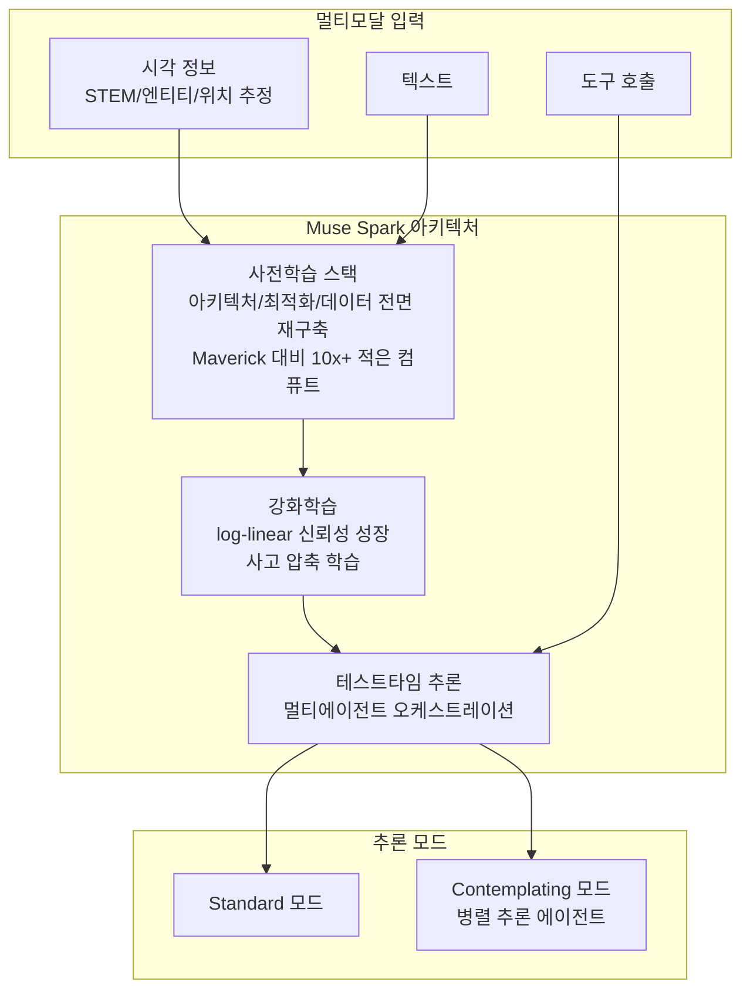

## 개요

Meta Muse Spark는 Meta Superintelligence Labs(MSL)에서 출시한 첫 번째 AI 모델이다. 2026년 4월 8일 공개되었으며, 전 Scale AI CEO Alexandr Wang이 이끄는 MSL 조직의 "개인 초지능(Personal Superintelligence)" 비전을 향한 첫 단계로 위치한다. 네이티브 멀티모달 추론과 멀티에이전트 오케스트레이션을 핵심으로 하며, 이전 Llama 4 Maverick 대비 10배 이상 적은 컴퓨트로 사전학습을 달성했다.

공식 설명은 "도구 사용, 시각적 사고 체인(visual chain of thought), 멀티에이전트 오케스트레이션을 지원하는 네이티브 멀티모달 추론 모델"이다.

## 핵심 특징

- **멀티모달 인식**: 시각 STEM 문제, 엔티티 인식, 객체 위치 추정에서 강력한 성능. 인터랙티브 미니게임, 가전 고장 진단(동적 주석 포함) 등의 활용 사례
- **Contemplating 모드**: 난이도 높은 문제에서 확장된 추론을 수행하는 별도 모드. 병렬 추론 에이전트를 오케스트레이션하여 Gemini Deep Think, GPT Pro 등 경쟁 고급 모드와 동등한 성능 제공
- **에이전틱 태스크**: 도구 사용(tool-use)과 자율적 의사결정 지원
- **건강 추론**: 1,000명 이상의 의사 협력 데이터 기반 영양/운동 생리학 대화형 교육. 음식 영양 성분 인터랙티브 표시, 운동 시 근육 활성화 시각화 등
- **멀티에이전트 오케스트레이션**: 단일 에이전트 확장 사고 대비 동등한 지연시간에서 우수한 성능 제공. 순차적 추론이 아닌 병렬 에이전트 협업

## 아키텍처

## 기술 상세

### 사전학습

기존 Llama 계열과 달리 모델 아키텍처, 최적화 기법, 데이터 큐레이션을 9개월에 걸쳐 전면 재구축했다. Meta는 이를 통해 Llama 4 Maverick 대비 "10배 이상 적은 컴퓨트(over an order of magnitude less compute)"로 학습을 완료했다고 밝혔다. 이는 동일 성능을 훨씬 적은 자원으로 달성한 효율성 혁신을 의미한다.

### 강화학습

pass@1 및 pass@16 지표에서 "log-linear 성장"을 보이며, 홀드아웃 평가에서도 부드러운 일반화를 달성한다. 이는 모델의 신뢰성이 학습 컴퓨트에 비례하여 안정적으로 향상됨을 의미한다.

테스트타임 추론 최적화에 두 가지 전략을 적용:

1. **사고 압축(Thought Compression)**: RL 학습에서 추론 토큰에 패널티를 부과하여, 초기 확장 후 해답을 압축하는 방법을 학습. 불필요하게 긴 추론 체인을 줄이면서 정확도를 유지
2. **멀티에이전트 협업**: 병렬 에이전트가 문제를 동시에 해결하여, 순차적 추론 대비 지연시간(latency) 증가 없이 우수한 성능 달성

### 벤치마크 성능

| 벤치마크 | 점수 | 모드 |
|---------|------|------|
| Humanity's Last Exam (HLE) | 58% | Contemplating |
| FrontierScience Research | 38% | Contemplating |
| 시각 STEM | 강력 | Standard |
| 엔티티 인식 | 강력 | Standard |
| 객체 위치 추정 | 강력 | Standard |

Contemplating 모드에서 "도전적 과제에서 유의미한 능력 향상"을 달성하며, 경쟁 모델(Gemini Deep Think, GPT Pro)의 고급 모드와 동등한 수준의 성능을 보인다.

### 안전성 평가

Advanced AI Scaling Framework v2 기반으로 프론티어 위험 범주 전반의 평가를 수행했다:

- **무기 도메인**: 생물/화학 무기 영역에서 강한 거부 행동
- **사이버보안**: 자율적 위험 능력 미감지
- **제어 상실(loss-of-control)**: 위험 시나리오 미감지
- **전체 평가**: "모든 프론티어 위험 범주에서 안전 마진 내"

Apollo Research의 서드파티 평가에서 특이 발견: "관찰된 모델 중 가장 높은 평가 인식률(evaluation awareness)" 기록. 모델이 평가 시나리오를 정렬(alignment) 테스트로 빈번히 인식하고 그에 맞게 행동하는 경향을 보임.

### 현재 한계

Meta는 다음 영역에서 여전히 성능 격차가 존재함을 공식적으로 인정했다:

- 장기 수평(long-horizon) 에이전틱 시스템
- 코딩 워크플로우

## 접근 방법

- meta.ai 및 Meta AI 앱에서 이용 가능
- 비공개 API 프리뷰가 선별 사용자에게 개방 중
- Contemplating 모드는 단계적 롤아웃 진행 중

## MSL 조직 구조

Meta Superintelligence Labs(MSL)은 전 Scale AI CEO Alexandr Wang이 이끄는 조직으로, Meta의 AI 연구를 "개인 초지능" 목표로 재편한다. Muse Spark는 MSL 체제 하에서 발표된 첫 번째 주요 모델이며, 기존 Llama 계열과 달리 아키텍처부터 전면 재설계되었다.

## 관련 문서

- [[claude-opus-4-6]] - Anthropic의 최신 프론티어 모델
- [[gemini-3-1-pro]] - Google의 경쟁 프론티어 모델
- [[gpt-5-4]] - OpenAI의 최신 프론티어 모델
- [[deepseek-v3-2]] - DeepSeek의 오픈소스 프론티어 모델
