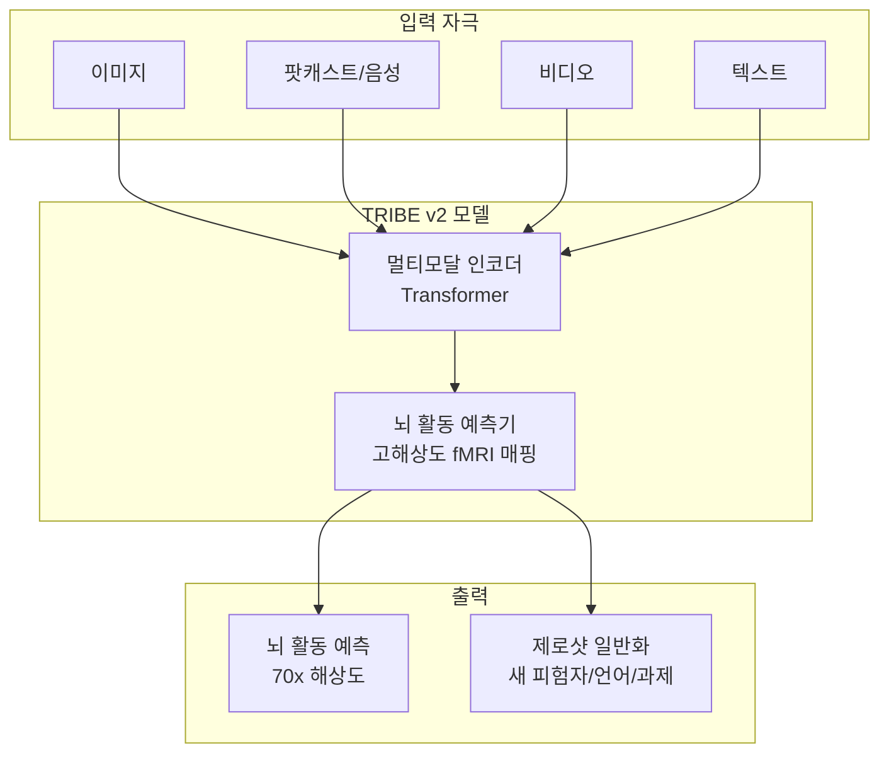
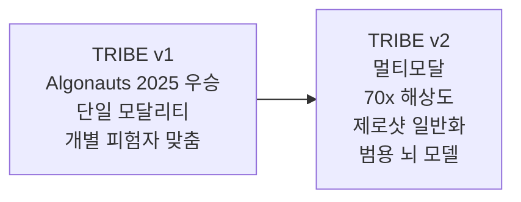

# Meta TRIBE v2

TRIBE v2(TRansformer for In-silico Brain Experiments)는 Meta FAIR(Fundamental AI Research)가 개발한 뇌 활동 예측 파운데이션 모델이다. 700명 이상의 피험자로부터 수집한 fMRI 데이터를 기반으로 인간의 뇌가 시각, 청각, 언어에 어떻게 반응하는지 예측하며, 이전 최첨단 모델 대비 70배 높은 공간 해상도를 달성한다. 연구 논문, 모델 가중치, 코드, 인터랙티브 데모가 CC BY-NC 라이선스로 공개되어 있다.

## 왜 지금 중요한가

신경과학 연구는 전통적으로 인간 피험자의 fMRI 스캔에 의존해왔다. 실험 설계부터 데이터 수집, 분석까지 수개월이 걸리고, 피험자 모집과 스캔 비용이 높다. TRIBE v2는 이 과정을 "인실리코(in-silico) 신경과학"으로 전환한다. 임상 뇌 스캔 없이 수초 내에 수천 개의 가상 실험을 수행할 수 있어, 신경과학 연구의 속도와 비용 구조를 근본적으로 변화시킨다. 또한 제로샷 학습으로 미학습 피험자, 언어, 과제에 대해서도 정확한 예측이 가능해, 범용 뇌 모델로서의 가능성을 보여준다.

## 핵심 기술

### 아키텍처

TRIBE v2는 Transformer 아키텍처를 기반으로 멀티모달 자극(이미지, 음성, 비디오, 텍스트)을 입력받아 대응하는 뇌 활동 패턴을 예측한다. 기존 모델이 단일 모달리티(주로 정적 이미지)만 처리한 것과 달리, 시각, 청각, 언어 처리 영역을 동시에 매핑한다.

### 학습 데이터

| 항목 | 내용 |
|------|------|
| 피험자 수 | 700명 이상 건강한 지원자 |
| 데이터 규모 | 1,115시간 이상의 fMRI 녹화 |
| 자극 유형 | 영화 시청, 팟캐스트 청취, 이미지, 텍스트 |
| 뇌 영역 | 시각 처리(ventral stream), 청각 처리 영역 등 |

### 핵심 성능 지표

| 지표 | TRIBE v2 | 이전 최첨단 |
|------|----------|------------|
| 공간 해상도 | 70배 향상 | 기준선 |
| 모달리티 | 멀티모달 (시각+청각+언어) | 단일 모달리티 |
| 제로샷 | 새 피험자/언어/과제 가능 | 불가 |
| 정확도 | 표준 모델링 대비 일관적 우수 | - |

### 제로샷 일반화

TRIBE v2의 가장 핵심적인 기술적 돌파는 제로샷 학습 능력이다:

- **새로운 피험자**: 학습에 포함되지 않은 개인의 뇌 활동도 정확히 예측
- **새로운 언어**: 학습 데이터에 없는 언어의 청각/언어 처리도 예측 가능
- **새로운 과제**: 학습하지 않은 유형의 인지 과제에 대해서도 일반화

이는 TRIBE v2가 개별 피험자의 특이성이 아니라 인간 뇌의 보편적 정보 처리 원리를 학습했음을 시사한다.

## 이전 버전과의 비교

TRIBE v1은 Algonauts 2025 챌린지 우승 모델로, 개별 피험자에 맞춤화된 단일 모달리티 디코딩에 특화되었다. v2는 이를 확장해 멀티모달 입력 처리, 70배 해상도 향상, 제로샷 일반화를 달성했다.

## 응용 분야

### 신경과학 연구 가속화

- 실제 fMRI 실험 없이 수초 내 수천 개 가상 실험 수행
- 신경과학 가설의 빠른 검증 및 반복 실험
- 연구 비용과 시간의 획기적 절감

### 임상 응용

- **뇌-컴퓨터 인터페이스(BCI)**: 뇌 신호 해석 모델의 학습 데이터 보강
- **신경 질환 연구**: 실어증(aphasia) 등 언어 관련 신경장애의 메커니즘 규명
- **신경 재활**: 뇌 영역별 기능 매핑을 통한 재활 전략 수립

### AI 개발에의 시사점

뇌의 정보 처리 원리를 AI 시스템 설계에 역으로 적용할 수 있다. 특히 [[titans-miras]]의 "놀라움 기반 선택적 메모리"처럼 신경과학에서 영감을 받은 AI 아키텍처 연구에 실증 데이터를 제공한다.

## 공개 정책

| 항목 | 내용 |
|------|------|
| 라이선스 | CC BY-NC (비상업적 사용) |
| 공개 대상 | 연구 논문, 모델 가중치, 코드 |
| 인터랙티브 데모 | 공개 (웹 기반) |
| 목적 | 전 세계 신경과학/AI 연구 협력 촉진 |

## 실무 관점

- TRIBE v2는 직접적인 소프트웨어 도구가 아니라 연구용 파운데이션 모델이다. 실무 적용은 신경과학 연구 또는 BCI 개발 맥락에서 이루어진다
- CC BY-NC 라이선스로 상업적 사용은 제한된다. 기업이 BCI나 의료 기기에 적용하려면 별도 라이선스 협상이 필요할 것이다
- 700명 이상 피험자의 대규모 fMRI 데이터셋은 그 자체로 신경과학 커뮤니티에 중요한 자원이다
- 제로샷 일반화 능력은 "범용 뇌 모델"의 가능성을 시사하지만, 임상 수준의 정확도 검증은 아직 필요하다
- AI 아키텍처 연구와의 양방향 시너지가 핵심이다. 뇌의 작동 원리가 AI 설계를 개선하고, AI 기법이 뇌 연구를 가속하는 선순환 구조

## 관련 문서

- [[titans-miras]] - 신경과학 영감의 장기 메모리 아키텍처
