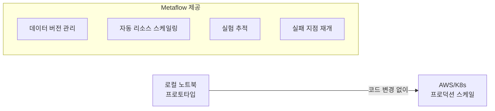

# Metaflow

Netflix가 개발한 ML 워크플로우 프레임워크. **데이터 사이언티스트의 생산성**에 초점을 맞춰, 로컬 프로토타이핑에서 프로덕션 배포까지 동일한 Python 코드로 스케일링할 수 있다.

## 핵심 설계 철학

- **`@step` 데코레이터**: DAG의 각 단계를 Python 메서드로 정의
- **자동 아티팩트 버전관리**: 모든 중간 결과물을 자동 저장/버전 관리
- **`@resources` 데코레이터**: GPU/메모리/CPU를 단계별로 선언적 할당
- **`@retry`/`resume`**: 실패 시 자동 재시도, 실패 지점에서 재개

## [[mlflow|MLflow]] / [[zenml|ZenML]]과의 비교

| 측면 | Metaflow | MLflow | ZenML |
|------|---------|--------|-------|
| 개발사 | Netflix/Outerbounds | Databricks | ZenML GmbH |
| 초점 | 데이터 사이언스 생산성 | 실험 추적/모델 관리 | 파이프라인 이식성 |
| DAG 정의 | Python 클래스 | 없음 (추적 중심) | Python 함수 |
| 클라우드 | AWS 네이티브 | 클라우드 무관 | 멀티 오케스트레이터 |

## 관련 문서

- [[mlflow]] -- MLflow
- [[zenml]] -- ZenML
- [[experiment-tracking]] -- 실험 추적
- [[kubernetes-for-ml]] -- Kubernetes for ML
